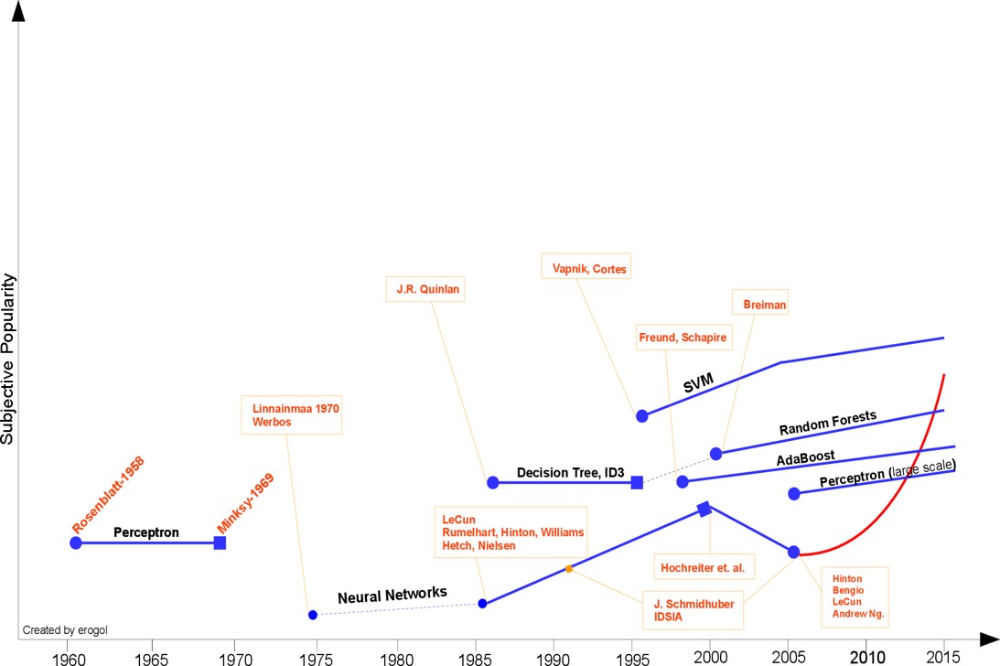

# 《机器学习》课程简介
## 教师：肖宇
## 授课时间：
## 答疑时间：
## 助教：

---

# 第一章、统计学习方法概论

## 

---
# 什么是机器学习？
## 维基百科
>  机器学习是近20多年兴起的一门多领域交叉学科，涉及**概率论、统计学、逼近论、凸分析、算法复杂度理论**等多门学科。机器学习理论主要是设计和分析一些让计算机可以自动“学习”的算法。机器学习算法是一类从数据中自动分析获得规律，并利用规律对未知数据进行预测的算法。因为学习算法中涉及了大量的统计学理论，机器学习与统计推断学联系尤为密切，也被称为统计学习理论。算法设计方面，机器学习理论关注可以实现的，行之有效的学习算法。很多推论问题属于无程序可循难度，所以部分的机器学习研究是开发容易处理的近似算法。

---
# 什么是机器学习？
## 机器学习的定义
>- 机器学习是一门人工智能的科学，该领域的主要研究对象是人工智能，特别是如何在经验学习中改善具体算法的性能。
>- 机器学习是用数据或以往的经验，以此优化计算机程序的性能标准。
>- A computer program is said to learn from **experience E** with respect to some class of **tasks T** and **performance measure P**, if its performance at tasks in T, as measured by P, improves with experience E.

---
# 什么是机器学习？
## 机器学习的应用
- 数据挖掘
- 计算机视觉
- 自然语言处理
- 生物特征识别
- 搜索引擎
- 医学诊断
- 检测信用卡欺诈
- 语音和手写识别
- 机器人
- ...

---
# 机器学习的发展历程
## “黑暗时代”，人工智能的诞生（1943年~1956年）
- Warren McCulloch和Walter Pitts在1943年发表了人工智能领域的开篇之作，提出了人工神经网络模型。
- John von Neumann。他在1930年加入了普林斯顿大学，在数学物理系任教，和阿兰·图灵是同事。
- Marvin Minsky和Dean Edmonds建造第一台神经网络计算机。
- 1956年：John McCarthy从普林斯顿大学毕业后去达特茅斯学院工作，说服了Marvin Minsky和Claude Shannon在达特茅斯学院组织一个暑期研讨会，召集了对机器智能、人工神经网络和自动理论感兴趣的研究者，参加由IBM赞助的研讨会。

---
# 机器学习的发展历程

---