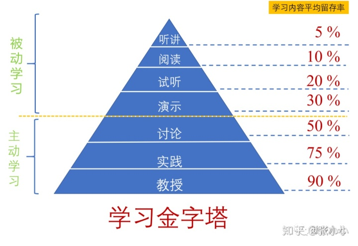
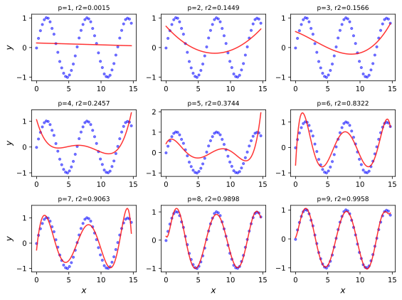

<!-- backgroundColor: light -->
# 课程简介
## 肖宇，xiaoyu@suibe.edu.cn
## 授课地点和时间
- SC310
- 星期二56节

## 答疑时间
- 1-17周 星期一78节
- 1-17周 星期二123478节
- 1-10周 星期一910节

---
# 学生须知

- 研究生课程无论采取哪一种考核形式均采用百分制评定成绩。学位课70分以下为不及格，非学位课60分以下为不及格。
- 研究生一门课程旷课时数达到该门课程总课时数的三分之一，将取消该研究生该门课程的考试资格，该门课程成绩作零分处理。
- 未办理选课手续的不得参加课程考核。
- 请自带笔记本电脑。

---
# 考核与评分
- 出勤: 10%
- 课堂表现: 10%
- 作业: 30%
- 期末: 50%

---
# Richard Philip Feynman
>What I cannot create, I do not understand.

# Linus Torvalds
>Talk is cheap. Show me the code.

---

---
# 为什么学习机器学习？
...

---
# 第1章内容提要
- 什么是机器学习？
- 机器学习的发展历程
- 机器学习和数据挖掘
- 机器学习和统计学
- 机器学习的分类
- 机器学习三要素
- 机器学习的应用
- 学习资源

---
# 什么是机器学习？
## 维基百科概念
>  机器学习是近20多年兴起的一门多领域交叉学科，涉及**概率论、统计学、逼近论、凸分析、算法复杂度理论**等多门学科。机器学习理论主要是设计和分析一些让计算机可以自动“学习”的算法。机器学习算法是一类从数据中自动分析获得规律，并利用规律对未知数据进行预测的算法。因为学习算法中涉及了大量的统计学理论，机器学习与统计推断学联系尤为密切，也被称为**统计学习理论**。算法设计方面，机器学习理论关注可以实现的，行之有效的学习算法。很多推论问题属于无程序可循难度，所以部分的机器学习研究是开发容易处理的近似算法。

---
# 什么是机器学习？
## 机器学习的定义
>- 机器学习是一门人工智能的科学，该领域的主要研究对象是人工智能，特别是如何在经验学习中改善具体算法的性能。
>- 机器学习是用数据或以往的经验，以此优化计算机程序的性能标准。
>- A computer program is said to learn from **experience E** with respect to some class of **tasks T** and **performance measure P**, if its performance at tasks in T, as measured by P, improves with experience E.

---
# 什么是机器学习？
## 机器学习的应用
- 数据挖掘
- 计算机视觉
- 自然语言处理
- 生物特征识别
- 检测信用卡欺诈
- 语音和手写识别
- 机器人
- ...

---
# 机器学习的发展历程
## “黑暗时代”，人工智能的诞生（1943年~1956年）
- Warren McCulloch和Walter Pitts在1943年发表了人工智能领域的开篇之作，提出了人工神经网络模型。
- John von Neumann。他在1930年加入了普林斯顿大学，在数学物理系任教，和阿兰·图灵是同事。
- Marvin Minsky和Dean Edmonds建造第一台神经网络计算机。
- 1956年：John McCarthy从普林斯顿大学毕业后去达特茅斯学院工作，说服了Marvin Minsky和Claude Shannon在达特茅斯学院组织一个暑期研讨会，召集了对机器智能、人工神经网络和自动理论感兴趣的研究者，参加由IBM赞助的研讨会。

---
# 机器学习的发展历程

---
# 机器学习的发展历程
## 新的方向：
- 集成学习
- 可扩展机器学习（对大数据集、高维数据的学习等）
- 强化学习
- 迁移学习
- 概率网络
- 深度学习

---
# 机器学习和数据挖掘
- 机器学习是数据挖掘的重要工具。
- 数据挖掘不仅仅要研究、拓展、应用一些机器学习方法，还要通过许多非机器学习技术解决数据仓储、大规模数据、数据噪音等等更为实际的问题。
- 机器学习的涉及面更宽，常用在数据挖掘上的方法通常只是“从数据学习”，然则机器学习不仅仅可以用在数据挖掘上，一些机器学习的子领域甚至与数据挖掘关系不大，例如增强学习与自动控制等等。
- 数据挖掘试图从海量数据中找出有用的知识。
- 大体上看，数据挖掘可以视为机器学习和数据库的交叉，它主要利用机器学习界提供的技术来分析海量数据，利用数据库界提供的技术来管理海量数据。

---
# 机器学习和统计学
## 机器学习
>机器学习(machine learning)致力于研究通过**计算**的手段，利用经验改善系统自身的性能。机器学习所研究的主要内容，是关于在计算机上从数据中产生“模型”的算法，即“学习算法”。如果说计算机科学是研究关于“算法”的学问，那么类似地，可以说机器学习是研究关于“学习算法”的学问。(周志华，《机器学习》，p1)

## 统计学习
>统计学习(statistical learning)是关于**计算机**基于**数据**构建**概率统计模型**并运用模型对数据进行预测与分析的一门学科。统计学习也称为统计机器学习。(李航，《统计学习方法》，p1)

---
# 机器学习和统计学
## 机器学习
>强调了通过机器设备（如计算机）进行学习以提升系统，由机器实施“计算”，因此重点在于“算法”。
## 统计学习
>强调了通过统计理论与模型（如线性回归）学习以提升系统，重点在于“模型”。
## 两者是统一的
>都是为了构建一个可通过经验进行自我提升的系统，“模型”和“算法”都是这个过程中涉及的不可或缺组成部分。

---
# 机器学习和统计学
|machine learning| statistics |
|:---|:---|
|instance | data point |
|feature | covariate|
|label | response|
|weights | parameters|
|learning | fitting/estimation |
|supervised learning | regression/classification|
|unsupervised learning | density estimation/clustering |

---
# 机器学习和统计学
- 研究方法差异
  - 统计学研究形式化和推导
  - 机器学习更容忍一些新方法
- 维度差异
  - 统计学强调低维空间问题的统计推导
  - 机器学习强调高维预测问题
- 统计学和机器学习各自更关心的领域：
  - 统计学: survival analysis, spatial analysis, multiple testing, minimax theory, deconvolution,  semiparametric inference, bootstrapping, time series.
  - 机器学习: online learning, semisupervised learning, manifold learning, active learning, boosting.

---
# 机器学习的分类
机器学习是一个范围宽阔、内容繁多、应用广泛的领域，并不存在一个统一的理论体系涵盖所有内容。下面从几个角度对机器学习方法进行分类。
## 基本分类
- 监督学习
- 无监督学习
- 强化学习
- 半监督学习
- 主动学习

---
# 机器学习的分类
## 按模型分类
- 概率模型与非概率（确定性）模型
  - 概率模型$P(y|x)$: 决策树、朴素贝叶斯、隐马儿可夫模型、条件随机场、概率潜在语义分析、潜在狄利克雷分配、高斯混合模型
  - 确定性模型$y=f(x)$: 感知机、支持向量机、k近邻、AdaBoost、k均值、潜在与意义分析、神经网络
  - Logit回归即可看作概率模型，又可看作确定性模型
  - 两类模型的区别在于模型的内在结构，而不在于映射关系。概率模型一定可以表示为联合概率分布的形式，而针对非概率模型则不一定存在这一的联合概率分布

---
# 机器学习的分类
## 按模型分类
- 线性模型与非线性模型
  - 如果函数$y=f(x)$是线性函数，则称模型为线性模型，否则称为非线性模型。
  - 线性模型：感知机、线性支持向量机、k近邻、k均值、潜在语义分析
  - 非线性模型：核函数支持向量机、`AdaBoost`、神经网络
- 参数化模型和非参数化模型
  - 参数化模型假设模型参数的维度不变，模型可由有限维参数完全刻画；非参数化模型参数维度不定或无穷大，随着训练数据量的增加而增大。
  - 参数化模型：感知机、朴素贝叶斯、`Logit`回归、高斯混合模型
  - 非参数化模型：决策树、支持向量机、`AdaBoost`、k近邻、潜在语义分析...

---
# 机器学习的分类
## 按算法分类
- 在线学习
- 批量学习

## 按技巧分类
- 贝叶斯学习
- 核方法

---
# 监督学习
**(1) 输入空间、特征空间和输出空间**
- 输入实例$x$的特征向量：
$$
x=(x^{(1)},x^{(2)},x^{(3)}, ..., x^{(n)})^T
$$
注意$x^{(i)}$与$x_i$的区别，后者表示多个特征变量的第i个
$$
x_i=(x_i^{(1)},x_i^{(2)},...,x_i^{(n)})^T
$$
- 训练集
$$
T=\{(x_1,y_1),(x_2, y_2),..., (x_N,y_N)\}
$$
- 输入变量和输出变量：分类问题、回归问题、标注问题

---
# 监督学习
**(2) 联合概率分布**
- 假设输入与输出的随机变量$X$和$Y$遵循联合概率分布$P(X,Y)$
- $P(X,Y)$为分布函数或分布密度函数
- 对于学习系统来说，联合概率分布是未知的
- 训练数据和测试数据被看作是依联合概率分布$P(X,Y)$独立同分布产生的。

**(3) 假设空间**
- 监督学习目的是学习一个由输入到输出的映射，称为模型
- 模式的集合就是假设空间（`hypothesis space`）
- 概率模型:条件概率分布$P(Y|X)$, 决策函数：$Y=f(X)$

---
# 监督学习
**(4) 问题的形式化**
给定一个训练集
$$
T=\{(x_1,y_1),(x_2, y_2),..., (x_N,y_N)\}
$$
其中$(x_i, y_i), i=1,2,...,N$称为样本或样本点。$x_i\in \chi \in \mathbb{R^n}$是输入的观测值，也称为输入或实例，$y_i\in \mathbf{y}$ 是输出的观测值，也称为输出。

监督学习分为**学习**和**预测**两个过程，分别由学习系统和预测系统完成：
- 学习系统基于给定的训练数据集和一定的准则训练得到条件概率分布$\hat{P}(Y|X)$或决策函数$Y=\hat{f}(X)$以描述输入与输出随机变量之间的映射关系。
- 预测系统基于学习得到的概率分布（或决策函数）和输入$x_{j}$得到对应的输出$y_{j}$。

---
# 监督学习
在监督学习中，假设训练数据和测试数据是依联合概率分布$P(X,Y)$独立同分布产生的。

学习系统试图通过训练集中的样本$(x_i, y_i)$带来的信息学习模型。对输入$x_i$，一个具体的模型$y=f(x)$可以产生一个输出$f(x_i)$，而训练数据集中对应的输出是$y_i$。如果这个模型有很好地预测能力，训练样本输出$y_i$和模型输出$f(x_i)$之间的差应该足够小。

学习系统通过不断地尝试，选取最好的模型，以便对训练数据集有足够好的预测，同时对未知的测试数据集的预测也有尽可能好的推广。

监督学习包括：回归和分类

---
# 无监督学习
无监督学习是指从无标注数据中学习预测模型的机器学习问题，本质是学习数据中的统计规律或潜在结构。

模型的输入和输出的所有可能取值的集合分别称为输入空间和输出空间。输入空间和输出空间可以是有限元素集合，也可以是欧式空间。

每个输入是一个实例，由特征向量表示。每一个输出是对输入的分析结果，由输入的类别、转换或概率表示。模型可以实现对数据的聚类、降维和概率估计。

---
# 无监督学习
假设$\chi$是输入空间，$\Zeta$是隐式结构空间。要学习的模型可以表示为函数$z=g(x)$，条件概率分布$P(z|x)$，或者条件概率分布$P(x|z)$的形式，其中$x\in \chi$是输入，$z\in \Zeta$是输出。

包含所有可能的模型的集合称为假设空间。无监督学习旨在从假设空间中学出在给定评价标准下的最优模型。

---
# 无监督学习
在学习过程中，学习系统从训练数据集学习得到一个最优模型，表示为函数$z=\hat{g}(x)$，条件概率分布$\hat{P}(z|x)$或者条件概率分布$\hat{P}(x|z)$。在预测过程中，预测系统对于给定的输入$x_{N+1}$，由模型$z_{N+1}=\hat{g}(x_{N+1})$或者$z_{N+1}=\text{arg max }\hat{P}(z|x_{N+1})$给出相应的输出$z_{N+1}$，进行聚类或降维；或由模型$\hat{P}(x|z)$给出输入的概率$\hat{P}(x_{N+1}|z_{N+1})$，进行概率估计。

---
# 强化学习

强化学习(`reinforcement learning`)是指智能系统在于环境的连续互动中学习最优行为策略的机器学习问题。强化学习的本质是学习最优的序贯决策。

在每一步$t$，智能系统从环境中观测一个状态$s_t$与一个奖励$r_t$，采取一个动作$a_t$。环境根据智能系统的选择的动作，决定$t+1$的$s_{t+1}$和$r_{t+1}$。要学习的策略表示为给定的状态下采取的动作。

注意，智能系统的目标是长期奖励的最大化。强化学习过程中，系统不断地试错，以达到学习最优策略的目的。

---
# 强化学习
强化学习的马儿可夫决策过程是状态、奖励、动作序列上的随机过程，有五元组$\mathrm{<S,A,P,r,\gamma>}$组成。
- $S$是有限状态的集合
- $A$是有限动作的集合
- $P$是状态转移概率函数: $P(s'|s,a)=P(s_{t+1}=s'|s_t=s,a_t=a)$
- $r$是奖励函数: $r(s,a)=E(r_{t+1}|s_t=s,a_t=a)$
- $\gamma$是衰减系数: $\gamma\in [0,1]$

> 马儿可夫决策过程具有马儿可夫性，下一个状态只依赖于前一个状态和动作，由$P(s'|s,a)$表示。下一个奖励依赖于前一个状态与动作，有奖励函数$r(s,a)$表示。

---
# 强化学习
- 马儿可夫策略$\pi$定义为给定状态下动作的函数$a=f(s)$或者条件概率分布$P(a|s)$

- 价值函数定义为策略$\pi$从某一个状态$s$开始的长期累积奖励的数学期望:
$$
v_{\pi}(s)=E_{\pi}\left[r_{t+1}+\gamma r_{t+2}+\gamma^2r_{t+3}+...|s_t=s \right]
$$

- 动作价值函数定义为策略$\pi$的从某一个状态$s$和动作$a$开始的长期累积奖励的属性期望：
$$
q_{\pi}(s,a)=E_{\pi}\left[r_{t+1}+\gamma r_{t+2}+\gamma^2r_{t+3}+...|s_t=s, a_t=a \right]
$$

>强化学习的目标是在所有可能的策略中选出价值函数最大的策略$\pi^*$，而在实际学习中往往从具体的策略出发，不断优化已有策略。

---
# 强化学习
强化学习方法包含无模型方法和有模型方法，无模型的方法又包括基于策略的和基于价值的方法。
- 无模型
  - 基于策略的: 试图求解最优策略$\pi^*$，表示为函数$a=f^*(s)$或者条件概率分布$P^*(a|s)$。学习通常从一个具体策略开始，通过搜索更优的策略进行。
  - 基于价值的: 试图求解最优价值函数，特别是最优动作价值函数$q^{*}(s,a)$。学习通常从一个具体价值函数开始，通过搜索更优的价值函数进行。
- 有模型
  - 通过学习马尔可夫决策过程的模型，包括转移概率函数和奖励函数
  - 通过模型对环境的反馈进行预测
  - 求解价值函数最大的策略$\pi^*$

---
# 半监督学习
- 少量标注数据，大量未标注数据
- 利用未标注数据的信息，辅助标注数据，进行监督学习
- 较低成本

# 主动学习
- 机器主动给出实例，教师进行标注
- 利用标注数据学习预测模型

---
# 贝叶斯学习
在概率模型的学习和推理中，利用贝叶斯定理，计算在给定数据条件下模型的条件概率，即后验概率，并应用这个原理进行模型的估计，以及对数据的预测。将模型、未观测要素及其参数用变量表示，使用模型的先验分布是贝叶斯学习的特点。

假设随机变量D表示数据，随机变量$\theta$表示模型参数。根据贝叶斯定理
$$
P(\theta|D)=\frac{P(\theta)P(D|\theta)}{P(D)}
$$
其中$P(\theta)$是先验概率，$P(D|\theta)$是似然函数。模型估计时，估计整个后验分布$P(\theta|D)$。如果需要给出一个模型，通常取后验概率最大的模型。预测时，计算数据对后验概率分布的期望值：
$$
P(x|D)=\int P(X|\theta,D)P(\theta|D)d \theta
$$

---
# 核方法
核方法是使用核函数表示和学习非线性模型，将线性模型学习方法扩展到非线性模型的一种机器学习方法，可以用于监督学习和无监督学习。

注意，核方法不显式地定义输入空间到特征空间的映射，而是直接定义核函数，即映射之后在特征空间的内积。

假设$x_1,x_2$是输入空间的任意两个实例，内积为$\left<x_1, x_2\right>$，输入空间到特征空间的映射为$φ$，核方法在输入空间中定义核函数 $K(x_1, x_2)$，使其满足 $K(x_1,x_2) = \left<φ(x_1), φ(x_2)\right>$

核函数支持向量机、核PCA、核k均值均属于核方法。

---
# 机器学习方法三要素: 模型+策略+算法

## 1. 模型
在监督学习过程中，模型就是要学习的条件概率分布或决策函数。假设空间用$F$表示，假设空间可以定义为决策函数的集合或者条件概率分布
$$
F=\{f|Y=f_\theta(X)\}\\
或者 \\
F=\{P|P_\theta(Y|X),\theta\in\mathbb{R^n}\}
$$
其中，参数向量$\theta$取决于n维欧式空间$\mathbb{R^n}$，成为参数空间。

---
# 机器学习方法三要素: 模型+策略+算法

## 2. 策略
机器学习的目标是从假设空间中选取出最优模型，策略考虑按照何种准则学习或者选择最优模型。
- 损失函数和风险函数
  - 0-1损失函数
$$
L(Y,f(x))=\begin{cases}
1, Y\neq f(X)\\
0, Y=f(X)
\end{cases}
$$

---
# 机器学习方法三要素: 模型+策略+算法

## 2. 策略
- 损失函数和风险函数
  - 平方损失函数：$L(Y,f(X))=(Y-f(X))^2$
  - 绝对损失函数：$L(Y,f(X))=|Y-f(X)|$
  - 对数损失函数：$L(Y,f(X))=-\mathrm{log}P(Y|X)$
  - 指数损失函数：$L(Y,f(X))=\mathrm{exp}(-Yf(X))$

---
# 机器学习方法三要素: 模型+策略+算法
## 2. 策略

损失函数值越小，模型越好，损失函数的期望是

$$\begin{aligned}
R_{exp}(f)&=E_p[L(Y,f(X))] \\
&= \int_\mathbf{X \times Y} L(y,f(x))P(x,y) dxdy
\end{aligned}$$

这是理论上模型$f(X)$关于联合分布$P(X,Y)$的平均意义下的损失，成为**风险函数(risk function)**或**期望损失(expected function)**。在学习过程中，一方面根据期望风险最小学习模型要用到联合分布，另一方面联合分布又是未知的，所以监督学习就成为一个病态问题。

---
# 机器学习方法三要素: 模型+策略+算法
## 2. 策略
给定一个训练集$T=\{(x_1,y_1),(x_2,y_2),\mathellipsis,(x_N,y_N)\}$，模型$f(X)$关于训练数据集的平均损失称为**经验风险(empirical risk)**或者**经验损失(empirical loss)**
$$
R_{emp}(f)=\frac{1}{N}\sum_{i=1}{N}L(y_i,f(x_i))
$$
根据大数定律，当样本容量N趋向于无穷时，经验风险$R_{emp}(f)$趋于期望风险$R_{exp}(f)$. 然而，现实中训练样本数量有限，因此用经验风险估计期望风险常常并不理想，要对经验风险矫正。监督学习中可采用两个基本策略：**经验风险最小化和结构风险最小化**。

---
# 机器学习方法三要素: 模型+策略+算法
## 2. 策略
- 经验风险最小化
$$
\mathrm{\min_{f\in F}}\frac{1}{N}\sum_{i=1}^N L(y_i,f(x_i))
$$
- 结构风险最小
>为了防止过拟合(`over-fitting`)提出的策略，等价于正则化(`regularization`)。
$$
\mathrm{\min_{f\in F}} R_{srm}(f)=\frac{1}{N}\sum_{i=1}^N L(y_i,f(x_i))+\lambda J(f)
$$
其中，$J(f)$为模型的复杂度(正则项)，模型越复杂，$J(f)$越大。

---
# 机器学习方法三要素: 模型+策略+算法
## 3. 算法
算法是指学习模型的具体计算方法。机器学习基于训练数据集，根据学习策略，从假设空间中选择最优模型，最后需要考虑用什么样的方法求解最优模型。

此时，机器学习问题归结为最优化问题。机器学习问题中通常不存在显式的解析解，此时需要用数值计算的方法求解。如何保证找到全局最优解，并使求解的过程非常搞笑，就成为一个重要问题。

机器学习方法之间的不同，主要来自于其模型、策略和算法的不同。确定了模型、策略、算法，机器学习方法也就确定了。

---
# 模型评估和模型选择
## 1. 训练误差与测试误差
当损失函数给定时，模型的训练误差和测试误差就成为学习方法评估的标准。假设学习到的模型是$Y=\hat{f}(X)$，训练误差是模型$Y=\hat{f}(X)$关于训练数据集的平均损失：
$$
R_{emp}(\hat{f})=\frac{1}{N}\sum_{i=1}^N L(y_i,\hat{f}(x_i))
$$
其中$N$是训练样本容量。测试误差是模型$Y=\hat{f}(X)$关于测试数据集的平均损失：
$$
e_{test}(\hat{f})=\frac{1}{N'}\sum_{i=1}^{N'} L(y_i,\hat{f}(x_i))
$$
其中$N'$是测试样本容量。

---
# 模型评估和模型选择
## 1. 训练误差与测试误差
当损失函数是0-1损失时，测试误差即常见的测试集上的误差率：
$$
e_{test}=\frac{1}{N'}\sum_{i=1}^{N'} I(y_i\neq \hat{f}(x_i))
$$
这里I是指示函数，即$y_i\neq \hat{f}(x_i)$是为1，否则为0。响应的，准确率为
$$
r_{test}=\frac{1}{N'}\sum_{i=1}^{N'} I(y_i=\hat{f}(x_i))
$$
显然有$e_{test}+r_{test}=1$。通常将机器学习方法对未知数据的预测能力成为泛化能力。

---
# 模型评估和模型选择
## 2. 过拟合与模型选择
当假设空间含有不同复杂度的模型时，就要面临模型选择问题。如果一味追求提高对训练数据的预测能力，所选模型的复杂度则往往比真模型更高，这种现象称为过**拟合(over-fitting)**。过拟合是指学习时选择的模型所包含的参数过多，从而对已知数据预测很好，但对未知数据预测得很差的现象。模型选择旨在避免并提高模型的预测能力。

例1.1 假设给定一个训练集$T=\{(x_1,y_1),(x_2,y_2),\mathellipsis,(x_N,y_N)\}$，其中$x_i\in \mathrm{R}$是$y$的观测值，$i=1,2,\mathellipsis,N$。

---
# 模型评估和模型选择

---
# 正则化与交叉验证
## 1. 正则化(`regularization`)
模型选择的典型方法是**正则化**，正则化一般具有如下形式：
$$
\min_{f\in F}\frac{1}{N}\sum_{i=1}^N L(y_i,\hat{f}(x_i)) + \lambda J(f)
$$
其中，第一项是经验风险，第二项是正则化项。回归问题中，损失函数是平方损失，正则化项可以是参数向量的$L_2$和$L_1$范数为：
$$
L_2(\omega)=\frac{1}{N}\sum_{i=1}^N (f(x_i;\omega)-y_i)^2 + \frac{\lambda}{2} ||\omega||^2
$$

---
# 正则化与交叉验证
## 1. 正则化(`regularization`)
正则化项也可以是$L_1$范数
$$
L_1(\omega)=\frac{1}{N}\sum_{i=1}^N (f(x_i;\omega)-y_i)^2 + \lambda ||\omega||_1
$$

**奥卡姆剃刀(`Occam's razor`)原理**应用于模型选择时变成以下想法：在所有可能选择的模型中，能够很好地解释已知数据并且十分简单才是最好的模型，也就是应该选择的模型。

从**贝叶斯估计**的角度来看，正则化项对应于模型的先验概率，可以加速复杂的模型有较小的先验概率，简单的模型有较大的先验概率。

---
# 正则化与交叉验证
## 2. 交叉验证(`cross validation`)
如果给定的样本数据充足，进行模型选择的一种简单方法是随机地将数据集切成三部分：**训练集(training set)、验证集(validation set)和测试集(test set)**。在学习到不同复杂度的模型中，选择对验证集有最小预测误差的模型。

在实际应用中，由于数据是不充足的，为了选择好的模型，可以采用交叉验证方法，其基本思想是重复地使用数据，把给定的数据进行切分，将切分的数据集组合为训练集和测试集，在此基础上反复地进行训练、测试及模型选择。

---
# 正则化与交叉验证
## 2. 交叉验证(`cross validation`)
交叉验证一般包含以下三种类型
- 简单交叉验证
- **S折交叉验证**
- 留一交叉验证

---
# 泛化能力
## 1. 泛化误差(`generalization error`)
学习方法的泛化能力是指由该方法学习到的模型对未知数据的预测能力，是学习方法本质上的重要性质。现实中采用最多的方法是通过**测试误差**来评价学习方法的泛化能力。但是该评价方法依赖于测试数据集，因此评价结果是不可靠的。以下从理论上对学习方法的泛化能力进行分析。

如果学习到的模型是$\hat{f}$，那么这个模型对未知数据预测的误差即为泛化误差(generalization error)
$$
\begin{aligned}
R_{exp}(\hat{f})&=E_p[L(Y,\hat{f}(X))]\\
&=\int_{X\times Y}L(y,\hat{f}(x))P(x,y)dxdy
\end{aligned}
$$
泛化误差反映了学习方法的泛化能力，泛化误差就是所学得到的模型的期望风险。

---
# 泛化能力
## 2. 泛化误差上界(`generalization error bound`)
学习方法的泛化能力分析往往是通过研究泛化误差的概率上界进行的，简称**泛化误差上界(generalization error bound)**。泛化误差上界具有以下性质：它是样本容量的函数，当样本容量增加时，泛化上界趋于0；它是假设空间容量的函数，假设空间容量越大，模型就越难学，泛化误差上界就越大。

下面给出一个简单的泛化误差上界的例子：二分类问题的泛化误差上界。考虑二分类问题，给定训练集$T=\{(x_1,y_1),(x_2,y_2),\mathellipsis,(x_N,y_N)\}$，其中$x_i\in \mathrm{R}$是$y$的观测值，$i=1,2,\mathellipsis,N$，N是样本容量，T是从联合概率分布$P(X,Y)$独立同分布产生的，$X\in \mathbb{R^n},Y\in\{-1,+1\}$。假设空间是函数的有限集合$F=\{f_1,f_2,\mathellipsis,f_d\}$，d是函数个数。设$f$是从$F$中选取的函数。损失函数是$0-1$损失。

---
# 泛化能力
## 2. 泛化误差上界(`generalization error bound`)
关于$f$的期望风险和经验风险分别是
$$
R(f)=E[L(Y,f(X))]\\
\hat{R}(f)=\frac{1}{N}\sum_{i=1}^N L(y_i, f(x_i))
$$
经验风险最小化函数是
$$
f_N=\mathrm{arg}\min_{f\in F}\hat{R}(f)
$$
$f_N$依赖训练集的样本容量N。人们更关心的是$f_N$的泛化误差上界。

---
# 泛化能力
## 2. 泛化误差上界(`generalization error bound`)
下面讨论从有限集合$F=\{f_1,f_2,\mathellipsis,f_d\}$中任意选出的函数$f$的泛化误差上界。
**定理1.1 （泛化误差上界）** 对于二分类问题，当假设空间是有限个函数的集合$F=\{f_1,f_2,\mathellipsis,f_d\}$时，对任意一个函数$f\in F$，至少以概率$1-\delta, 0<\delta<1$，以下不等式成立
$$
R(f)\leq \hat{R}(f)+\epsilon(d,N,\delta)
$$
其中，
$$
\epsilon(d,N,\delta) = \sqrt{\frac{1}{2N}\left(\log d + \log \frac{1}{\delta} \right)}
$$

---
# 生成模型与判别模型
监督学习方法可分为**生成方法(generative approach)**和**判别方法(discriminative approach)**，所学到的模型分别是**生成模型(generative model)**和**判别模型(discriminative model)**

生成方法由数据学习联合概率分布$P(X,Y)$，然后求出条件概率分布$P(Y|X)$作为预测的模型，即生成模型
$$
P(Y|X) = \frac{P(X,Y)}{P(X)}
$$
这样的方法之所以称为生成方法，是因为模型表示了给定输入$X$产生输出$Y$的生成关系。典型的生成模型有朴素贝叶斯法和隐马儿可夫模型。

---
# 生成模型与判别模型
判别方法由数据直接学习决策函数$f(X)$或者条件概率分布$P(Y|X)$作为预测的模型，即判别模型。判别方法关心的是对给定的输入$X$，应该预测什么样的输出$Y$。典型的判别模型包括：**k近邻法、感知机、决策树、Logistic模型、最大熵模型、支持向量机、提升方法和条件随机场等**。

生成方法的特点：生成方法可以还原出联合概率分布$P(X,Y)$，而判别方法则不能；生成方法的学习收敛速度更快，即当样本容量增加的时候，学到的模型可以更快地收敛于真实模型；当存在隐变量时，仍可以用生成方法学习，此时判别方法就不适用。

判别方法的特点：判别方法直接学习的是条件概率分布$P(Y|X)$或者决策函数$f(X)$，直接面对预测，往往学习的准确率更高；由于直接学习$P(Y|X)$或$f(X)$，可以对数据进行各种程度上的抽象、定义特征并使用特征，因此可以简化学习问题。

---
# 监督学习应用
监督学习的应用主要在三个方面：分类问题、标注问题和回归问题。
## 1. 分类问题(classification)
在监督学习中，当输出变量Y取有限个离散值，预测问题便成为分类问题。输入变量X可以是连续或者离散的。监督学习从数据中学习一个分类器(`classifier`)。分类器对新的输入进行输出的预测，成为分类(`classification`)。可能的输出称为类别(`class`)。当分类的类别是多个时，称为多分类问题。

分类问题包括学习和分类两个过程，学习过程根据已知训练数据集学习得到一个分类器，分类过程中基于分类器对新输入实例进行预测分类。

---
# 监督学习应用
## 1. 分类问题(classification)
评价指标：精确率(`precisioin`)和召回率(`recall`)。通常以关注的类为正类，其他类为负类。分类器在测试数据集上的预测或正确或不正确，4种情况出现的总数分别记作
| |正类`True` | 负类`False` |
| ---: |---: | ---: |
|预测为正类`Positive` | TP | FP |
|预测为负类`Negative` | TN | FN |

---
# 监督学习应用
## 1. 分类问题(classification)
精准率，即所有被预测为`Postive`的实例中为`True`的比例，可由以下式子计算:
$$P=\frac{TP}{TP+FP}$$
召回率，即所有预测正确的实例中为`True`的比例，可由以下式子计算：
$$R=\frac{TP}{TP+FN}$$
精准率和召回率的调和均值$F_1$:
$$F_1=\frac{2PR}{P+R}$$

---
# 监督学习应用
## 1. 分类问题
许多机器学习方法可以用于分类：k近邻、感知机、朴素贝叶斯、决策树、`Logistic`回归模型、支持向量机、提升方法、贝叶斯网络、神经网络等

分类问题在许多领域有着广泛的应用，例如风险评级、异常识别、物体识别、手写识别、网页分类等

---
# 监督学习应用
## 2. 标注问题(tagging)
标注问题可以看作是分类问题的一个推广，标准问题也是更复杂的结构预测(`structure prediction`)问题的简单形式。标注问题的输入是一个观测序列，输出是一个标记序列或状态序列。标注问题的目标在于学习一个模型，使它能够对预测序列给出标记序列作为预测。标注问题分为学习和标注两个过程。首先给定一个训练数据集
$$
T=\{(x_1,y_1), (x_2, y_2),\mathellipsis,(x_N,y_N)\}
$$
这里，$x_i=(x^{(1)}_i,x^{(2)}_i,\mathellipsis,x^{(n)}_i,)^T,i=1,2,\mathellipsis,N$是输入观测序列；$y_i=(y^{(1)}_i,y^{(2)}_i,\mathellipsis,y^{(n)}_i)^T$是相应的输出标记序列；$n$是序列的长度，对不同样本可以有不同的值。学习系统基于训练数据集构建一个模型，表示为条件概率分布：
$$
P(Y^{(1)},Y^{(2)},\mathellipsis,Y^{(n)}|X^{(1)},X^{(2)},\mathellipsis,X^{(n)})
$$

---
# 监督学习应用
## 2. 标注问题(tagging)
评价标准模型的指标与评价分类模型的指标一样，常用的有标准准确率、精确率和召回率。标准常用的方法有：隐马儿可夫模型和条件随机场。

标注问题在信息抽取、自然语言处理等领域被广泛应用，是这些领域的基本问题。

例如，自然语言处理中的词性标注就是一个典型的标注问题：给定一个由单词组成的句子，对这个句子中的每个单词进行词性标注。

---
# 监督学习应用
## 3. 回归问题(regression)
回归问题用于预测输入变量和输出变量之间的关系，特别是当输入标量的值发生变化时，输出变量的值也随之发生的变化。回归模型是表示从输入变量到输出变量之间映射的函数。回归问题的学习等价于函数拟合：*选择一条函数曲线使其很好地拟合已知数据且很好地预测未知数据*。

回归问题分为学习和预测两个过程。首先给定一个训练数据集
$$
T=\{(x_1,y_1), (x_2, y_2),\mathellipsis,(x_N,y_N)\}
$$
这里，$x_i\in \mathbb{R^n}$是输入，$y\in \mathbb{R}$是输出，$i=1,2,\mathellipsis,N$。学习模型的任务是基于T构建一个模型$Y=f(X)$；对新的输入$x_{N+1}$，预测系统根据学习的模型确定相应的输出$y_{N+1}$
。

---
# 监督学习应用
## 3. 回归问题(regression)
回归问题按照输入变量的个数，分为一元回归和多元回归；按照输入变量和输出变量之间关系的类型即模型的类型，分为线性回归和非线性回归。

回归模型学习最常用的损失函数是平方损失函数，在此情况下回归问题可由最小二乘法求解。

许多领域的任务可以形式化为回归问题：市场趋势预测、产品质量管理、客户满意度调查、投资风险分析等。

---
| 周次 | 教学内容 |
|:---:|:---:|
|2	|概述：机器学习的历史、概念、内容和任务等|
|3	|感知机|
|4	|k-近邻回归|
|5	|Logistic回归与最大熵模型1|
|6	|Logistic回归与最大熵模型2|
|7	|朴素贝叶斯分类1|
|8	|朴素贝叶斯分类2|
|9	|期中作业|

---
| 周次 | 教学内容 |
|:---:|:---:|
|10	|决策树1|
|11	|决策树2|
|12 |集成学习1|
|13	|集成学习2|
|14	|人工神经网络1|
|15	|人工神经网络2|
|16 |学生讲解：机器学习方法的实现或应用1|
|17	|学生讲解：机器学习方法的实现或应用2|
|18 |提交报告 |

---
# 学习资源
1. 李航，《统计学习方法》，2019，第二版
2. 周志华，《机器学习》，2017
3. Gavin Hackeling, "Mastering machine learning with scikit-learn", second edition
4. [PyTorch中文文档](https://pytorch-cn.readthedocs.io/zh/latest/)
5. [斯坦福机器学习](http://v.163.com/special/opencourse/machinelearning.html)

---
# 教学与软件软件环境
## Python
- numpy
- pandas
- matplotlib
- scikit-learn
- networkx
- pytorch
- ...
