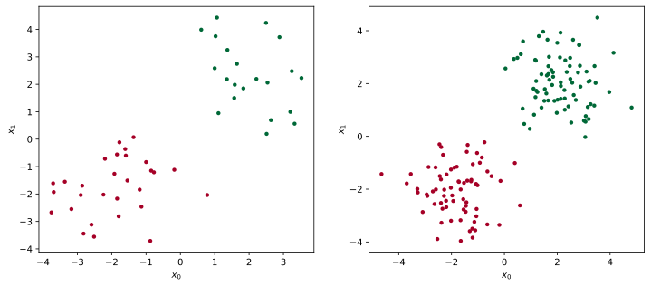
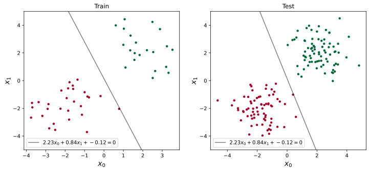

<!-- fit -->
# 第2章 感知机

---
# 主要内容
- 问题
- 感知机模型
- 策略
- 寻优算法的原始形式
- 寻优算法的对偶形式
- 算法实现
- 算法应用
- 参考


---
# 概述
- 1957年由`Rosenblatt`提出，是**神经网络**与**支持向量机**的基础。
- 输入为实例的特征向量，输出为实例的类别，正例取$+1$，反例取$-1$；
- 感知机对应于输入空间中将实例划分为正负两类的分离超平面，属于判别模型；
- 导入基于误分类的损失函数；
- 利用梯度下降法对损失函数进行极小化；
- 感知机学习算法具有简单而易于实现的优点，分为原始形式和对偶形式；

---
# 模型
**定义2.1 （感知机）** 假设输入空间是$\mathbf{X} \subseteq \mathbb{R^n}$，输出空间是$\mathbf{Y}=\{+1,-1\}$。输入$x\in \mathbf{X}$表示实例的特征向量，对应于输入空间的点；输出$y\in \mathbf{Y}$表示实例的类别。由输入空间到输出空间的如下函数
$$
f(x)=\mathrm{sign} (\omega\cdot x+b)
$$
称为感知机。其中，$\omega$和$b$为感知机模型参数，$\omega\in\mathbb{R^n}$为权重值或者权值向量，$b\in\mathbb{R}$称为偏置。$\mathrm{sign}$是符号函数，即
$$
\mathrm{sign}(x)=\begin{cases}
+1,x\geq 0 \\
-1,x<0
\end{cases}
$$
感知机的假设空间是定义在特征空间上的所有线性分类模型或线性分类器，即函数集合$\{f|f(x)=\omega\cdot x + b\}$

---
```python
import numpy as np
import pandas as pd
import torch
import matplotlib.pyplot as plt

# 定义感知机函数
def percetron(w, X, b):
    '''
    w: 参数向量 n, 1
    X: 矩阵 m, n
    b: 偏置，标量
    '''
    z = X@w + b  # m*1 纬向量
    y = torch.ones_like(z)
    y[torch.lt(z, 0)] = -1  # 小于0的值为-1，大于等于0的值为1
    return y
```

---
# 数据集的线性可分性
**定义2.2 （数据集的线性可分性）** 给定一个数据集
$$
T=\{(x_1,y_1),(x_2,y_2),...,(x_N,y_N)\}
$$
其中，$x_i\in \mathbf{X}=\mathbb{R^n},y_i\in\mathrm{Y}=\{+1,-1\},i=1,2,...,N$，如果存在某个超平面S
$$
\omega\cdot x + b=0
$$
能够将数据集的正实例点和负实例点完全正确地划分到超平面的两侧，即对所有的$y_i=+1$的实例i，有$\omega\cdot x_i+b>0$，对所有的$y_i=-1$的实例i，有$\omega\cdot x_i+b<0$，则称数据集$T$为线性可分数据集；否则，称之为线性不可分。

---
# 数据集的线性可分性



---
# 感知机学习策略
- 假设训练数据集是线性可分的，感知机学习的目标是求得一个能够将训练集正负实例完全正确分开的分离超平面。
- 损失函数：误分类点到超平面S的总距离。
- 输入空间$\mathbb{R^n}$中任意点$x_0$到超平面S的距离
    $$
    \mathrm{dist(x_0,S)}=\frac{1}{\|\omega\|}|\omega\cdot x_0+b|
    $$
    这里，$\|\omega\|$是$\omega$的$L_2$范数。

- 对于误分类数据点$(x_i,y_i)$，有$-y_i(\omega\cdot x_i+b)>0$成立。因此
$$
\mathrm{dist(x_0,S)}=-\frac{1}{\|\omega\|}y_i(\omega\cdot x_0+b)
$$

---
# 感知机学习策略
- 假定S的误分类集合为M，则所有误分类点到超平面的距离总和为
$$
\mathrm{Dist(M,S)}=-\frac{1}{\|\omega\|}\sum_{x_i\in M}y_i(\omega\cdot x_i+b)
$$
- $\Vert \omega \Vert$是$\omega$的$L_2$范。如果不考虑$\frac{1}{\|\omega\|}$，就得到了感知机学习的损失函数。
$$
L(\omega,b)=-\sum_{x_i\in M}y_i(\omega\cdot x_i+b)
$$
- 显然，以上损失函数是非负的。

---
```python
# 定义损失函数
def loss(w, b, X, y):  # 所有误分类点的误差
    '''
    w: 参数向量 n, 1
    X: 矩阵 m, n
    y: 向量 m, 1
    b: 偏置, 标量
    '''
    hat_y = X@w + b
    neg_Dist = -hat_y.reshape(1, -1) * y.reshape(1, -1)  # 误分类点对应的值为正
    return torch.sum(neg_Dist[neg_Dist > 0])  # 取所有正值(即误分类点)的和
```

---
# 参数学习
- 感知机的学习问题即$L(\omega, b)$的极小化问题
$$
\min_{\omega, b}L(\omega, b)=-\sum_{x_i\in M}y_i(\omega\cdot x_i + b)
$$

- 感知机是误分类驱动的，具体可采用多种方法，如**梯度下降、随机梯度下降**等。
- 假设误分类集合$M$是固定的，那么损失函数$L(\omega, b)$的梯度由$\bigtriangledown_{\omega}=-\sum_{i\in M}y_ix_i,\bigtriangledown_{b}=-\sum_{i\in M}y_i$给出。
    > 注意： $x_i$是和$\omega$具有相同纬度的特征，$-\sum_{i\in M}y_ix_i$在各对应维度上求和。
- 随机选取一个误分类点$(x_i,y_i)\in M$，对$\omega, b$进行更新：$\omega := \omega + \eta y_i x_i,b := b + \eta y_i$，其中$0<\eta\leq 1$是步长，也称为学习率。
- 通过迭代可以减少损失函数$L(\omega, b)$的值，直到$L$为0.

---
# *梯度下降*
考虑$\mathbf{x} \in \mathbb{R}^d$, 其中$\mathbf{x}$为向量, 目标函数$f: \mathbb{R}^d \to \mathbb{R}$映射至标量。对应的$f$关于$\mathbf{x}$每一维度$x_i$的偏导构成梯度

$$\nabla f(\mathbf{x}) = \bigg[\frac{\partial f(\mathbf{x})}{\partial x_1}, \frac{\partial f(\mathbf{x})}{\partial x_2}, \ldots, \frac{\partial f(\mathbf{x})}{\partial x_d}\bigg]^\top.$$

利用泰勒展开式可得：$f(\mathbf{x} + \Delta\mathbf{x}) = f(\mathbf{x}) + \Delta\mathbf{x}^\top \nabla f(\mathbf{x}) + O(|\mathbf{\Delta x}|^2).$

换而言之，最速下降方向由$-\nabla f(\mathbf{x})$给出。令$\Delta \mathbf{x}=-\eta \nabla f(\mathbf{x})$，则有

$$f(\mathbf{x} + \Delta \mathbf{x}) = f(\mathbf{x}) - \eta \nabla f(\mathbf{x})^T \nabla f(\mathbf{x}) + O(|\Delta\mathbf{x}|^2).$$

选定合适的学习率$\eta > 0$，则可得梯度下降更新公式
$$\mathbf{x} \leftarrow \mathbf{x} - \eta \nabla f(\mathbf{x}).$$

---
```python
def grad_desc(f, grad_f, x0, learn_rate=0.05):
    '''
    f: 待优化目标函数, grad_f: f的梯度, x0: 参数初值, learn_rate: 学习率
    '''
    trace_x = np.array([x0])  # x的历史记录
    x = x0
    i = 0
    while True:
        x = x - learn_rate * grad_f(x)  # 更新x的值
        trace_x = np.concatenate([trace_x, x.reshape(1, -1)])
        i += 1
        if i % 5 == 0:
            print(f'迭代次数: {i}, 目标函数值f: {f(x):.6f}')

        if np.sum(np.abs(trace_x[-1] - trace_x[-2])) < 1e-3:  # 停止条件
            break

    print(f'共迭代{len(trace_x)}次, 目标函数: {f(x)}, 最优参数值: {x.tolist()}')
    return trace_x
```

---
# 算法2.1  感知机学习算法的原始形式
- 输入：训练数据集$T=\{(x_1,y_1),(x_2,y_2),...,(x_N,y_N)\}$，其中$x_i\in X=\mathbb{R^n}, y_i\in Y=\{-1, +1\}, i=1,2,...,N$; 学习率$\eta(0<\eta\leq 1)$；
- 输出：$\omega,b$, 感知机模型$f(x)=\mathrm{sign}(\omega\cdot x+b)$
- 算法过程：
  (1) 选取初值$\omega_0, b_0$;
  (2) 对于$i\in T$，根据$y_i(\omega\cdot x_i+b)\leq 0$获取误分类点集合$M$，如果$M=\emptyset$，则结束算法；
  (3) 在$M$中随机选取一个数据点$(x_i, y_i)$;
  (4) 更新参数：$\omega := \omega + \eta y_i x_i, b := b + \eta y_i$；
  (5) 转至步骤（2）

---
```python
def learning_perceptron_sgd(X, y, epochs=100, lr=0.03):
    '''
    X: 特征矩阵 N * d | y: 标签 N * 1 | epochs: 最大训练批次 | lr: 学习率
    '''
    w = torch.randn(size=(X.shape[1], 1))  # 随机取特征权重
    b = torch.zeros(size=(1, ))  # 取截距为0
    s_idx = np.arange(X.shape[0])  # 训练样本的下标
    for epoch in range(epochs):
        np.random.shuffle(s_idx)  # 随机打乱s_idx
        for i in s_idx:  #
            x_i = X[i]
            y_i = y[i]
            if (x_i @ w + b) * y_i <= 0: # 选择第一个分错的点更新
                w = w + (lr*y_i*x_i).reshape(-1, 1)
                b = b + lr*y_i
                break  # 更新一个误分类点后跳出循环，进行下一轮
        else:  # 如果所有节点被正确分类，则跳出迭代
            print(f'迭代在{epoch+1}次结束, 所有数据点已被正确分类!')
            break
    return w, b
```

---
```python
# 批梯度下降学习过程，基于pytorch的自动求导机制实现
def learn_model(lossfunc, X, y, epochs=50, lr=0.03):
    '''
    lossfunc: 损失函数 | X: 特征矩阵 | y: 标签 | epochs: 训练批次 | lr: 学习率
    '''
    w = torch.randn(size=(X.shape[1], 1), requires_grad=True)
    b = torch.zeros(size=(1, ), requires_grad=True)
    for epoch in range(epochs):
        l = lossfunc(w, b, X, y)
        l.backward()  # 反向传播，获取参数的梯度
        w.data.sub_(lr*w.grad)
        w.grad.data.zero_()
        b.data.sub_(lr*b.grad)
        b.grad.data.zero_()
        with torch.no_grad():  # 不计算梯度，加速损失函数的运算
            d_w, d_b = w.detach(), b.detach()   #  从计算图中解绑，后面的操作不影响计算图中对应的结果
            train_l = loss(d_w, d_b, X, y)  # 最近一次的负对数似然率
            if epoch % 5 == 0:
                print(f'epoch {epoch}, loss: {train_l.numpy():.4f}')
    return w, b
```

---
# 学习结果


---
# 算法收敛性
**定理2.1 (`Novikoff`)** 设训练集$T=\{(x_1,y_1),(x_2,y_2),...,(x_N,y_N)\}$是线性可分的，其中$x_i\in\chi=\mathbb{R^n}, y_i\in\mathbf{Y}=\{-1,+1\}, i=1,2,...,N$，则
- 存在满足条件$||\hat{\omega}_{opt}||=1$的超平面$\hat{\omega}_{opt}\cdot \hat{x}+b_{opt}=0$将训练集完全正确分开；且存在$\gamma > 0$，对于所有的$i=1,2,...,N$有 $y_i(\hat{\omega}_{opt}\cdot x_i+b_{opt})\geq \gamma$
- 令$R= \max_{1 \leq i \leq N}||\hat{x_i}||$，则感知机算法`2.1`在训练集上的误分类次数k满足
$$
k\leq \left(\frac{R}{\gamma}\right)^2
$$

> 以上定理表明，误分类的次数k是有上界的，经过有限次搜索可以找到将训练数据完全正确分开的分离超平面，即当训练数据集线性可分时，感知机学习算法原始形式迭代是收敛的。

---
# 感知机学习算法的对偶形式

- 对偶形式的基本想法: 将$\omega$和$b$表示为实例$x_i$和标记$y_i$的线性组合形式，通过求解其系数而求得$\omega$和$b$。
- 假定初始值$\omega_0,b_0$均为0，更新后通过$\omega:=\omega+\eta y_i x_i, b:=b+\eta y_i$ 给出
- 逐步修改$\omega, b$，经过$n$次修改后，则$\omega, b$关于$(x_i,y_i)$的增量分别是$\alpha_iy_ix_i$和$\alpha_iy_i$，这里$\alpha_i=n_i\eta$，最后学习到的$\omega, b$可以分别表示为
$$
\omega=\sum_{i=1}^N\alpha_iy_ix_i, b=\sum_{i=1}^N\alpha_iy_i
$$
- 实例点更新次数越多，说明它对分离超平面越敏感，距离分离超平面越近，也就越难正确分类，即这样的实例对学习结果影响最大。
- 对偶形式的目的是降低每次迭代的运算量，但是并不是在任何情况下都能降低运算量，而是**在特征空间的维度远大于数据集大小**时才起作用。

---
# 感知机学习算法的对偶形式

- 将$\omega$和$b$结合写成增广参数向量, 特征和偏置对应写成$\hat{X}=(X,1)$
    $$
    \begin{aligned}
    \mathbf{\hat{\omega}} &=  (\omega_1, \omega_2, ..., \omega_n, b) \\
    &= (\sum_{i=1}^N \alpha_i y_i x_i^{(1)}, \sum_{i=1}^N \alpha_i y_i x_2^{(2)}, ..., \sum_{i=1}^N \alpha_i y_i x_i^{(n)}, \sum_{i=1}^N \alpha_i y_i) \\
    &= (\alpha_{1\times N} \odot y_{1\times N}^T) \hat{X}_{N\times (n+1)}
    \end{aligned}
    $$
    其中$\mathbf{\alpha}=(\alpha_1, \alpha_2, ..., \alpha_N)$是针对各数据点的累积更新次数。例如，如果针对点0更新了4次，则对应有$\alpha_0=4\eta$，$\eta$为学习率。感知机为$f( \mathbf{x_i}) = \mathbf{\hat{\omega}\hat{x_i}^T}$，其中$\mathbf{\hat{x_i}}=(x_i^{(1)}, x_i^{(2)}, ..., x_i^{(n)}, 1)$。


---
# 算法2.2 （感知机学习算法的对偶形式）
- 输入：训练数据集$T=\{(x_1,y_1),(x_2,y_2),...,(x_N,y_N)\}$，其中$x_i\in \mathbf{X=R^n}, y_i\in Y=\{-1, +1\}, i=1,2,...,N$; 学习率$\eta(0<\eta\leq 1)$；
- 输出：$\mathbf{\alpha},b$，其中$\mathbf{\alpha}=(\alpha_1,\alpha_2,...,\alpha_N)^T$为各数据点更新的次数; 感知机模型$f(x)=\mathrm{sign}(\sum_{j=1}^N \alpha_jy_j\cdot \mathbf{x} +b)$
- 算法过程：
  (1) 更新$\alpha := (0, 0, ..., 0)^T, b:= 0$;
  (2) 根据$y_i\left(\sum_{j=1}^N\alpha_j y_j x_j\cdot x_i+b\right)\leq 0$随机选取一个误分类数据$(x_i,y_i)$;
  (3) 执行更新$\alpha_i:=\alpha_i+\eta,b:=b+\eta y_i$;
  (4) 转至(2)直到没有误分类点
> 技巧: 可以先计算`gram`矩阵$\mathbf{A} = \hat{X} \hat{X}^T$，对于误分类点$x_i$时，直接取对应的列$A_{.,i}$，从而可计算$(\mathbf{\alpha_{1\times N} \cdot y_{1\times N}^T) A_{.,i}}$。由于$X$和$y$是已知的，因此只需更新$\alpha$即可。
---

```python
def learning_perceptron_dual_sgd(X, y, epochs=100, lr=0.03):
    '''
    X: 特征矩阵 N*n | y: 标签 | epochs: 最大训练批次 | lr: 学习率
    '''
    gram = X @ X.t()  # 求X的Gram矩阵 (N, N)
    alpha = torch.zeros(X.shape[0])  # 误分类的更新累积量
    b = torch.zeros(1)
    s_idx = np.arange(X.shape[0])  # 训练样本的下标
    for epoch in range(epochs):
        np.random.shuffle(s_idx)  # 随机打乱s_idx
        for i in s_idx:
            if (alpha * y @ gram[i] + b) * y[i] <= 0: # 选择第一个分错的点更新
                alpha[i] = alpha[i] + lr
                b = b + lr * y[i]
                break  # 更新一个误分类点后跳出循环，进行下一轮
        else:  # 如果所有节点被正确分类，则跳出迭代
            print(f'迭代在{epoch+1}次结束, 所有数据点已被正确分类!')
            break

    w = train_y * alpha @ train_x  # 对应的w
    return w, b, alpha
```
---
# 感知机应用


--- 
# 感知机的缺陷
- 不能完美解决线性不可分数据集
- 最终迭代次数受结果超平面以及训练集的影响较大
- 损失函数为减少误分类点，最终训练得到的超平面可能距离某些正确分类的点非常近，预测效果并不一定好。
---
# 参考
- Rosenblatt F. *The Perceptron: a probabilistic model for information storage and organization in the Brain. Cornell Aeronautical Laboratory*. Psychological Review, 1958, 65 (6): 384-408.
- 李航. 《统计学习方法（第2版）》. 清华大学出版社, 2019.