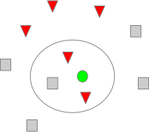
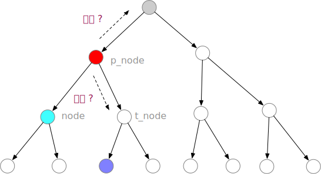
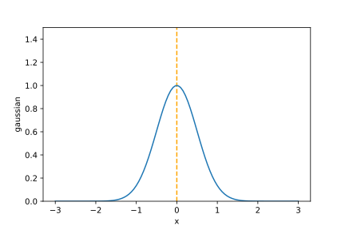

<!-- fit -->
# `K`-近邻法

---
# 主要内容

- `k`近邻
- 距离度量
- `kd`树
    - 生成
    - 搜索
- 决策规则

---


# 绿色圆点应属于哪一类？

---
# 0. 概述

- `k`近邻法(`k-nearest neighbor, k-NN`)是一种基本分类和回归方法(`Cover & Hart, 1968`)。

- `k`近邻法的输入为实例的特征向量，对应于特征空间的点，输出为实例的类别，可以取多类。

- 分类时，对新的实例，根据其`k`个最近邻的训练实例的类别，根据其`k`个最近邻的训练实例的类别，通过**多数表决等方式**进行预测。

- `k`近邻法不具显式的学习过程，`k`值的选择、距离度量以及分类决策规则是`k`近邻法的三要素。难点在于如何高效地定位到输入实例的`k`个最近邻居。

---
# 1. `k`近邻算法

**算法3.1（` k`近邻法）**
- 输入：训练数据集$T=\{(x_1, y_1), (x_2, y_2), ..., (x_N, y_N)\}$，其中$x_i\in\mathbf{x}\subset \mathbf{R^n}$为实例的特征向量，$y_i\in \mathbf{y}=\{c_1,c_2,...,c_K\}$为实例的类别，$i=1,2,...,N$；实例特征向量$x$；
- 输出：实例$x$的所属类$y$
- 算法过程
    - 根据给定的距离度量，在训练集$T$中找出与$x$最近邻的$k$个点，涵盖这$k$个点的$x$的近邻记作$N_K(x)$
    - 在$N_k(x)$中根据分类决策规则决定$x$类别$y=\mathrm{arg} \max_{c_j} \sum_{x_i\in N_k(x)} I(y_i=c_i),i=1,2,...,N;j=1,2,...,K$，上式中，$I$为指示函数，即当$y_i=c_j$时$I$为1，否则$I$为0.

---
# 2. 距离度量

- $L_p$距离
    设特征空间$\mathbf{X}$是n维实数向量空间$\mathbf{R^n}$，$x_i, x_j\in \mathbf{x}, x_i = (x^{(1)}_i,x^{(2)}_i,...,x^{(n)}_i)^T,x_j=(x_j^{(1)}, x_j^{(2)},... ,x_j^{(n)})^T,x_i,x_j$的$L_p$距离定义为
    $$
    L_p(x_i,x_j)=\left(\sum_{l=1}^n|x_i^{(l)}-x_j^{(l)}|^p\right)^{\frac{1}{p}}
    $$
    这里$p\ge 1$。

---
# 2. 距离度量
- 当$p=2$时，称为欧式距离(`Euclidean distance`)，即
$$
L_2(x_i,x_j)=\left(\sum_{l=1}^n|x_i^{(l)}-x_j^{(l)}|^2\right)^{\frac{1}{2}}
$$

- 当$p=1$时，称为曼哈顿距离(`Manhattan distance`)，即
$$
L_1(x_i,x_j)=\left(\sum_{l=1}^n|x_i^{(l)}-x_j^{(l)}|\right)
$$

- 当$p=\infty$时，它是各个坐标距离的最大值，即
$$
L_{\infty}(x_i,x_j)=\max_l|x_i^{(l)}-x_j^{(l)}|
$$

---
# 2. 距离度量
```python
import numpy as np
import pandas as pd
import networkx as nx
import time

def distance(xi, xj, p=2):
    if np.isinf(p):
        return np.max(np.abs(xi - xj))
        
    return np.sum((np.abs(xi - xj))**p)**(1/p)

euclidean_dist = lambda x: distance(x[0], x[1], p=2)
manhattan_dist = lambda x: distance(x[0], x[1], p=1)

```

---
# 如何确定距给定点`x`最近的`k`个最近邻结点？

- 方法1：逐一计算待预测实例与训练数据集之间的特征距离，然后取距离最近的k近邻，在此基础上预测

    ```python
    def brute_force_knn(x, X, k):
        dist_list = []
        for i in range(len(X)):
            dist_list.append([distance(X[i], x), i])

        top_k = sorted(dist_list)[:k]
        return top_k
    ```
    > 缺点?

- 方法2：基于训练集构建一定的存储结构(如`kd tree`和`ball tree`)，然后快速确定待预测实例的k个最近邻，在此基础上进行预测


---
# 3. `kd`树

- `kd`树是一种对`k`维空间中的实例点进行存储以便对其进行快速检索的树型数据结构。`kd`树是二叉树，表示对`k`维空间的一个划分。构造`kd`树相当于不断地用垂直于坐标轴的超平面将`k`维空间切分，构成一系列的k维超矩形区域。

- `kd`树的每一个结点对应于一个k维矩形区域。

- 注意，`kd`树是存储`k`维空间数据的树结构，这里的`k`与`k`近邻中的的k意义不同。通常，依次选择坐标轴对空间划分，选择训练实例点在选定**坐标轴上的中位数**为切分点，这样得到的`kd`树是平衡的。


---
# 3. `kd`树: 构造算法
**算法3.2（构造平衡`kd`数）**
- 输入：k维空间数据集$T=\{(x_1, y_1), (x_2, y_2), ..., (x_N, y_N)\}$，其中$x_i = (x^{(1)}_i,x^{(2)}_i,...,x^{(n)}_i)^T,i=1,2,...,N$
- 输出：`kd`平衡树
- 算法过程：
    - 开始：构造根结点，根结点对应于包含`T`的`k`维空间的超矩形区域。选择以$x^{(1)}$为坐标轴，以T中所有实例的$x^{(1)}$坐标的*中位数*为切分点，将根结点对应的超矩形区域切分成两个子区域。切分由通过切分点并与坐标轴$x^{(1)}$垂直的超平面实现。由根结点生成深度为1的左右子结点：左子区域对应$x^{(1)}$小于切分点的子区域，右子区域对应$x^{(1)}$大于切分点的子区域。将落在切分超平面上的实例点保存在根结点。

---
# 3. `kd`树: 构造算法
**算法3.2（构造平衡`kd`树）**
- 算法过程（续）：
    - 重复：对深度为`j`的结点，选择$x^{(l)}$为切分的坐标轴，$l=(j\ \text{mod}\ k) + 1$，以该节点的区域所有实例的$x^{(1)}$坐标的中位数为切分点，将该结点对应的超矩形区域切分为两个子区域。切分由通过切分点并与坐标轴$x^{(j)}$垂直的超平面实现。由根结点生成深度为$j+1$的左右子结点：左子区域对应$x^{(l)}$小于切分点的子区域，右子区域对应$x^{(l)}$大于切分点的子区域。将落在切分超平面上的实例点保存在该结点。
    - 直到两个区域没有实例存在时停止。从而形成`kd`树的区域划分。

---
# 3. `kd`树: 构造算法

## 举例1

---
# 3. `kd`树

## 算法3.2中存在的实现问题：
- 如果使用中位数作为切分点，非叶结点上可能没有数据，如何处理？
- 多个数据保留在非叶结点上，如何处理？
- 倒数第二层只有2个结点，继续分时缺少右子结点，如何继续往下分？


---
# 3. `kd`树

## 如何编程实现？

- 如何表示树结构？
    - 结点
    - 结点之间的指向关系

- 结点如何生长？
    - 如果结点对应数据个数不大于1，则停止增长
    - 如果结点对应数据个数大于1，则继续生成两个后代结点
        - 按照指定维度的数据切分为两部分，下分给两个后代节点

---
# 3. `kd`树：如何表示树结构？

- 方法1：基于字典
- 方法2：构建`tree`类
- 方法3：基于`networkx`的[DiGraph](https://networkx.github.io/documentation/stable/reference/classes/digraph.html#networkx.DiGraph)类

---
# 3. `kd`树：基于递归生成`kd`树

- 辅助函数`generate_node_id`：用于生成唯一的结点编号

    ```python
    def generate_node_id(start=0, step=1):
        '''
        用于生成结点编号
        '''
        node_id = start
        while True:
            yield node_id
            node_id += step
    ```

---
# 3. `kd`树：基于递归生成`kd`树
- 主函数`gen_kdTree_recur`: 用于生成kd树
    ```python
    def gen_kdTree_recur(X, y, k, dim, node_id=0, kd_tree=nx.DiGraph()):
        '''
        X: ndarray, y: ndarray, k: 实例的维度, dim: 当前结点所处的维度, node_id: 当前结点的编号
        '''
        if node_id == 0:  # 根结点
            kd_tree.add_node(node_id)
        if y.size >= 2:  # 如果有两个以上的结点，继续往下分
            x_dim = X[:, dim]  # 取当前维度数据
            next_dim = (dim + 1) % k  # 获取下一代结点数据的切分维度
            s_indices = np.argsort(x_dim)  # 获取按x_dim由小到大排序的各特征索引
            m = len(s_indices) // 2  # 中间或中间靠左的索引
            l_indices = s_indices[:m]  # 左子区域索引
            m_idx = s_indices[m]  # 留在结点上的数据索引
            r_indices = s_indices[m + 1:]  # 右子区域索引
            l_X, l_y = X[l_indices], y[l_indices]
            r_X, r_y = X[r_indices], y[r_indices]
            ...
    ```

---
# 3. `kd`树：基于递归生成`kd`树
```python
        ...
        l_node_id = next(nodeId_gen)  # 获取下一个结点编号
        r_node_id = next(nodeId_gen)
        # 添加当前结点到子节点的连边
        kd_tree.add_edges_from([(node_id, l_node_id), (node_id, r_node_id)]) 
        kd_tree.nodes[node_id]["l_succ"] = l_node_id
        kd_tree.nodes[node_id]["r_succ"] = r_node_id
        kd_tree.nodes[node_id]["point"] = (X[m_idx], y[m_idx])  # 当前结点上的数据
        kd_tree = gen_kdTree_recur(l_X, l_y, k, next_dim, l_node_id, kd_tree)  # 递归左子结点
        kd_tree = gen_kdTree_recur(r_X, r_y, k, next_dim, r_node_id, kd_tree)  # 递归左子结点
    else:  # 如果少于2个结点，则将当前结点设为叶结点
        kd_tree.nodes[node_id]['node_type'] = 'leaf'
        if y.size == 1:
            kd_tree.nodes[node_id]["dim"] = dim  # 结点的继续切分维度
            kd_tree.nodes[node_id]["point"] = (X[0], y[0])
        else:
            p_node_id = list(kd_tree.predecessors(node_id))[0]
            # 有些叶结点可能没有数据，为了简化接下来的搜索程序，该结点取父结点的数据
            kd_tree.nodes[node_id]["dim"] = kd_tree.nodes[p_node_id]["dim"]
            kd_tree.nodes[node_id]["point"] = kd_tree.nodes[p_node_id]["point"]

    return kd_tree
```

---
# 3. `kd`树：基于递归生成`kd`树
- 示例:
    ```python
    # 示例
    X = np.random.randint(low=0, high=100, size=(10000, 6))
    y = np.ones(X.shape[0], dtype=np.int)
    y[np.random.rand(y.size) < 0.5] = 0
    dim = 0
    nodeId_gen = generate_node_id(start=0)  # 用于生成结点编号
    root_nodeId = next(nodeId_gen)
    tree = gen_kdTree_recur(X, y, k=X.shape[1], dim=0, node_id=root_nodeId, kd_tree=nx.DiGraph())
    ```

---
# 3. `kd`树：基于循环生成`kd`树
```python
def generate_kd_tree(X, y):
    '''
    X: ndarray
    y: ndarray
    '''
    k = X.shape[1]  # X的维度k
    kd_tree = nx.DiGraph()
    node_id = 0
    no_tag_nodes = [node_id]
    kd_tree.add_node(node_id)
    kd_tree.nodes[node_id]["X"] = X
    kd_tree.nodes[node_id]["y"] = y
    kd_tree.nodes[node_id]["node_type"] = 'root'
    i = 0
    while no_tag_nodes:
        new_nodes = []
        dim = i % k  # 当前的维度
        for node in no_tag_nodes:
            c_X = kd_tree.nodes[node]["X"]
            c_y = kd_tree.nodes[node]["y"]
            x_dim = c_X[:, dim]
            ...
```

---
# 3. `kd`树：基于循环生成`kd`树
```python
            if len(x_dim) >= 2:  # 如果有2个以上样本，则继续分
                kd_tree.nodes[node]["dim"] = dim  # 结点的切分维度
                s_indices = np.argsort(x_dim)
                m = len(s_indices)//2  # 中间的索引
                l_indices = s_indices[:m]  # 左子区域
                m_idx = s_indices[m]  # 留在结点上
                r_indices = s_indices[m + 1: ]  # 右子区域
                l_X, l_y = c_X[l_indices], c_y[l_indices]
                r_X, r_y = c_X[r_indices], c_y[r_indices]
                
                # 左子结点
                node_id += 1
                kd_tree.add_edge(node, node_id)
                kd_tree.nodes[node_id]["X"] = l_X
                kd_tree.nodes[node_id]["y"] = l_y
                kd_tree.nodes[node_id]['node_type'] = 'non_leaf'
                kd_tree.nodes[node]["l_succ"] = node_id
                new_nodes.append(node_id)
                
                # 右子结点
                node_id += 1
                kd_tree.add_edge(node, node_id)
                kd_tree.nodes[node_id]['node_type'] = 'non_leaf'
                new_nodes.append(node_id)
                kd_tree.nodes[node_id]["X"] = r_X
                kd_tree.nodes[node_id]["y"] = r_y
                kd_tree.nodes[node]["r_succ"] = node_id                    
                
                # 结点node上的数据
                kd_tree.nodes[node]["point"] = (c_X[m_idx], c_y[m_idx])
                ...
```

---
# 3. `kd`树：基于循环生成`kd`树
```python
            else:
                kd_tree.nodes[node]['node_type'] = 'leaf'
                if len(x_dim) == 1:
                    kd_tree.nodes[node]["point"] = (c_X[0], c_y[0])
                    kd_tree.nodes[node]["dim"] = dim  # 结点的切分维度
                else:  # 若不存在数据
                    p_node = list(kd_tree.predecessors(node))[0]
                    kd_tree.nodes[node]["point"] = kd_tree.nodes[p_node]["point"]  # 设为父结点的数据
                    kd_tree.nodes[node]["dim"] = kd_tree.nodes[p_node]["dim"]
            
        i += 1
        no_tag_nodes = new_nodes
        
    return kd_tree

```

---
# 3. `kd`树：基于循环生成`kd`树

- 注意，在以上算法实现中，并非是一个数据对应一个结点。如果在倒数第二层结点对应数据集中只包含2个数据点，则对应只有一个儿子叶结点。
- 此时，有两种处理方式：
  - 只生成一个儿子叶结点
  - 生成两个儿子叶结点，其中一个保存对应数据，另一个不保存数据，回指向其父结点（或者直接复制保存父结点数据）
- 以上处理方式均可，对应生成的`kd`树略有差异，在进行`kd`树搜索时需要考虑在内

---
# 课堂练习1

- 以上算法实现实践了《统计学习方法》一书中的特征维度选择办法。另一种特征维度选择办法为：计算当前节点数据集每一个特征维度的方差，选择方差最大的维度作为当前节点继续划分的维度。请完成基于该特征选择方法的`kd`树生成算法。

---
# 4. `kd`树: 基于`kd`树搜索`k`个近邻

## `k`值的选择
- 如果选择较小的`k`值
    - 学习的近似误差（*对训练集的预测误差*）会减小，但学习的估计误差（*对预测集的预测误差*）会增大
    - 噪声敏感
    - `k`值的减小意味着整体模型变得复杂，容易发生过拟合
- 如果选择较大的`k`值
    - 学习的估计误差减小，但学习的近似误差会增大
    - k值的增大意味着整体的模型变得简单

---
# 4. `kd`树: 基于`kd`树搜索`k`个近邻

## 举例2
- 判断是否为最近邻点
- 判断下一个搜索点

---


---
# 4. `kd`树: 基于kd树搜索k个近邻

**算法3.3 （基于`kd`树的`k`最优近邻搜索）**

- 输入: 已构造的`kd`树，目标点`x`，邻居数量`k`
- 输出: x的k个最近邻`k_list`
- 算法过程
    - (1)在`kd`树中找到包含目标点`x`的**某一**叶结点：
        - 从根节点出发，递归地向下访问`kd`树：如果目标点x当前维的坐标小于等于切分点的坐标，则移动到左子结点；否则移动到右子结点，直到子结点为叶结点为止；
        - 令叶结点为当前结点`node`；


---
# 4. `kd`树: 基于kd树搜索k个近邻

**算法3.3 （基于`kd`树的`k`最优近邻搜索）**
- 算法过程
  - (2)进行以下循环
    - (2.1)计算`node`至`x`的距离`dist_node_x`，将`node`保存至回退历史列表`trace_list`，按以下规则判断是否将`node`添加至`k_list`：
        - 若 **`k_list`中的元素个数小于`k`** ，直接将`(dist_node_x, node)`保存至`k_list`，对`k_list`按距离从小到大排序；
        - 否则，若 **`dist_node_x`小于`k_list`的最大距离** ，则`(dist_node_x, node)`替换`k_list`的距离最大一个点，重新对`k_list`按距离从小到大排序；

---
# 4. `kd`树: 基于`kd`树搜索`k`个近邻

**算法3.3 （基于`kd`树的`k`最优近邻搜索）续**
- 算法过程
    - (2)进行以下循环
        - (2.2)如果`node`是根结点，则终止循环，跳转至(3); 
        - (2.3)确定下一轮要计算距离的点
            - 获取`node`的父结点`p_node`；
            - 如果`p_node`不属于`trace_list`，则将`p_node`添加至`trace_list`，并计算`x`到`p_node`所在切割面的距离`dist_x_div`，判断是否遍历`p_node`的另一分支:
                

---
# 4. `kd`树: 基于`kd`树搜索`k`个近邻

**算法3.3 （基于`kd`树的`k`最优近邻搜索）续**
- 算法过程
  - (2)进行以下循环
    - (2.3)确定下一轮要计算距离的点
      - 如果`p_node`不属于`trace_list`...
        - 如果 **`k_list`中的元素个数小于`k`** 或者 **`dist_x_div`小于`k_list`的最大距离**，则遍历`p_node`的另一分支，得到该分支距离`x`最近的叶结点，并将其置为`node`；
            - 否则，`node := p_node`;
        - 否则，`node := p_node`;
  - (3)返回`k_list`


---
# 4. `kd`树: 基于`kd`树搜索`k`个近邻
- 返回由node作为根结点的距`x`最近的叶结点
```python
def search_kd_tree(x, node, kd_tree):
    '''
    搜索node在哪个区域(叶结点)
    '''
    if kd_tree.nodes[node]['node_type'] != 'leaf':
        dim = kd_tree.nodes[node]['dim']
        median = kd_tree.nodes[node]["point"][0][dim]
        if x[dim] <= median:  # 如果刚好处在内部结点所在的切割面上，则往左子节点走
            return search_kd_tree(x, kd_tree.nodes[node]['l_succ'], kd_tree)
        else:  # 右子结点
            return search_kd_tree(x, kd_tree.nodes[node]['r_succ'], kd_tree)
    else:
        return node
```

---
# 4. `kd`树: 基于`kd`树搜索`k`个近邻
- 从叶结点回退，寻找距离`x`最近的`k`个近邻
    ```python
    def find_k_neighbors(x, k, kd_tree):
        '''
		x: 目标点
		k: 近邻数量
		k_list保存离x最近的k个点, trace_list保存回退比较历史
		'''
        k_list, trace_list = [], []
		# (1) 在kd树中找到包含目标点x的某一叶结点
		node = search_kd_tree(x, 0, kd_tree)
		# (2) 循环
		while True:
			# (2.1)
			if node not in trace_list:  # 将node添加到回退列表
				trace_list.append(node)
        ...
    ```

---
# 4. `kd`树: 基于`kd`树搜索`k`个近邻
- 从叶结点回退，寻找距离`x`最近的`k`个近邻（续）
	```python
		...
		node_x = kd_tree.nodes[node]['point'][0]  # 结点保存的数据特征x
		dist_node_x = distance(x, node_x)  # x到node的距离
		if (len(k_list) < k or dist_node_x < k_list[-1][0]) //
		and kd_tree.nodes[node]['y'].size > 0:
			k_list.append([dist_node_x, node])
			k_list = sorted(k_list, key=lambda x: x[0])[:k]
		
		# (2.2) 如果node是根结点，则终止循环
		if kd_tree.nodes[node]['node_type'] == 'root':
			break
		...
	```

---
# 4. `kd`树: 基于`kd`树搜索`k`个近邻
- 从叶结点回退，寻找距离`x`最近的`k`个近邻（续）
	```python
		...
		# (2.3) 获取下一个需要遍历的点
		p_node = list(kd_tree.predecessors(node))[0]
		if p_node not in trace_list:
			trace_list.append(p_node)
			dim = kd_tree.nodes[p_node]['dim']
			pnode_x = kd_tree.nodes[p_node]['point'][0]
			dist_div_x = np.abs(pnode_x[dim] - x[dim])
			if len(k_list) < k or dist_div_x < k_list[-1][0]:
				t_node = [i for i in kd_tree.successors(p_node) 
				if i not in trace_list][0]
				node = search_kd_tree(x, t_node, kd_tree)
			else:
				node = p_node
		else:
			node = p_node
	# (3) 返回k_list
	return k_list
	```

---
# 5. `kd`树: 决策规则

- `k`近邻法中的分类决策规则往往是多数表决，即由输入实例的`k`个近邻的训练实例中的多数类决定新输入实例的类。

- 多数表决规则有如下解释：如果分类的损失函数为0-1损失函数，分类函数为
    $$
    f: \mathbf{R^n} \rightarrow \{c_1,c_2,...,c_K\}
    $$
    那么误分类的概率是
    $$
    P(Y\neq f(X))=1-P(Y=f(X))
    $$

---
# 5. `kd`树: 决策规则

- 对于给定的实例$x\in \chi$，其最近邻的k个训练实例点构成集合$N_k(x)$。如果涵盖$N_k(x)$的区域的类别是$c_j$，那么误分类率是
    $$
    \frac{1}{k}\sum_{x_i\in N_k(x)}I(y_i\neq c_j)=1-\frac{1}{k}\sum_{x_i\in N_k(x)}I(y_i=c_j)
    $$
    要使误分类率最小即经验风险最小，就要使$\sum_{x_i\in N_k(x)}I(y_i=c_j)$最大，所以多数表决规则等价于经验风险最小化。

---
# 5. `kd`树: 决策规则

- 近邻影响的加权。 在得到距离`x`的k个最近邻后，可以根据最近邻与`x`之间的距离进行加权。由于权重与距离呈反比，因此根据一定规则由距离计算出各邻居点的权重。
- 一种方法: 使用高斯密度函数生成结点的权重
    $$
    f(x)=a\cdot e^{-\frac{(x-b)^2}{2c^2}}
    $$
    ```python
    # 生成未标准化的权重
    def gaussian(dist, a=1, b=0, c=0.5):
        return a * np.exp(-(dist - b)**2/(2*c**2))
    ```

---
# 5. `kd`树: 决策规则
- 结点权重的计算步骤:
    - 根据距离计算出未标准化的权重
    - 对未标准化的权重进行标准化
    - 分类时，根据各近邻点的类别分类，然后加总其权重，取加总权重最大值对应的类别作为目标特征的预测类别
    - 回归时，对各近邻点的标签值按权重进行加权平均，作为目标特征的预测标签值


---
# 5. `kd`树: 决策规则
- 分类
    ```python
    def majority_vote(x, k_list, kd_tree, weight=False):
        y_dict = {}
        dist_list = [k[0] for k in k_list]
        if weight:
            weight_list = [gaussian(x) for x in dist_list]
            weight_list = [x/np.sum(weight_list) for x in weight_list]
        else:
            weight_list = np.ones_like(dist_list)
            
        for i, (_, node) in enumerate(k_list):
            y = kd_tree.nodes[node]['point'][1]
            y_dict[y] = y_dict.get(y, 0) + weight_list[i]
        
        return sorted(list(y_dict.items()), key=lambda x: x[1])[-1][0]
    ```

---
# 5. `kd`树: 决策规则
- 回归
    取`k`近邻对应y的平均值为输入实例的预测值
    $$
    \hat{y} = \sum_{x_i\in N_k(x)}y_i\cdot w_i
    $$
    其中，$w_i$为近邻i对应的标准化权重值，$y_i$为近邻i对应的标签值。

---
# 5. `kd`树: 决策规则
- 回归

    ```python
    def average_k_nn(x, k_list, kd_tree, weight=False):
        y_list = []
        dist_list = []
        for dist, node in k_list:
            y = kd_tree.nodes[node]['point'][1]
            y_list.append(y)
            dist_list.append(dist)
        
        if weight:
            weight_list = [gaussian(x) for x in dist_list]
            weight_list = [x / np.sum(weight_list) for x in weight_list]
        else:
            weight_list = np.ones_like(weight_list)
            
        pred_y = np.average(y_list, weights=weight_list)
        
        return pred_y
    ```

---
# 6. `kd`树应用

- 身高预测

- 鸢尾花

---
# 7. knn算法特点

- 优点
    - 精度高
    - 对异常值不敏感
    - 无数据输入假定
- 缺点
    - 计算复杂度高
    - 空间复杂度高


