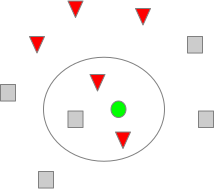
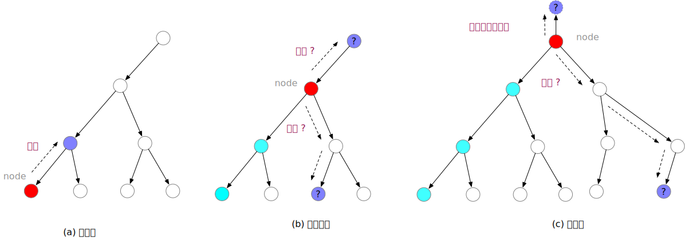

# 主要内容

- `k`近邻算法
- 距离度量
- `kd`树
    - 生成
    - 搜索
- 决策规则


---


# 绿色圆点应属于哪一类？

---
# k近邻法

- k近邻法(`k-nearest neighbor, k-NN`)是一种基本分类和回归方法(`Cover & Hart, 1968`)。

- k近邻法的输入为实例的特征向量，对应于特征空间的点，输出为实例的类别，可以取多类。

- 分类时，对新的实例，根据其k个最近邻的训练实例的类别，根据其k个最近邻的训练实例的类别，通过**多数表决等方式**进行预测。

- k近邻法不具显式的学习过程，k值的选择、距离度量以及分类决策规则是k近邻法的三要素。难点在于如何高效地定位到输入实例的k个最近邻居。

---
# 1. `k`近邻算法

**算法3.1（k近邻法）**
- 输入：训练数据集$T=\{(x_1, y_1), (x_2, y_2), ..., (x_N, y_N)\}$，其中$x_i\in\mathbf{x}\subset \mathbf{R^n}$为实例的特征向量，$y_i\in \mathbf{y}=\{c_1,c_2,...,c_K\}$为实例的类别，$i=1,2,...,N$；实例特征向量$x$；
- 输出：实例$x$的所属类$y$
- 算法过程
    - 根据给定的距离度量，在训练集$T$中找出与$x$最近邻的$k$个点，涵盖这$k$个点的$x$的近邻记作$N_K(x)$
    - 在$N_k(x)$中根据分类决策规则决定$x$类别$y=\mathrm{arg} \max_{c_j} \sum_{x_i\in N_k(x)} I(y_i=c_i),i=1,2,...,N;j=1,2,...,K$，上式中，$I$为指示函数，即当$y_i=c_j$时$I$为1，否则$I$为0.

---
# 2. 距离度量

- $L_p$距离

设特征空间$\mathbf{X}$是n维实数向量空间$\mathbf{R^n}$，$x_i, x_j\in \mathbf{x}, x_i = (x^{(1)}_i,x^{(2)}_i,...,x^{(n)}_i)^T,x_j=(x_j^{(1)}, x_j^{(2)},... ,x_j^{(n)})^T,x_i,x_j$的$L_p$距离定义为
$$
L_p(x_i,x_j)=\left(\sum_{l=1}^n|x_i^{(l)}-x_j^{(l)}|^p\right)^{\frac{1}{p}}
$$
这里$p\ge 1$。

---
# 2. 距离度量
当$p=2$时，称为欧式距离(`Euclidean distance`)，即
$$
L_2(x_i,x_j)=\left(\sum_{l=1}^n|x_i^{(l)}-x_j^{(l)}|^2\right)^{\frac{1}{2}}
$$

当$p=1$时，称为曼哈顿距离(`Manhattan distance`)，即
$$
L_1(x_i,x_j)=\left(\sum_{l=1}^n|x_i^{(l)}-x_j^{(l)}|\right)
$$

当$p=\infty$时，它是各个坐标距离的最大值，即
$$
L_{\infty}(x_i,x_j)=\max_l|x_i^{(l)}-x_j^{(l)}|
$$

---
# 2. 距离度量
```python
import numpy as np
import pandas as pd
import networkx as nx
import time

def distance(xi, xj, p=2):
    if np.isinf(p):
        return np.max(np.abs(xi - xj))
    else:
        return np.sum((np.abs(xi - xj))**p)**(1/p)

euclidean_dist = lambda x: distance(x[0], x[1], p=2)
manhattan_dist = lambda x: distance(x[0], x[1], p=2)

```

---
# 如何确定距给定点`x`最近的`k`个最近邻结点？

- 方法1：逐一计算待预测实例与训练数据集之间的特征距离，然后取距离最近的k近邻，在此基础上预测

```python
def line_search_knn(x, X, k):
    dist_list = []
    for i in range(len(X)):
        dist_list.append([distance(X[i], x), i])

    top_k = sorted(dist_list)[:k]
    return top_k
```

- 方法2：通过利用基于训练集构建的`kd`树，快速确定待预测实例的k个最近邻，在此基础上预测


---
# 3. `kd`树

- `kd`树是一种对`k`维空间中的实例点进行存储以便对其进行快速检索的树型数据结构。`kd`树是二叉树，表示对`k`维空间的一个划分。构造`kd`树相当于不断地用垂直于坐标轴的超平面将`k`维空间切分，构成一系列的k维超矩形区域。

- `kd`树的每一个结点对应于一个k维矩形区域。

- 注意，`kd`树是存储`k`维空间数据的树结构，这里的`k`与`k`近邻中的的k意义不同。通常，依次选择坐标轴对空间划分，选择训练实例点在选定坐标轴上的中位数为切分点，这样得到的`kd`树是平衡的。


---
# 3. `kd`树: 构造算法
**算法3.2（构造平衡`kd`数）**
- 输入：k维空间数据集$T=\{(x_1, y_1), (x_2, y_2), ..., (x_N, y_N)\}$，其中$x_i = (x^{(1)}_i,x^{(2)}_i,...,x^{(n)}_i)^T,i=1,2,...,N$
- 输出：kd平衡树
- 算法过程：
    - 开始：构造根结点，根结点对应于包含T的k维空间的超矩形区域。选择以$x^{(1)}$为坐标轴，以T中所有实例的$x^{(1)}$坐标的*中位数*为切分点，将根结点对应的超矩形区域切分成两个子区域。切分由通过切分点并与坐标轴$x^{(1)}$垂直的超平面实现。由根结点生成深度为1的左右子结点：左子区域对应$x^{(1)}$小于切分点的子区域，右子区域对应$x^{(1)}$大于切分点的子区域。将落在切分超平面上的实例点保存在根结点。

---
# 3. `kd`树: 构造算法
**算法3.2（构造平衡`kd`数）**
- 算法过程（续）：
    - 重复：对深度为j的结点，选择$x^{(l)}$为切分的坐标轴，$l=(j\ \text{mod}\ k) + 1$，以该节点的区域所有实例的$x^{(1)}$坐标的中位数为切分点，将该结点对应的超矩形区域切分为两个子区域。切分由通过切分点并与坐标轴$x^{(j)}$垂直的超平面实现。由根结点生成深度为$j+1$的左右子结点：左子区域对应$x^{(l)}$小于切分点的子区域，右子区域对应$x^{(l)}$大于切分点的子区域。将落在切分超平面上的实例点保存在该结点。
    - 直到两个区域没有实例存在时停止。从而形成`kd`树的区域划分。

---
# 3. `kd`树: 划分实例

---
# 3. `kd`树

## 算法3.2中存在的实现问题：
- 如果使用中位数作为切分点，非叶结点上可能没有数据，如何处理？
- 多个数据保留在非叶结点上，如何处理？
- 倒数第二层只有2个结点，继续分时缺少右子结点，如何继续往下分？


---
# 3. `kd`树

## 如何编程实现？

- 如何表示树结构？
    - 结点
    - 结点之间的指向关系

- 结点如何生长？
    - 如果结点对应数据个数不大于1，则停止增长
    - 如果结点对应数据个数大于1，则继续生成两个后代结点
        - 按照指定维度的数据切分为两部分，下分给两个后代节点

---
# 3. `kd`树：如何表示树结构？

- 方法1：基于字典
- 方法2：自己构建class
- 方法3：基于`networkx`的[DiGraph](https://networkx.github.io/documentation/stable/reference/classes/digraph.html#networkx.DiGraph)类

---
# 3. `kd`树：基于递归生成`kd`树

- 辅助函数`generate_node_id`：用于生成唯一的结点编号

```python
def generate_node_id(start=0, step=1):
    '''
    用于生成结点编号
    '''
    node_id = start
    while True:
        yield node_id
        node_id += step
```

---
# 3. `kd`树：基于递归生成`kd`树
- 主函数`gen_kdTree_recur`: 用于生成kd树
```python
def gen_kdTree_recur(X, y, k, dim, node_id=0, kd_tree=nx.DiGraph()):
    '''
    X: ndarray, y: ndarray, k: 实例的维度
    dim: 当前结点所处的维度, node_id: 当前结点的编号
    '''
    if node_id == 0:  # 根结点
        kd_tree.add_node(node_id)
    if y.size >= 2:  # 如果有两个以上的结点，继续往下分
        x_dim = X[:, dim]  # 取当前维度数据
        next_dim = (dim + 1) % k  # 获取下一代结点数据的切分维度
        s_indices = np.argsort(x_dim)  # 获取按x_dim由小到大排序的各特征索引
        m = len(s_indices) // 2  # 中间或中间靠左的索引
        l_indices = s_indices[:m]  # 左子区域索引
        m_idx = s_indices[m]  # 留在结点上的数据索引
        r_indices = s_indices[m + 1:]  # 右子区域索引
        l_X, l_y = X[l_indices], y[l_indices]
        r_X, r_y = X[r_indices], y[r_indices]
        ...
```

---
# 3. `kd`树：基于递归生成`kd`树
- 主函数`gen_kdTree_recur`: 用于生成kd树(续)
```python
        ...
        l_node_id = next(nodeId_gen)  # 获取下一个结点编号
        r_node_id = next(nodeId_gen)
        # 添加当前结点到子节点的连边
        kd_tree.add_edges_from([(node_id, l_node_id), (node_id, r_node_id)]) 
        kd_tree.nodes[node_id]["l_succ"] = l_node_id
        kd_tree.nodes[node_id]["r_succ"] = r_node_id
        kd_tree.nodes[node_id]["point"] = (X[m_idx], y[m_idx])  # 当前结点上的数据
        kd_tree = gen_kdTree_recur(l_X, l_y, k, next_dim, l_node_id, kd_tree)  # 递归左子结点
        kd_tree = gen_kdTree_recur(r_X, r_y, k, next_dim, r_node_id, kd_tree)  # 递归左子结点
    else:  # 如果少于2个结点，则将当前结点设为叶结点
        kd_tree.nodes[node_id]['node_type'] = 'leaf'
        p_node_id = list(kd_tree.predecessors(node_id))[0]
        # 有些叶结点可能没有数据，为了简化接下来的搜索程序，该结点取父结点的数据
        kd_tree.nodes[node_id]["point"] = (X[0], y[0]) if y.size == 1 else kd_tree.nodes[p_node_id]["point"]

    return kd_tree
```

---
# 3. `kd`树：基于递归生成`kd`树
- 示例:
```python
# 示例
X = np.random.randint(low=0, high=100, size=(10000, 6))
y = np.ones(X.shape[0], dtype=np.int)
y[np.random.rand(y.size) < 0.5] = 0
dim = 0
nodeId_gen = generate_node_id(start=0)  # 用于生成结点编号
root_nodeId = next(nodeId_gen)
tree = gen_kdTree_recur(X, y, k=X.shape[1], dim=0, node_id=root_nodeId, kd_tree=nx.DiGraph())
```

---
# 3. `kd`树：基于循环生成`kd`树

---
# 4. `kd`树: 基于kd树搜索k个近邻

**算法3.3 （基于kd树的k最优近邻搜索）**

- 输入: 已构造的`kd`树，目标点`x`，邻居数量`k`
- 输出: x的k个最近邻`k_list`
- 算法过程
    - (1)在`kd`树中找到包含目标点`x`的**某一**叶结点：
        - 从根节点出发，递归地向下访问`kd`树：如果目标点x当前维的坐标小于等于切分点的坐标，则移动到左子结点；否则移动到右子结点，直到子结点为叶结点为止；
        - 令叶结点为当前结点`node`；
    - (2)计算`node`至`x`的距离，并将`node`保存至回退历史列表`back_list`，将`(dist(node, x), node)`保存至`k_list`;

---
# 4. `kd`树: 基于kd树搜索k个近邻

**算法3.3 （基于kd树的k最优近邻搜索）**
- 算法过程
    - (3)如果`node`是根结点，则跳转至(4); 否则，进行以下循环
        - (3.1)获取`node`的父结点`p_node`;
        - (3.2)如果`p_node`不在`back_list`中，则将`p_node`添加至`back_list`，并计算x到`p_node`和`p_node`所在切割面的距离`dist_x_pnode`、`dist_x_div`；
            - (3.2.1)判断是否将`p_node`添加至`k_list`: 
                - 如果`k_list`中的元素个数小于k，则将`(dist_pnode_x, p_node)`保存至`k_list`，并对`k_list`按距离从小到大排序；
                - 否则，如果`dist_pnode_x`小于`k_list`的最大距离，则`(dist_pnode_x, p_node)`替换`k_list`的最后一个元素，对`k_list`按距离从小到大排序;

---
# 4. `kd`树: 基于kd树搜索k个近邻

**算法3.3 （基于kd树的k最优近邻搜索）**
- 算法过程
    - (3.2)
      - (3.2.2)判断是否遍历`p_node`的另一分支：
            - 如果`dist_x_div`小于`k_list`的最大距离，则遍历`p_node`的另一分支，得到其距离`x`最近的点，并将其设为下一轮需判断的结点`node`；并将`node`保存至回退历史列表`back_list`，计算`node`至`x`的距离`dist_node_x`，并根据(3.2.1)过程判断是否应将`node`添加至`k_list`;
            - 否则更新`node := p_node`;
      - (3.3)否则，更新`node := p_node`;
    - (4)返回`k_list`

---


# 回退或者下溯?
---
# 4. `kd`树: 基于kd树搜索k个近邻
- 确定由node作为根结点的距x最近的叶结点
```python
def search_kd_tree(x, node, kd_tree):
    '''
    搜索node在哪个区域(叶结点)
    '''
    if kd_tree.nodes[node]['node_type'] != 'leaf':
        dim = kd_tree.nodes[node]['dim']
        median = kd_tree.nodes[node]["point"][0][dim]
        if x[dim] <= median:  # 如果刚好处在内部结点所在的切割面上，则往左子节点走
            return search_kd_tree(x, kd_tree.nodes[node]['l_succ'], kd_tree)
        else:  # 右子结点
            return search_kd_tree(x, kd_tree.nodes[node]['r_succ'], kd_tree)
    else:
        return node
```

---
