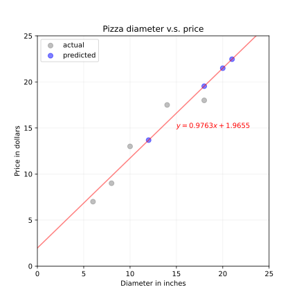

<!-- fit -->
# 第4章 线性模型

---
# 主要内容

- 线性回归模型
- 线性回归模型的参数学习
- `torch`实现
    - 梯度下降
    - 小批量梯度下降
    - `torch.nn.Module`

---
# 0.概述
- 线性回归输出是一个连续值，因此适用于回归问题。回归问题在实际中很常见，如预测房屋价格、气温、销售额等连续值的问题。

- 与回归问题不同，分类问题中模型的最终输出是一个离散值。我们所说的图像分类、垃圾邮件识别、疾病检测等输出为离散值的问题都属于分类问题的范畴。`logit`和`softmax`回归则适用于分类问题。

- 由于线性回归、`logit`回归和`softmax`回归都是单层神经网络，它们涉及的概念和技术同样适用于大多数的深度学习模型。我们首先以线性回归为例，介绍大多数深度学习模型的基本要素和表示方法。

---
# 0.概述
## 模型的基本形式

- 给定由$d$个属性描述的示例$\mathbf{x}=(x_1;x_2;...;x_d)$，其中$x_i$是$x$在第$i$个属性上的取值，线性模型试图学得通过属性的线性组合来进行预测的函数，即
    $$f(\mathbf{x})=\omega_1x_1 + \omega_2x_2+...+\omega_dx_d+b,$$
- 一般用向量形式写出
    $$f(\mathbf{x})=\mathbf{\omega^Tx}+b,$$
    其中$\mathbf{\omega}=(\omega_1;\omega_2;...;\omega_d)$. $\mathbf{\omega}$和b学得后，模型就确定了.

---
# 1.线性回归模型
`Galton(1886)`发现了父亲身高与儿子身高存在着某种给定的关系：子辈的平均身高是其父辈平均身高以及他们所处族群平均身高的加权平均和。这种**回归**现象称为：均值回归或者平庸回归（`reversion to the mean/reversion to mediocrity`）。因此，哪怕单看一组父亲和孩子的身高，两个人的身高可能差异很大，但是从整个人群上来看，父亲和孩子的身高分布应该是很相近的。

此外，这里所说的线性回归是指$f(x)$相对于系数$\omega, b$为线性，变量$X_j$ 可以是
- 数值变量
- 数值变量的转换，如`log`
- 数值变量的基扩展，例如$X_2=X_1^2,X_3=\sin(X_1)$
- 分组变量，用`one-hot`向量表示分组


---
# 1.线性回归模型




---
# 1.线性回归模型
- 给定数据集$D=\{(\mathbf{x_1},y_1),(\mathbf{x_2},y_2),...,(\mathbf{x_m},y_m)\}$，其中$\mathbf{x_i}=(x_{i1};x_{i2};...;x_{id}),y_i\in R$. 线性回归试图学得一个线性模型以尽可能准确地预测实数值输出标记. 我们试图学得
    $$f(\mathbf{x_i})=\mathbf{x_i}+b,使得f(x_i)\simeq y_i,$$
    这称为 **多元线性回归(`multivariate linear regression`)** .

- 可以利用最小二乘法对$\mathbf{\omega}$和b进行估计。假定增广参数向量$\mathbf{\hat \omega}=(\mathbf{\omega};b)$，相应地
    $$
    \mathbf{X} =
    \begin{pmatrix}
        x_{11} & x_{12} & ... & x_{1d} & 1 \\
        x_{21} & x_{22} & ... & x_{2d} & 1 \\
        ... \\
        x_{m1} & x_{m2} & ... & x_{md} & 1
    \end{pmatrix} = 
    \begin{pmatrix}
        \mathbf{x_1^T} & 1 \\
        \mathbf{x_2^T} & 1 \\
        ... \\
        \mathbf{x_m^T} & 1
    \end{pmatrix}, \mathbf{y}=
    \begin{pmatrix}
    y_1 \\
    y_2 \\
    ... \\
    y_m
    \end{pmatrix}=(y_1;y_2;...;y_m)
    $$

---
# 1.线性回归模型

## 学习准则1: 最小化总(均方)平方误差
- 如何确定$\mathbf{\hat\omega}$呢？关键在于衡量$f(\mathbf{x})$和$y$的差别。总平方误差是回归任务中最常用的性能衡量指标，因此我们可以试图让总平方误差最小化.
$$
\mathbf{\hat\omega^*}=\operatorname*{argmin}_{\mathbf{\hat\omega}}\mathbf{(y-X\hat\omega)^T(y-X\hat\omega)}.
$$

- 令$E_{\mathbf{\hat\omega}}=\mathbf{(y-X\hat\omega)^T(y-X\hat\omega)}$，对$\mathbf{\hat\omega}$求导可得
$$
\cfrac{\partial E_{\hat{w}}}{\partial \hat{w}}=2\mathbf{X}^T(\mathbf{X}\hat{w}-\mathbf{y}).
$$

- 令上式为`0`可得$\mathbf{\hat\omega}$最优解的封闭解。

---
# 1.线性回归模型
## 学习准则2: 最大化(对数)似然率
- 假定模型残差服从正态分布，$\epsilon\sim N(0,\sigma^2)$，即有$(y-xw^T)\sim N(0,\sigma^2)$
- 根据最大似然估计原则，建立优化目标
$$
\max_{\omega} \prod_{i=1}^N \frac{1}{\sqrt{2\pi}\sigma}\exp\left({-\frac{y_i-x_i\hat{w}^T}{2\sigma^2}}\right)
$$
- 化简后可得
$$
\max_{\omega}  \frac{1}{(\sqrt{2\pi}\sigma)^N}\exp{\left(-\frac{\sum_{i=1}^N(y_i-x_i\hat{w}^T)^2}{2\sigma^2}\right)}
$$
- 等价于最小二乘优化目标
$$
\min_{\omega}  \mathbf{(y-X\hat{w})(y-X\hat{w})^T}
$$


---
# 1.线性回归模型
- 当$\mathbf{X^T X}$为满秩矩阵或正定矩阵时，令$\cfrac{\partial E_{\hat{w}}}{\partial \hat{w}}=0$可得
$$
\mathbf{\hat\omega^*=(X^T X)^{-1}X^T y},
$$

其中$\mathbf{(X^T X)^{-1}}$是$\mathbf{X^T X}$的逆矩阵。令$\mathbf{\hat x_i} = (\mathbf{x_i}; 1)$，则最终学得的线性回归模型为
$$
f(\mathrm{\hat x_i})=\mathbf{\hat x_i^T(X^T X)^{-1}X^T y}.
$$

- 然而，现实任务中$\mathbf{X^T X}$往往不是满秩矩阵，而且随着数据量的增加，计算量呈现大幅增长。因此，往往求助于数值优化算法（如梯度下降）迭代求解。

---
# 1.线性回归模型

## 模型评价指标

- 决定系数：$R^2 = \mathrm{\frac{SST-SSR}{SST}}$
    - 回归平方和：$\mathrm{SSR}=\sum_{i=1}^{n}(y_i - f(x_i))^2$
    - 总平方和：$\mathrm{SST}=\sum_{i=1}^n(y_i-\bar{y})^2$


---
# 1.线性回归模型
## 训练方法
- 在求数值解的优化算法中，小批量随机梯度下降(`mini-batch stochastic gradient descent`)在深度学习中被广泛使用。

- 算法过程如下:
    - 先选取一组模型参数的初始值，如随机选取;
    - 接下来对参数进行多次迭代，使每次迭代都可能降低损失函数的值。

    > **批量梯度下降法**和**随机梯度下降**可以看作是**小批量随机梯度下降法**的特殊形式，批量梯度下降法使用所有的样本更新参数，随机梯度下降使用1个样本更新参数，小批量随机梯度下降法选择1个小样本更新参数

---
# 1.线性回归模型
## 线性模型

```python
def linearModel(X: torch.tensor, w: torch.tensor)-> torch.tensor:
    """
    X: N*a, N为样本数量，a为（增广）特征维度
    w: a*1
    """
    return X@w.reshape(-1, 1)
```

---
# 1.线性回归模型
## 损失函数
```python
def meanSquaredLoss(X: torch.tensor, y: torch.tensor, w: torch.tensor) -> torch.tensor:
    """
    X: N*a, N为样本数量，a为（增广）特征维度
    y: N, 标签
    w: a*1
    """
    hat_y = X @ w.reshape(-1, 1)
    sLoss = torch.dot(hat_y.reshape(-1) - y.reshape(-1), hat_y.reshape(-1) - y.reshape(-1))
    return sLoss / y.numel()
```

---
# 1.线性回归模型
## 正则化：在实际回归任务中，为了防止过拟合，以上损失函数也可以加入对参数的惩罚。
- `L1: Lasso regression`
    $$
    \min \frac{1}{2}(y-X\hat{w})(y-X\hat{w})^T+\frac{1}{2}\lambda \sum_{i=1}^d|w_i|
    $$
    等价于
    $$
    \min \frac{1}{2}(y-X\hat{w})(y-X\hat{w})^T \\
    \text{s.t.  } \sum_{i=1}^d|w_i|\leq t 
    $$

---
# 1.线性回归模型
## 正则化：在实际回归任务中，为了防止过拟合，以上损失函数也可以加入对参数的惩罚。

- `L2: Ridge regression`
    $$
    \min \frac{1}{2}(y-X\hat{w})(y-X\hat{w})^T+\frac{1}{2}\lambda ww^T
    $$

    等价于

    $$
    \min \frac{1}{2}(y-X\hat{w})(y-X\hat{w})^T \\
    \text{s.t.  } ww^T \leq t
    $$

---
# 1.线性回归模型
## 加入惩罚项的损失函数

```python
def meanSquaredLoss_Penalty(X, y, w, delta=0.5, l=0):
    """
    X: N*a, N为样本数量，a为（增广）特征维度
    y: N, 标签
    w: a*1
    delta: 惩罚系数, 超参数
    l: 取0, 1, 2, 分别表示不惩罚，l1惩罚和l2惩罚
    """
    hat_y = X @ w.reshape(-1, 1)
    sLoss = torch.dot(hat_y.reshape(-1) - y.reshape(-1), hat_y.reshape(-1) - y.reshape(-1))
    if l == 0:
        penalty = 0
    elif l == 1:
        penalty = torch.sum(torch.abs(w.reshape(-1)[:-1]))
    else:
        penalty = torch.sqrt(torch.dot(w.reshape(-1)[:-1], w.reshape(-1)[:-1]))
    return (sLoss + delta*penalty) / y.numel()
```

---
# 1.线性回归模型
## 损失函数`mse`对`w`的梯度
```python
def grad_mse_w(X, y, w):
    '''
    X: N*a, N为样本数量，a为（增广）特征维度
    y: N
    w: a*1
    '''
    return 2*(X.t()@(X@w.reshape(-1, 1) - y.reshape(-1, 1))) / y.numel()
```

---
# 1.线性回归模型
## 基于梯度下降实现多元线性回归
**线性回归的梯度下降参数学习算法**
- 输入: 特征`X`, 标签`y`, 样本数量`m`, 训练回合数`epochs`, 学习率$\eta$
- 输出: 最优参数$w^*$，训练模型$f(x, w^*)$
- 算法过程:
    - 初始化参数值$w$, 当前回合数`epoch=1`
    - 如果`epoch > n`, 转至下一步, 否则执行以下循环
        - 更新参数值$w := w - \frac{\eta}{m}\mathbf{X}^T(\mathbf{X}\hat{w}-\mathbf{y})$
        - 更新训练次数`epoch := epoch + 1`
    - 令$w^*=w, f(x, w^*)=x^Tw^*$, 算法结束

---
# 1.线性回归模型
## 基于梯度下降实现多元线性回归
- 自己写导数

    ```python
    def lm_grad_desc(features, labels, epochs=100, learn_rate=0.05):
        w = torch.randn(features.shape[1], 1)
        for epoch in range(epochs):
            w -= learn_rate * grad_mse_w(features, labels, w)
            if (epoch + 1) % 10 == 0:
                mse = meanSquaredLoss(features, labels, w)
                print(f"{epoch + 1}: {mse:.4f}")

        return w
    ```

---
# 1.线性回归模型
## 基于梯度下降实现多元线性回归
- 基于`torch`自动求导机制
    ```python
    def lm_gd_auto(features, labels, epochs=100, learn_rate=0.05):
        w = torch.randn(size=(features.shape[1], 1), requires_grad=True)  # 参数初始化
        for epoch in range(epochs):
            loss = meanSquaredLoss(features, labels, w)  # 计算损失函数值
            loss.backward()  # 反向传播误差，计算梯度
            w.data.sub_(learn_rate * w.grad.data)
            w.grad.data.zero_()  # 需将梯度重置为0，否则会被累加，影响迭代结果
            if (epoch + 1) % 10 == 0:
                with torch.no_grad():  # 不计算梯度，加速损失函数的运算
                    train_l = meanSquaredLoss(features, labels, w)
                    # detach得到一个有着和原tensor相同数据的tensor
                    est_w = w.detach().data.reshape(-1).numpy()
                    print(f'epoch {epoch + 1}, mean of squared loss: {train_l.numpy():.4f}')

        return w.detach().data
    ```

---
# 练习1
- 请基于`torch`实现多项式回归的参数学习与预测。
$$
y=\alpha + \sum_{j=1}^{p}X^jw_j
$$

---
# 1.线性回归模型
## 基于小批量随机梯度下降实现多元线性回归
**线性回归的小批量随机梯度下降学习方法**
- 输入: 特征`X`, 标签`y`, 批次样本量`batch_size`, 训练回合总数`epochs`, 学习率$\eta$
- 输出: 最优参数$w^*$，训练模型$f(x, w^*)$
- 算法过程:
    - 初始化模型参数值`w`，如随机选取，初始化当前回合数`epoch=1`;
    - 构建小样本生成器: 随机打乱样本次序，然后依次取出`batch_size`的样本作为用于一次参数更新的样本


---
# 1.线性回归模型
## 基于小批量随机随机梯度下降实现多元线性回归
**线性回归的小批量随机梯度下降学习方法**

- 算法过程:
    （续）
    - 如果`epoch > epochs`，则跳至下一步，否则进行以下循环
        - 由小样本生成器依次取出`batch_size`的小样本$\{X_s, y_s\}$，按照$w:=w-\frac{1}{\mathrm{batch\_size}}\eta \mathbf{X_s}^T(\mathbf{X_s}\hat{w}-\mathbf{y_s})$，直到取完;
        - 则更新`epoch:= epoch+1`；
    - 令$w^*=w, f(x, w^*)=x^Tw^*$, 算法结束

---
# 1.线性回归模型
## 基于小批量随机梯度下降实现多元线性回归
**线性回归的小批量随机梯度下降学习方法**

注意
> - 每一次小批量更新为一次迭代，所有训练集的样本更新一遍为一个回合
> - **批量梯度下降法**和**随机梯度下降**可以看作是**小批量随机梯度下降法**的特殊形式，批量梯度下降法使用所有的样本更新参数，随机梯度下降使用1个样本更新参数，小批量随机梯度下降法选择1个小样本更新参数

---
# 1.线性回归模型
## 基于小批量随机梯度下降实现多元线性回归
```python
# 随机选取batch_size数量的数据，生成器
def sampleData(batch_size, features, labels):
    """
    随机打乱样本次序，然后依次取出batch_size的(features, labels)作为训练集
    """
    num_examples = len(features)
    indices = list(range(num_examples))
    # 通过随机打乱索引次序进行随机化
    random.shuffle(indices)
    for i in range(0, num_examples, batch_size):
        j = torch.tensor(indices[i: min(i + batch_size, num_examples)])
        yield features[j], labels[j]  # 没调用一次函数，生成一个批次样本
```

---
# 1.线性回归模型
## 基于小批量随机梯度下降实现多元线性回归
- 方法1: 自己定义导数
```python
def lm_mb_grad_desc(features, labels, batch_size=20, 
                    epochs=100, learn_rate=0.05):
    w = torch.randn(features.shape[1], 1)
    for epoch in range(epochs):
        for X, y in sampleData(batch_size, features, labels):
            w -= lr * grad_mse_w(X, y, w)

        if (epoch + 1) % 10 == 0:
            mse = meanSquaredLoss(features, labels, w)
            print(f"{epoch + 1}: {mse:.4f}")

    return w
```
> 当`batch_size=1`时，即为随机梯度下降

---
# 1.线性回归模型
## 基于小批量随机梯度下降实现多元线性回归
- 方法2: 利用`torch`的自动求导机制
    - **自动微分（Automatic Differentiation，AD）** 是一种可以对一个（程序）函数进行计算导数的方法。符号微分的处理对象是数学表达式，而自动微分的处理对象是一个函数或一段程序。

    - 自动微分的基本原理是所有的数值计算可以分解为一些基本操作，包含`+, −, ×, / `和一些初等函数`exp, log, sin, cos`等，然后利用链式法则来自动计算一个复合函数的梯度。

---
# 1.线性回归模型
## 基于小批量随机梯度下降实现多元线性回归
方法2: 利用`torch`的自动求导机制


$$
f(x;w,b)=\frac{1}{\exp(-(wx+b))+1}
$$
> 图片来源: 《神经网络与深度学习》图4.8


---
# 1.线性回归模型
## 基于小批量随机梯度下降实现多元线性回归
- 方法2: 利用`torch`的自动求导机制
```python
def lm_mbgd_auto(features, labels, batch_size=20, epochs=100, learn_rate=0.05):
    w = torch.randn(features.shape[1], 1)
    w.requires_grad_(True)
    # w = torch.randn(size=(num_inputs, 1), requires_grad=True)
    for epoch in range(epochs):
        for X, y in sampleData(batch_size, features, labels):
            loss = meanSquaredLoss(X, y, w)
            # 计算损失函数在 w 上的梯度
            loss.backward()
            # 原地操作，结果等价于 param -= lr * param.grad
            w.data.sub_(learn_rate * w.grad.data)
            # 需将梯度重置为0，否则会被累加，影响迭代结果
            w.grad.data.zero_() 

```

---
# 1.线性回归模型
## 基于小批量随机梯度下降实现多元线性回归
- 方法2: 利用`torch`的自动求导机制
```python

        if (epoch + 1) % 10 == 0:
            with torch.no_grad():  # 不计算梯度，加速损失函数的运算
                # 最近一次的损失函数值
                train_l = meanSquaredLoss(features, labels, w)
                # detach得到一个有着和原tensor相同数据的tensor
                est_w = w.detach().data.reshape(-1).numpy()
                print(f'epoch {epoch + 1}, mean of squared loss: {train_l.numpy():.4f}')

    return w.detach().data

```

---
# 1.线性回归模型
## 基于小批量随机梯度下降实现多元线性回归
- 方法3: 基于`torch.nn.Module`实现


---
# 1.线性回归模型
## 基于小批量随机梯度下降实现多元线性回归
- 方法3: 基于`torch.nn.Module`实现

```python
from torch.utils.data import TensorDataset, DataLoader

batch_size = 10  # 构建10个批次的训练集
p_features = features[:, :-1]  # 排除偏置
dataset = TensorDataset(p_features, labels)
data_iter = DataLoader(dataset=dataset, batch_size=batch_size, shuffle=True)

```

---
# 1.线性回归模型
## 基于小批量随机梯度下降实现多元线性回归
- 方法3: 基于`torch.nn.Module`实现

```python
class LinearRegressionModel(torch.nn.Module):
    def __init__(self, num_input, num_output):
        super(LinearRegressionModel, self).__init__()
        self.layer1 = torch.nn.Linear(num_input, num_output, bias=True)

    def forward(self, x):
        y_pred = self.layer1(x)
        return y_pred
```

---
# 1.线性回归模型
## 基于小批量随机梯度下降实现多元线性回归
- 方法3: 基于`torch.nn.Module`实现单层神经网络模型(线性回归)
```python
# 初始化实例，2维特征，1维输出
num_input, num_output = 2, 1
net = LinearRegressionModel(num_input, num_output)
# 初始化权重和偏差
net.layer1.weight.data = torch.randn(num_output, num_input)
net.layer1.bias.data = torch.randn(1)
# 定义损失函数
# reduction指定了应用于output的方法：'none' | 'mean' | 'sum'
loss = torch.nn.MSELoss(reduction = "sum")
# 定义训练方法
trainer = torch.optim.SGD(net.parameters(), lr=0.05)  # 随机梯度下降算法
```

---
# 1.线性回归模型
## 基于小批量随机梯度下降实现多元线性回归
- 方法3: 基于`torch.nn.Module`实现

```python
# 训练
num_epochs = 10
for epoch in range(num_epochs):
    for X, y in data_iter:
        l = loss(net.forward(X), y)
        trainer.zero_grad()  # 梯度归0
        l.backward()  # 计算梯度
        trainer.step()  # 执行一步随机梯度下降算法

    with torch.no_grad():  # 不计算梯度，加速损失函数的运算
        l_epoch = loss(net(p_features), labels)
        print('epoch {}, loss {}'.format(epoch+1, l_epoch)) 
```

---
# 练习2

- 请基于`torch`实现`Ridge regression`的参数学习。

---
## 参考资料
1. 周志华. 机器学习. 2019.
2. 邱锡鹏. 神经网络与机器学习. 2020.
3. [阿斯顿·张、李沐、扎卡里 C. 立顿、亚历山大 J. 斯莫拉等. 动手学深度学习. 2020.](https://github.com/d2l-ai/d2l-zh)
4. Bishop C. M.. Pattern recognition and machine learning. 2006.
5. Hastie T., Tibshirani R.. Friedman J. The elements of statistical learning (second edition), 2009.