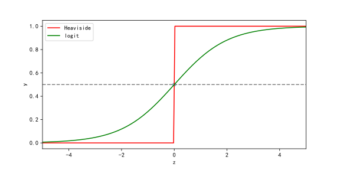

<!-- fit -->
# `Logit`模型


---
# 主要内容

- `Logit`模型
- `Logit`模型的参数学习方法
- `torch`实现
- 多分类问题
- 样本不平衡问题


---
# 1. `Logit`模型
考虑一个二分类任务，其标签$y\in \{0,1\}$，而线性回归模型产生的预测值$z=\mathbf{\omega^T x+b}$是实数，于是需将$z$转换为0/1值。直观地，可以考虑"单位阶跃函数"
$$
y=\begin{cases}
0,z<0;\\
0.5,z=0;\\
1,z>0.
\end{cases}
$$
即若预测值$z$大于0则判为正例。显然，单位阶越函数是不连续函数，无法利用梯度下降算法进行求解。因此，退而使用有更好性质的对数几率函数（`logistic function`）:
$$
y=\frac{1}{1+e^{-z}}.
$$
>对数几率函数可以将z值转换为一个接近0或1的值，且在$z=0$附近变化很陡。

---


---
# 1. `Logit`模型
将$z=\mathbf{\omega^T x+b}$代入对数几率函数，可得
$$
y=\frac{1}{1+e^{-\mathbf{(\omega^T x+b)}}}.
$$
进而转换为
$$
\mathrm{ln}\frac{y}{1-y}=\mathbf{\omega^T x+b}.
$$
若将$y$视为样本$\mathbf{x}$作为正例的可能性，则$1-y$是其反例可能性，两者比值为
$$
\frac{y}{1-y}
$$
称为几率（`odd`），反映了$x$的正例相对反例的可能性。显然，当该值大于1时，$x$作为正例的可能性比反例更大，此时有$\mathbf{\omega^T x+b}>0$。

---
# 1. `Logit`模型
```python
def logit(X, beta, bias=True):
    '''
    X: m * d m个样本，每个样本d维特征
    beta: d+1 维, d维特征权重+1维截距
    bias: 指定是否含截距项
    '''
    if bias:
        hat_X = torch.cat([X, torch.ones(X.shape[0], 1)], axis=1)
        return 1 / (1 + torch.exp(-hat_X@beta.reshape(-1, 1)))
    else:
        return 1 / (1 + torch.exp(-X@beta.reshape(-1, 1)))
```

---
# 2. `Logit`模型的参数学习
对几率取自然对数则可得对数几率（`log odds`, 也称为`logit`）
$$
\mathrm{ln}\frac{y}{1-y}
$$
通过**极大似然法**来估计$\omega$和$b$，给定数据集$\{(x_i,y_i)\}^m_{i=1}$，最大化对数似然率
$$
\max \mathbf{ll(w,b)}=\sum_{i=1}^m \mathrm{ln}p(y_i|\mathbf{x_i;w,b})
$$
即令每个样本属于其真实标记的概率越大越好。上式又等价于最小化负对数似然率
$$
(\omega, b)^* = \text{argmin  } \mathbf{nll(w,b)}=\sum_{i=1}^m\left(-y_i(\omega^T x_i+b)+\mathbf{ln}(1+e^{\omega^T x_i+b})\right)
$$

---
# 2. `Logit`模型的参数学习
令$\beta = (\omega, b), \hat{x}_i = (x_i, 1)$，则有
$$
\beta^* = \text{argmin  } \mathbf{nll(\beta)}=\sum_{i=1}^m\left(-y_i \hat{x}_i \beta^T+\mathbf{ln}(1+e^{\beta^T \hat{x}_i})\right)
$$

对$\beta$求梯度可得
$$
\mathbf{\frac{\partial nll}{\partial \beta}}=\sum_{i=1}^m(-y_i+\frac{1}{1+e^{-\beta^T\hat{x}_i}})\hat{x}_i
$$
令$\hat{y}_i=\frac{1}{1+e^{-\beta^T\hat{x}_i}}$，则有
$$
\begin{aligned}
\mathbf{\frac{\partial nll}{\partial \beta}}&=\sum_{i=1}^m(\hat{y}_i-y_i)\hat{x}_i \\
&=(\hat{y}-y)^T \hat{X} 
\end{aligned}
$$

---
# 2. `Logit`模型的参数学习
```python
# 负对数似然函数
def negloglikelihood(X, y, beta, bias=True):
    '''
    X: m * d m个样本，每个样本d维特征
    y: m * 1 m个标签
    beta: d+1 维, d维特征权重+1维截距
    '''
    hat_y = logit(X, beta, bias=bias)
    nllike = -y.reshape(1, -1)@hat_y + /
        torch.ones_like(hat_y).reshape(1, -1)@torch.log(1 + torch.exp(hat_y))
    return nllike

# 计算预测精度
def precision(beta, feature, true_label):
    '''
    预测精度
    '''
    z = logit(feature, beta)  # 计算对数几率
    y = (z >= 0.5).float()  # 大于等于0.5的为1
    return torch.sum(y == true_label).numpy() / len(y)

```

---
# 3. `Logit`模型参数学习的`torch`实现

```python
# 梯度下降
def gradident_descendent_logit(X, y, lr=0.05, bias=True):
    if bias:
        hat_X = torch.cat([X, torch.ones(X.shape[0], 1)], axis=1)
    else:
        hat_X = X
    beta = torch.randn(hat_X.shape[1], 1)  # 增广权重
    loss = negloglikelihood(X, y, beta, bias=bias)
    trace_loss = loss.numpy()
    while True:
        err = logit(X, beta, bias=bias) - y
        beta = beta - lr * hat_X.t() @ err
        loss = negloglikelihood(X, y, beta, bias=bias)
        loss = loss.numpy()
        trace_loss = np.concatenate([trace_loss, loss])
        if np.abs((trace_loss[-1] - trace_loss[-2]) / trace_loss[-1]) < 1e-5:
            break     
    return beta.squeeze(), trace_loss

```

---
# 3. `Logit`模型参数学习的`torch`实现

```python
# 小批量随机梯度下降
def mini_batch_sgd(X, y, loss_func, beta, bias=True, num_epochs=50, batch_size=20, lr=0.05):
    dataset = TensorDataset(X, y)
    data_iter = DataLoader(dataset=dataset, batch_size=batch_size, shuffle=True)
    for epoch in range(num_epochs):
        for t_x, t_y in data_iter:
            l = loss_func(t_x, t_y, beta, bias=bias)        
            l.backward()  # 计算损失函数在 [w,b] 上的梯度
            beta.data.sub_(lr*beta.grad/batch_size)
            beta.grad.data.zero_()
            
        if (epoch + 1) % 10 == 0:
            with torch.no_grad():  # 不计算梯度，加速损失函数的运算
                train_l = loss_func(t_x, t_y, beta, bias=bias)  # 最近一次的负对数似然率
                est_beta = [u[0] for u in beta.detach().numpy()]
                train_accu_ratio = precision(beta, X, y)
                print(f'epoch {epoch + 1}, loss: {train_l.numpy()[0][0]:.4f}')
                print(f'    train accuracy: {train_accu_ratio}')
            
    return est_beta, train_l.numpy()
```

---
# 4. 多分类问题

- 现实中常遇到多分类学习任务。有些二分类学习方法可以直接推广到多分类，例如，将`Logit`模型推广为`SoftMax`模型。但在更多情形下，我们是基于一些基本训练策略，利用二分类学习器来解决多分类问题。

- 考虑N个类别$C_1,C_2,...,C_N$，多分类学习的基本思路是“拆解法”，即将多分类任务拆分为若干个二分类任务求解。具体而言：先对问题进行拆分，然后为拆出的每个二分类任务训练一个分类器；在测试时，对这些分类器的预测结果进行集成以获取最终的多分类结果。这里的关键是如何对多分类任务进行拆分，以及如何对多个分类器进行集成。

- 最经典的拆分策略有三种：**“一对一”（one v.s. one, 简称OvO）** 、**“一对其余”（one v.s. rest, 简称OvR）** 和 **“多对多”（many v.s. many, 简称MvM）**。

---


---
# 4. 多分类问题

## one v.s. one

- 给定数据集$D=\{(x_1,y_1),(x_2,y_2),...,(x_m,y_m)\},y_i\in\{C_1,C_2,...,C_N\}$. OvO将这N个类别两两配对，从而产生$N(N-1)/2$个二分类任务。

- OvO将为区分类别$C_i$和$C_j$训练一个分类器，该分类器将$C_i$类样例作为正例，$C_j$类样例作为反例。在测试阶段，新样本将同时提交给所有分类器，于是我们将得到$N(N-1)/2$个分类结果，最终结果可通过投票产生：即把被预测得最多的类别作为最终分类结果。


---
# 4. 多分类问题

## one v.s. rest

- OvR每次将一个类的样例作为正例、所有其他类的样例作为反例来训练N个分类器。在测试时若仅有一个分类器预测未正类，则对应的类别标记作为最终分类结果。若有多个分类器预测为正类，则通常考虑各分类器的预测置信度，选择置信度最大的类别标记作为分类结果。

- 容易看出，相对于OvO，OvR只需要训练N个分类器，而OvO则需要训练$N(N-1)/2$个分类器，因此，OvO的存储开销和测试时间开销通常比OvR更大。但在训练时，OvR的每个分类器均使用全部训练样例，而OvO的每个分类器仅用到两个类的样例。因此，在类别很多时，OvO的训练时间开销通常比OvR更小。至于预测性能，则取决于具体的数据分布，在多数情形下两者差不多。

---
# 4. 多分类问题
## many v.s. many
- MvM是每次将若干个类作为正类，若干个其他类作为反类。显然，OvR和OvO是MvM的特例。MvM的正、反类构造必须有特殊的设计，不能随意选取。有一种常用的MvM技术：“纠错输出码”(`Error Correcting Output Codes, ECOC`)。ECOC将编码的思想引入类别拆分，尽可能在解码过程中具有容错性。
- ECOC工作流程主要分类两步：
  - 编码： 对N个类别做M次划分（每次划分将一部分类别作为正类，一部分为反类，形成一个二分类训练集），从而产生M个训练集，训练出M个分类器; 
  - 解码：M个分类器分别对测试样本进行预测，这些预测标记组成一个编码。将这个预测编码与每个类别各自的编码进行比较，返回其中距离最小的类别作为最终预测结果。

---
# 4. 多分类问题

## many v.s. many

- 类别划分通过“编码矩阵”（coding matrix）指定。编码矩阵有多种形式，常见的主要有二元码(`Dietterich & Bakiri, 1995`)和三元码(`Allwein et al., 2000`)。前者将每个类别分别指定为正类和反类，后者在正、反类之外，还可指定“停用类”。

---


---
# 5. 类别不平衡问题

- 目前为止，我们学习的分类学习方法都有一个共同的基本假设，即**不同类别的训练样例数目相当**。如果不同类别的训练样本数目稍微有差别，通常影响不大。但是，如果差别很大，则会对学习过程造成困扰。例如有99个反例，但正例只有1个，那么学习方法只需要返回一个永远将新样本预测未反例的学习器，就能达到99%的精度；然而这样的学习器往往没有价值，因为它不能预测任何正例。

- **类别不平衡(class-imbalance)** 就是指分类任务中不同类别的训练样例数目相差很大的情况。假定正类样例较少，反类样例较多。在现实的分类学习分类任务中，经常会遇到类别不平衡，例如在通过拆分法解决多分类问题时，即使原始问题中不同类别的训练样例数目相当，在使用OvR, MvM策略后产生的二分类任务仍可能出现类别不平衡现象，因此有必要了解类别不平衡性处理的基本方法。

---
# 5. 类别不平衡问题

- 用$y=w^T x+b$对新样本进行分类时，事实上是在用预测出的y值与一个阈值进行比较，例如通常在$y>0.5$时判别为正例，否则为反例。y实际上表达了正例的可能性，几率$\frac{y}{1-y}$则反映了正例可能性与反例可能性的比值，阈值设置为0.5表明分类器认为真实正、反例可能性相同，则分类器的决策规则为
$$
\text{如果 }\frac{y}{1-y}>1, \text{那么预测为正例}
$$
- 然而，当训练集中正、反例的数量不同时，令$m^+$表示正例数目，$m^-$表示反例数目，则观测几率为$\frac{m^+}{m^-}$，由于我们通常假设训练集是真实样本总体的无偏采样，因此观测几率就代表了真实几率。

---
# 5. 类别不平衡问题

- 只要分类器的预测几率高于观测几率就应判定为正例，即
$$
\text{如果 }\frac{y}{1-y}>\frac{m^+}{m^-}, \text{那么预测为正例}
$$

- 因此，需要将预测值调整为
$$
\frac{y'}{1-y'}=\frac{y}{1-y}\times\frac{m^-}{m^+}
$$
- 以上过程称为“再平衡(rebalance)”。这就是类别不平衡学习的一个基本策略---**“再缩放”（rescaling）**。

---
# 5. 类别不平衡问题

- 再缩放的思想虽简单，但实际操作却并不平凡，因为“训练集是真实样本总体的无偏采样”这个假设往往不成立，也就是说，我们未必能有效地基于训练集观测几率来推断出真实几率。现有技术大体上有三类做法；

    - **“欠采样”（undersampling）**: 去除一些反例使得正、反例数目接近，然后再进行学习
    - **“过采样”（oversampling）**：增加一些正例使得正反例数目接近，然后再进行学习
    - **“阈值移动”（threshold-moving）**：同再缩放策略

---
# 5. 类别不平衡问题

- 欠采样的时间开销远小于过采样，因为前者丢弃了很多反例，使得分类器训练集远小于初始训练集，而过采样法则增加了很多正例，使得训练集大于初始训练集。

- 过采样法不能简单地对初始正例样本进行重复采样，否则会招致严重的过拟合；过采样法的代表性算法`SMOTE(chawlaet al., 2002)`通过对训练集中的正例进行插值来产生额外的正例。

- 欠采样法如果随机丢弃反例，可能丢失一些重要信息；欠采样法的代表性算法`EasyEnsemble (Liu et al., 2009)`则是利用集成学习机制，将反例划分为若干个集合供不同学习期使用，这样对每个学习期来看都进行了欠采样，但在全局来看却不会丢失重要信息。

---
# 练习3. 
- 请基于`Logit`回归实现多分类, 并利用鸢尾花数据集比较`OvR`和`OvO`策略下的分类准确率。

---
# 参考文献
1. 周志华. 机器学习. 2019.
2. Christopher M. Bishop. Pattern recognition and machine learning. 2006.
3. [阿斯顿·张、李沐、扎卡里 C. 立顿、亚历山大 J. 斯莫拉等. 动手学深度学习. 2020.](https://github.com/d2l-ai/d2l-zh)