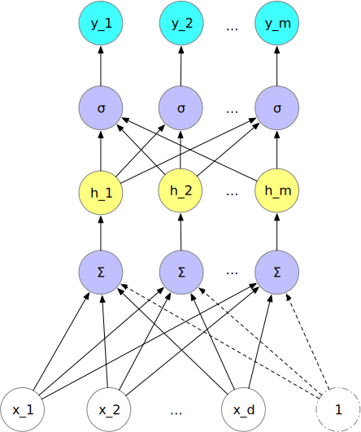

<!-- fit -->
# `Softmax`模型

---
# 主要内容

- `Softmax`回归模型
- 交叉熵损失函数
- `Softmax`回归模型的参数学习
    - 梯度下降
    - 小批量梯度下降
    - `torch.nn.Module`

---
# 1. `Softmax`回归模型
- Softmax回归（Softmax Regression），也称为多项（Multinomial）或多类（Multi-Class）的Logit回归，是Logit回归在多分类问题上的推广。

- 对于多类问题，类别标签$y \in {1, 2,..., C}$ 可以有C个取值．给定一个测试样本$x$，Softmax 回归预测的属于类别c的条件概率为
    $$
    \begin{aligned}
    p(y=c|\mathbf{x})&=\mathrm{softmax}(\mathbf{w^T_c x})\\
    &=\frac{\exp(\mathbf{w^T_c x})}{\sum_{i=1}^C \exp(\mathbf{w^T_i x})}
    \end{aligned}
    $$

    其中$\mathbf{w_i}$是第i类的权重向量。

---
# 1. `Softmax`回归模型


---
# 1. `Softmax`回归模型
```python
def softmax(X, W):
    """
    X: torch.FloatTensor, N*a, N样本数量, a为特征的维度
    W: torch.FloatTensor, a*C, C为类别数量
    """
    C = torch.exp(X@W)  # hat_y, N*C
    # 返回各样本对应类别的标准化概率分布
    return C / torch.sum(C, axis=1).reshape(X.shape[0], -1)
```


---
# 1. `Softmax`回归模型

- `Softmax`回归的决策函数可以表示为

$$
\begin{aligned}
\hat{y}&=\text{arg}\max_{i=1}^{C}p(y=c|\mathbf{x})\\
&=\text{arg}\max_{i=1}^{C}\mathbf{w_i^T x}
\end{aligned}
$$

```python
def hat_y(X, W):
    S = softmax(X, W)  # 各样本在各类别上的概率
    max_indices = torch.max(S, dim=1)[1]
    pred_y = torch.zeros_like(S)
    pred_y[torch.arange(S.shape[0]), max_indices] = 1
    return max_indices, pred_y
```

---
# 1. `Softmax`回归模型

- 与`Logistic`回归的关系。当类别数$C=2$时，`softmax`回归的决策函数为
    $$
    \begin{aligned}
    \hat{y}&=\text{arg}\max_{i\in\{1,2\}}p(y=c|\mathbf{x})\\
    &=\text{arg}\max_{i\in\{1,2\}}\mathbf{w_i^T x}\\
    &=I(\mathbf{(w_2-w_1)^T x}>0)
    \end{aligned}
    $$
    其中$I(\cdot)$是指示函数。


--- 
# 2. 交叉熵损失函数

- 信息量是对于单个事件来说的，但是实际情况一件事有很多种发生的可能，比如掷骰子有可能出现6种情况，明天的天气可能晴、多云或者下雨等等。因此，我们需要评估事件对应的所有可能性。

- 熵（entropy）是表示随机变量不确定的度量，是对表征所有可能发生的事件所需信息量的期望。

- 设$X$是一个取有限个值的随机变量，其概率分布为
$$
P(X=x_i)=p_i,i=1,2,...,n
$$

---
- 熵(`entropy`)定义为
    $$
    H(x)=\sum_{i=0} p(x_i) I(x_i)=-\sum_{i=1}^n p(x_i) \log p(x_i)
    $$
上式中，若$p_i=0$，则定义$0\log 0=0$；对数以2或者e为底，这时熵的单位分别称为比特(bit)或者纳特(nat)。熵只依赖于$X$的分布，与其取值无关，因此也可将$X$的熵记作$H(p)$, 即
$$
H(p)=-\sum_{i=1}^n p_i \log p_i
$$
熵越大，不确定越大。

---

- 熵

```python
def entropy(P):
    '''
    P为概率分布
    '''
    return -np.sum([p*np.log2(p) if p > 0 else 0 for p in P])

P1 = np.ones(10) / 10
P2 = np.zeros(10)
P2[3] = 1
entropy(P1), entropy(P2)
```

--- 

- 条件熵(`conditional entropy`): 表示在已知随机变量$X$的条件下随机变量$Y$的不确定性。

    $$
    H(Y|X)=\sum_{i=1}^n P(X=x_i)H(Y|X=x_i)
    $$

其中，$H(Y|X=x_i)=-\sum_j P(Y=y_j|X=x_i)\log P(Y=y_j|X=x_i)$，表示在$X=x_i$时Y的不确定程度；$p(Y=y_j|X=x_i) = \frac{p(X=x_i, Y=y_j)}{p(X=x_i)}$。
> 如果X与Y无关，则有$H(Y|X)=H(Y)$；如果Y由X唯一决定，则有$H(Y|X)=0$

---

- 条件熵(`conditional entropy`)
```python
def conditional_entropy(P_XY):
    '''
    P_XY为X和Y的联合概率分布shape(x_size, y_z)
    '''
    return np.sum([np.sum(P_XY[i]) * entropy(P_XY[i, :]/np.sum(P_XY[i])) 
                   for i in P_XY.shape[1]])
```

---

- `KL`散度
相对熵(`relative entropy`)或KL散度(`Kullback-Leibler divergence`)：度量一个概率分布$p(x)$相对另一个概率分布$q(X)$的差异

$$
\text{KL(p||q)}=-\sum_x p(x)\log\frac{q(x)}{p(x)}
$$

- 由`Jesen`不等式可证明，$\text{KL(p||q)}\geq 0$，当且仅当对于所有$x$有$p(x)=q(x)$时，取等号。

- 此外，需注意，$\text{KL(p||q)}\neq \text{KL(q||p)}$

---
- `KL`散度
```python
# KL散度
def KL(p_x, q_x):
    return -np.sum([p_x[i]*np.log(q_x[i]/p_x[i]) 
                    if p_x[i] > 0 and q_x[i] > 0 else 0 
                    for i in range(len(p_x))])

# 交叉熵
def cross_entropy(p_x, q_x):
    return -np.sum([p_x[i]*np.log(q_x[i]) 
                    if q_x[i] > 0 else 0 
                    for i in range(len(p_x))])

```

---

- 交叉熵(`cross entropy`)

$$
\text{crossEntropy(p(x), q(x))} = -\sum_x p(x)\log q(x)
$$

- 与`KL`散度的关系
$$
\begin{aligned}
\text{KL(p||q)} &= -\sum_x p(x)\log\frac{q(x)}{p(x)}\\
&= -\sum_x p(x)\log q(x) + \sum_x p(x)\log p(x) \\
&= \text{crossEntropy(p(x), q(x))} - H\left(p(x)\right)
\end{aligned}
$$

- 有$\text{crossEntropy(p(x), q(x))} = \text{KL(p||q)} + H\left(p(x)\right)$

- 由于$H\left(p(x)\right)$为定值，针对q最小化交叉熵等价于最小化`KL(p||q)`，即使理论分布与抽样分布之间的差异最小。

---
# 3. `Softmax`回归模型的参数学习
- 给定N个训练样本，Softmax回归使用交叉熵损失函数学习最优的参数矩阵$W$。为了方便起见，使用C维的`one-hot`向量表示类别标签，对于类别`i`，其向量表示为
    $$
    y = [I(i=1), I(i=2), ..., I(i=C)]
    $$

- 采用交叉熵损失函数，Softmax回归模型的风险函数是
    $$
    \begin{aligned}
    R(\mathbf{W})&=-\frac{1}{N}\sum_{n=1}^N\sum_{i=1}^{C}y_c^{(n)}\log \hat{y}_c^{(n)}\\
    &=-\frac{1}{N}\sum_{n=1}^N(\mathbf{y^{(n)}})^T\log \hat{y}_c^{(n)}
    \end{aligned}
    $$
    其中，$\hat{y}_c^{(n)}=\text{softmax}\mathbf(W^Tx^{(n)})$为样本$x^{(n)}$在每个类别的后验概率。

---

```python
def cross_entropy(X, y, W):
    """
    X: N*(a+1), N个样本, 特征数量为为a, 外加1维偏置
    y: N*C, y为N个C维的one-hot向量
    W: (a+1)*C
    """
    p_y = softmax(X, W) # N*C, N个样本分别在C个类别的后验概率
    # 展开成1维，点积
    crossEnt = -torch.dot(y.reshape(-1), torch.log2(p_y).reshape(-1)) / y.shape[0]
    return crossEnt
```

---
- 风险函数$\mathbf{R(W)}$关于$W$的梯度为
$$
\frac{\partial R(W)}{\partial W}=-\frac{1}{N}\sum_{n=1}^N\mathbf{x^{(n)}(y^{(n)}-\hat{y}^{(n)})}^T
$$

```python
def grad_crosEnt_W(X, y, W):
    '''
    X: N*(a+1), N个样本, 特征数量为为a, 外加1维偏置
    y: N*C, y为N个C维的one-hot向量
    W: (a+1)*C
    '''
    hat_y = softmax(X, W)
    a = (X.t() @ (y - hat_y)) / y.shape[0]  # (a+1)*N | N*C
    return a
```

---
**采用梯度下降法，softmax回归的训练过程为**

- 输入: 训练集X，`one-hot`形式的标签y
- 输出: 最优参数$w^*$
- 算法过程
    - 初始化$W_0:=0$，最大迭代次数$T$
    - 然后通过下式进行参数的迭代更新
    $$
    W_{t+1}:=W_t+\eta\left(\frac{1}{N}\sum_{n=1}^N\mathbf{x^{(n)}(y^{(n)}-\hat{y}^{(n)})}^T\right) 
    $$
    - 直到满足指定迭代次数，令$w^*=w^T$。
                                                                                                                                                
---
- 方法1: 梯度下降-人工求导

```python
def softmax_sgd(X, y, num_steps=100, lr=0.1):
    '''
    X: N*(a+1), N个样本, 特征数量为为a, 外加1维偏置
    y: N*C, y为N个C维的one-hot向量
    W: (a+1)*C
    '''
    hat_X = torch.cat([X, torch.ones(X.shape[0], 1)], axis=1)  # 增广X
    W = torch.randn(hat_X.shape[1], y.shape[1])  # 增广参数矩阵
    for i in range(num_steps):
        W += lr*grad_crosEnt_W(hat_X, y, W)
        loss = cross_entropy(hat_X, y, W)
        if (i+1) % 50 == 0:
            print(f'训练{i+1}轮, 交叉熵为{loss:.2f}')
            
    return W
```


---
- 方法2: 随机梯度下降-自动求导

```python
def softmax_miniBatch_sgd(X, y, num_epoch=50, batch_size=40, lr=0.05):
    '''
    X: N*a, N个样本, 特征数量为为a
    y: N*C, y为N个C维的one-hot向量
    W: a*C
    '''
    hat_X = torch.cat([X, torch.ones(X.shape[0], 1)], axis=1)  # 增广X
    W = torch.randn(hat_X.shape[1], y.shape[1])  # 增广参数矩阵
    W.requires_grad_()
    dataset = TensorDataset(hat_X, y)
    data_iter = DataLoader(dataset=dataset, batch_size=batch_size, shuffle=True)
    for epoch in range(num_epoch):
        for t_x, t_y in data_iter:
            l = cross_entropy(t_x, t_y, W)        
            l.backward()  # 计算损失函数在 W 上的梯度
            W.data.sub_(lr*W.grad/batch_size)
            W.grad.data.zero_()
            
        if (epoch + 1) % 50 == 0:
            with torch.no_grad():  # 不计算梯度，加速损失函数的运算
                train_l = cross_entropy(hat_X, y, W)  # 最近一次的负对数似然率
                est_W = W.detach().numpy()  # detach得到一个有着和原tensor相同数据的tensor
                print(f'epoch {epoch + 1}, loss: {train_l:.4f}')
            
    return est_W, train_l
```

---
- 方法3: `torch.nn`
```python
class SofmaxRegresModel(torch.nn.Module): 
    def __init__(self, dim_in, dim_out):
        super(SofmaxRegresModel, self).__init__() 
        self.layer1 = torch.nn.Linear(dim_in, dim_out, bias=True)
        
    def forward(self, x):
        y_pred = self.layer1(x)
        return torch.nn.functional.softmax(y_pred, dim=1)  # softmax

dim_in = X.shape[1]
dim_out = y.shape[1]
# 实例化1个网络
net = SofmaxRegresModel(dim_in, dim_out)
# 初始化网络参数和偏置
net.layer1.weight.data = torch.randn(dim_out, dim_in)
net.layer1.bias.data = torch.Tensor(dim_out)
# 损失函数
loss = torch.nn.CrossEntropyLoss()
# 随机梯度下降算法
trainer = torch.optim.SGD(net.parameters(), lr=0.05)
```

---
- 方法3: `torch.nn`

```python
# 加载数据
batch_size = 20
num_epochs = 100
dataset = TensorDataset(train_X, train_indices_y)
data_iter = DataLoader(dataset=dataset, batch_size=batch_size, shuffle=True)
# 开始训练
for epoch in range(num_epochs):
    for t_x, t_y in data_iter:
        l = loss(net(t_x), t_y)  # 计算当前批量的交叉熵损失
        trainer.zero_grad()  # 参数梯度清零
        l.backward()  # 反向传播，计算梯度
        trainer.step()  # 更新参数
    if (epoch+1) % 20 == 0:
        with torch.no_grad():  # 不计算梯度，加速损失函数的运算
            l_epoch = loss(net(train_X), train_indices_y) 
            print('epoch {}, loss {}'.format(epoch+1, l_epoch))

```

---

# 谢谢！
