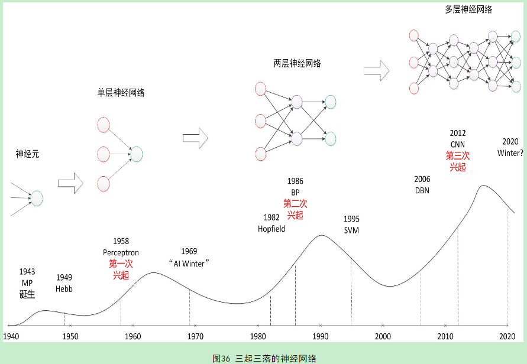

<!-- fit -->
# 第7讲 人工神经网络1


---


---
# 主要内容

- 导言
- 人工神经网络的发展历程
- 人工神经网络的结构
- 前馈神经网络
- 激活函数
- 应用于分类任务
- `Fashion-MNIST`数据集


---
# 导言
## 神经网络是一门重要的机器学习技术，是深度学习的基础。
> 学习神经网络不仅可以让你掌握一门强大的机器学习方法，也可以更好地帮助你理解深度学习技术。神经网络是一种模拟人脑的神经网络结构以期能够实现类人工智能的机器学习技术。人脑中的神经网络是一个非常复杂的组织，成人的大脑中估计有1000亿个神经元。

---
# 导言
## 神经网络（`neural network`）方面的研究很早就已出现，今天的“神经网络”已经是一个相当大的、多学科交叉的学科领域。
> 各相关学科对神经网络的定义多种多样，此处采用目前使用最广泛的一种：神经网络是由具有适应性的简单单元组成的广泛并行互联的网络，它的祖师能够模拟生物神经系统对真实世界物体所作出的交互反应(`Kohonen, 1988`)。


---
# 导言
## 神经网络中最基本的成分是神经元模型，即上述定义的“简单单元”。
> 在生物神经网络中，每个神经元与其他神经元相连，当它“兴奋”时，就会向相连的神经元发送化学物质，从而改变这些神经元内的电位；如果某个神经元的电位超过了一个“阈值”，那么它被激活，向其它神经元发送化学物质。把许多个这样的神经元按一定的层次结构连接起来，就得到了神经网络。

---
# 导言
## 从计算机科学的角度看，我们暂时不考虑神经网络是否真的模拟和生物神经网络，只需将一个神经网络视为包含了许多参数的数学模型，这个模型是若干个函数相互嵌套代入而得。
> 感知机只有输出层神经元进行激活函数处理，即只拥有一层功能神经元，学习能力非常有限，只能解决线性可分问题，例如甚至不能学习“异或”问题。要解决更加复杂的如非线性可分问题，需考虑使用多层功能神经元。

---


图片来源于互联网

---
# 神经网络的发展过程

- 1940年，生物学家知晓了神经元的组织结构

> 一个神经元通常具有多个树突，主要接收传入信息。轴突只有一条，轴突尾端有许多轴突末梢可以给其它多个神经元传递信息，跟其它神经元的树突产生连接，连接的问题称为“突触”。

- 1943年，心理学家McCulloch和Pitts参考了生物神经元的结构，发明了抽象的神经元模型MP

- 1949年，心理学家Hebb提出了Hebb学习率，任务人脑神经细胞的突触上的强度可以变化。因此，计算机科学家开始考虑用调整权重的方法来让机器学习，为后来的学习算法奠定了基础。

- 1958年，计算科学家Rosenbalt提出了由两层神经元组成的神经网络，取名为“Perceptron”

---
# 神经网络的发展过程
- 1969年，人工智能巨擘Minsky在一本叫《Perceptron》一书中，用详细的数学证明了感知机的弱点（不能解决异或问题），且认为如果将计算层增加到两层，计算量将很大，而且没有有效的学习算法，由此认为研究更深层的网络没有价值。

- 1986年，Rumelhar&Hinton等人提出反向传播算法，解决了两层神经网络（MLP）所需要的复杂计算量问题，从而带动了业界使用两层神经网络研究的热潮。10多年前困扰神经网络界的异或问题被轻松解决，神经网络在这个时候，已经可以用于语音识别、图像识别和自动驾驶等多个领域。

- 2006年，Hinton在《Science》和相关期刊上发表论文，首次提出了“深度信念网络”的概念。深度信念网络有一个“预训练(pre-training)”的过程，这可以方便的让神经网络中的权值找到一个接近最优解的值，之后再使用“微调(fine-tuning)”技术对整个网络进行优化训练。

---
# 神经网络的发展过程
- 2012年，Hinton与他的学生在ImageNet竞赛中，用多层的卷积神经网络成功地对包含1,000多个类别的1,000,000多张图片进行了训练，取得了分类错误率15%的好成绩，比第2名高出11个百分点。

- 神经网络在人工智能界占据统治地位：`Hinton, YannLecun, Bengio, Andrew Ng`获得2018年的图领奖


---
# 神经网络的结构
- 一个生物神经细胞的功能比较简单，而人工神经元只是生物神经细胞的理想化和简单实现，功能更加简单．要想模拟人脑的能力，单一的神经元是远远不够的，需要通过很多神经元一起协作来完成复杂的功能．

- 这样通过一定的连接方式或信息传递方式进行协作的神经元可以看作一个网络，就是神经网络．到目前为止，研究者已经发明了各种各样的神经网络结构．目前常用的神经网络结构有以下三种：
    - 前馈神经网络
    - 反馈神经网络
    - 图神经网络

---


---
# 神经网络的结构: 前馈神经网络

- 前馈网络中各个神经元按接收信息的先后分为不同的组．每一组可以看作一个神经层．每一层中的神经元接收前一层神经元的输出，并输出到下一层神经元．

- 整个网络中的信息是朝一个方向传播，没有反向的信息传播，可以用一个有向无环路图表示．

- 前馈网络包括**全连接前馈网络**和**卷积神经网络**等．

- 前馈网络可以看作一个函数，通过简单非线性函数的多次复合，实现输入空间到输出空间的复杂映射．

- 这种网络结构简单，易于实现．


---
# 神经网络的结构: 记忆神经网络


- 记忆网络，也称为反馈网络，网络中的神经元不但可以接收其他神经元的信息，也可以接收自己的历史信息．

- 和前馈网络相比，记忆网络中的神经元具有记忆功能，在不同的时刻具有不同的状态．记忆神经网络中的信息传播可以是单向或双向传递，因此可用一个有向循环图或无向图来表示．

- 记忆网络包括**循环神经网络、Hopfield 网络、玻尔兹曼机、受限玻尔兹曼机**等．

- 记忆网络可以看作一个程序，具有更强的计算和记忆能力．

- 为了增强记忆网络的记忆容量，可以引入外部记忆单元和读写机制，用来保存一些网络的中间状态，称为**记忆增强神经网络（Memory Augmented Neural Network，MANN）**，比如神经图灵机[Graves et al., 2014] 和记忆网络[Sukhbaatar et al., 2015] 等．


---
# 神经网络的结构: 图神经网络

- 前馈网络和记忆网络的输入都可以表示为向量或向量序列．但实际应用中很多数据是图结构的数据，比如知识图谱、社交网络、分子（Molecular ）网络等．前馈网络和记忆网络很难处理图结构的数据．

- 图网络是定义在图结构数据上的神经网络．图中每个节点都由一个或一组神经元构成．节点之间的连接可以是有向的，也可以是无向的．每个节点可以收到来自相邻节点或自身的信息．

- 图网络是前馈网络和记忆网络的泛化，包含很多不同的实现方式，比如图卷积网络（Graph Convolutional Network，GCN）[Kipf et al., 2016]、图注意力网络（Graph Attention Network，GAT）[Veličković et al., 2017]、消息传递神经网络（Message Passing Neural Network，MPNN）[Gilmer et al., 2017] 等．

---
# 前馈神经网络


---
# 前馈神经网络

- 给定一组神经元，我们可以将神经元作为节点来构建一个网络．不同的神经网络模型有着不同网络连接的拓扑结构．

- 一种比较直接的拓扑结构是前馈网络．前馈神经网络（`Feedforward Neural Networ, FNN`）是最早发明的简单人工神经网络．前馈神经网络也经常称为多层感知器（`Multi-Layer Perceptron, MLP`）．

- 但多层感知器的叫法并不是十分合理，因为前馈神经网络其实是由多层的`Logistic`回归模型（连续的非线性函数）组成，而不是由多层的感知器（不连续的非线性函数）组成[`Bishop, 2007`].

- 本课程中，不对多层感知机和前馈神经网络作区分.


---
# 前馈神经网络

- 在前馈神经网络中，各神经元分别属于不同的层。

- 每一层的神经元可以接收前一层神经元的信号，并产生信号输出到下一层。

- 第0 层称为输入层，最后一层称为输出层，其他中间层称为隐藏层。

- 整个网络中无反馈，信号从输入层向输出层单向传播，可用一个有向无环图表示。

- 在各层神经元的信息传递过程中，**激活函数**承担着重要的角色。

---
# 前馈神经网络: 激活函数的重要性

- 给定一个小批量样本$\boldsymbol{X} \in \mathbb{R}^{n \times d}$，其批量大小为$n$，输入个数为$d$。假设多层感知机只有一个隐藏层，其中隐藏单元个数为$h$。记隐藏层的输出（也称为隐藏层变量或隐藏变量）为$\boldsymbol{H}$，有$\boldsymbol{H} \in \mathbb{R}^{n \times h}$。

- 因为隐藏层和输出层均是全连接层，可以设隐藏层的权重参数和偏差参数分别为$\boldsymbol{W}_h \in \mathbb{R}^{d \times h}$和 $\boldsymbol{b}_h \in \mathbb{R}^{1 \times h}$，输出层的权重和偏差参数分别为$\boldsymbol{W}_o \in \mathbb{R}^{h \times q}$和$\boldsymbol{b}_o \in \mathbb{R}^{1 \times q}$。

- 我们先来看一种含单隐藏层的多层感知机的设计。其输出$\boldsymbol{O} \in \mathbb{R}^{n \times q}$的计算为

$$
\begin{aligned}
\boldsymbol{H} &= \boldsymbol{X} \boldsymbol{W}_h + \boldsymbol{b}_h,\\
\boldsymbol{O} &= \boldsymbol{H} \boldsymbol{W}_o + \boldsymbol{b}_o,
\end{aligned}      
$$

- 也就是将隐藏层的输出直接作为输出层的输入。


---
# 前馈神经网络: 激活函数的重要性

- 如果将以上两个式子联立起来，可以得到

$$
\boldsymbol{O} = (\boldsymbol{X} \boldsymbol{W}_h + \boldsymbol{b}_h)\boldsymbol{W}_o + \boldsymbol{b}_o = \boldsymbol{X} \boldsymbol{W}_h\boldsymbol{W}_o + \boldsymbol{b}_h \boldsymbol{W}_o + \boldsymbol{b}_o.
$$


- 从联立后的式子可以看出，虽然神经网络引入了隐藏层，却依然等价于一个单层神经网络：其中输出层权重参数为$\boldsymbol{W}_h\boldsymbol{W}_o$，偏差参数为$\boldsymbol{b}_h \boldsymbol{W}_o + \boldsymbol{b}_o$。

**不难发现，即便再添加更多的隐藏层，以上设计依然只能与仅含输出层的单层神经网络等价。**


---
# 激活函数

- 上述问题的根源在于全连接层只是对数据做仿射变换（`affine transformation`），而多个仿射变换的叠加仍然是一个仿射变换。

- 解决问题的一个方法是引入非线性变换，例如对隐藏变量使用按元素运算的非线性函数进行变换，然后再作为下一个全连接层的输入。这个非线性函数被称为**激活函数（activation function）**。下面我们介绍几个常用的激活函数。


---
# 激活函数

## 1. `sigmoid`函数
- sigmoid函数可以将元素的值变换到0和1之间：

$$\text{sigmoid}(x) = \frac{1}{1 + \exp(-x)}.$$

- sigmoid函数在早期的神经网络中较为普遍，但它目前逐渐被更简单的`ReLU`函数取代。当输入接近0时，sigmoid函数接近线性变换。

- 在`torch`中有对应的实现`torch.sigmoid()`

---


---
# 激活函数

## 1. `sigmoid`函数

- 依据链式法则，sigmoid函数的导数

$$\text{sigmoid}'(x) = \text{sigmoid}(x)\left(1-\text{sigmoid}(x)\right).$$

- 下面绘制了sigmoid函数的导数。当输入为0时，sigmoid函数的导数达到最大值0.25；当输入越偏离0时，sigmoid函数的导数越接近0。

---


---
# 激活函数

## 2. `ReLU`函数

- ReLU（rectified linear unit）函数提供了一个很简单的非线性变换。给定元素$x$，该函数定义为

$$\text{ReLU}(x) = \max(x, 0).$$

- 可以看出，ReLU函数只保留正数元素，并将负数元素清零。

---


---
# 激活函数

## 2. `ReLU`函数

- 显然，当输入为负数时，ReLU函数的导数为0；当输入为正数时，ReLU函数的导数为1。尽管输入为0时ReLU函数不可导，但是我们可以取此处的导数为0。下面绘制ReLU函数的导数。

$$
\frac{\text{d}Relu(x)}{\text{d}x}=\begin{cases}
1,x\ge 0\\
0,x< 0
\end{cases}
$$

---


---
# 激活函数

## 3. `tanh`函数
- tanh（双曲正切）函数可以将元素的值变换到-1和1之间：

$$\text{tanh}(x) = \frac{1 - \exp(-2x)}{1 + \exp(-2x)}.$$

- 我们接着绘制tanh函数。当输入接近0时，tanh函数接近线性变换。虽然该函数的形状和sigmoid函数的形状很像，但tanh函数在坐标系的原点上对称。

---


---
# 激活函数

## 3. `tanh`函数

- 依据链式法则，tanh函数的导数

$$\text{tanh}'(x) = 1 - \text{tanh}^2(x).$$

- 下面绘制了tanh函数的导数。当输入为0时，tanh函数的导数达到最大值1；当输入越偏离0时，tanh函数的导数越接近0。

---


---
# 前馈神经网络

- 前馈神经网络就是含有至少一个隐藏层的由全连接层组成的神经网络，且每个隐藏层的输出通过激活函数进行变换。

- 前馈神经网络的层数和各隐藏层中隐藏单元个数都是超参数。前馈神经网络按以下方式计算输出：

$$
\begin{aligned}
\boldsymbol{H} &= \phi(\boldsymbol{X} \boldsymbol{W}_h + \boldsymbol{b}_h),\\
\boldsymbol{O} &= \boldsymbol{H} \boldsymbol{W}_o + \boldsymbol{b}_o,
\end{aligned}
$$
 
- 其中$\phi$表示激活函数。在分类问题中，我们可以对输出$\boldsymbol{O}$做softmax运算，并使用softmax回归中的交叉熵损失函数。

- 在回归问题中，我们将输出层的输出个数设为1，并将输出$\boldsymbol{O}$直接提供给线性回归中使用的平方损失函数。


---
# 前馈神经网络

- 基于`torch.tensor`的多层感知机实现

```python
def multilayer_perceptron(features, layers):
    """
    features: 输入
    layers: [(权重矩阵, 偏置向量, 激活函数), ..., ], 如果该层没有激活函数, 则应给None或者False
    """
    y = features  # 初始化输入features
    for weight, bias, func in layers:
        z = y@weight + bias  # 计算净值
        if func:  # 应用激活函数
            if func.__name__ == 'softmax':
                y = func(z, dim=1)
            else:
                y = func(z)
        else:
            y = z
            
    return y.double()
```

---
# 前馈神经网络

- 基于`torch.tensor`的多层感知机实现
```python
features = torch.randn(1000, 5)
layers = [
    (torch.randn(5, 10), torch.tensor(0), torch.tanh),
    (torch.randn(10, 6), torch.tensor(0), torch.relu),
    (torch.randn(6, 5), torch.tensor(0), torch.softmax)
]

y = multilayer_perceptron(features, layers)
```

---
# 前馈神经网络

- 交叉熵损失函数：应用于多分类任务

```python
def cross_entropy(y, hat_y):  # 交叉熵
    '''
    y: one-hot向量
    hat_y: softmax之后对应概率向量，多层感知机的输出
    '''
    crossEnt = -torch.dot(y.reshape(-1), torch.log2(hat_y).reshape(-1)) / y.shape[0]  # 展开成1维，点积
    return crossEnt
```
- mse损失函数: 应用于回归任务
```python
def mean_squared_error(y, hat_y):  # 平均平方误差
    '''
    y: scalar
    hat_y: 多层感知机的输出
    '''
    return torch.mean((hat_y - y)**2)
```

---
# `Fashion-MNIST`数据集

- [Fashion-MNIST](https://gitee.com/mirrors/Fashion-MNIST)是一个替代[MNIST](http://yann.lecun.com/exdb/mnist/)手写数字集的图像数据集。

- 它是由Zalando（一家德国的时尚科技公司）旗下的研究部门提供。其涵盖了来自10种类别的共7万个不同商品的正面图片。

- Fashion-MNIST的大小、格式和训练集/测试集划分与原始的MNIST完全一致。60000/10000的训练测试数据划分，28x28的灰度图片。

- 可以直接用它来测试你的机器学习和深度学习算法性能。

---
# `Fashion-MNIST`数据集

- 经典的MNIST数据集包含了大量的手写数字。十几年来，来自机器学习、机器视觉、人工智能、深度学习领域的研究员们把这个数据集作为衡量算法的基准之一。

- 你会在很多的会议，期刊的论文中发现这个数据集的身影。实际上，MNIST数据集已经成为算法作者的必测的数据集之一。

- 有人曾调侃道："如果一个算法在MNIST不work, 那么它就根本没法用；而如果它在MNIST上work, 它在其他数据上也可能不work！"

- Fashion-MNIST的目的是要成为MNIST数据集的一个直接替代品。作为算法作者，你不需要修改任何的代码，就可以直接使用这个数据集。Fashion-MNIST的图片大小，训练、测试样本数及类别数与经典MNIST完全相同。

---


---
# `Fashion-MNIST`数据集

## 如何加载?

- 方法1:

```python
mnist_train = torchvision.datasets.FashionMNIST(root='../dataset/fashion_mnist', 
                train=True, transform=transforms.ToTensor())
mnist_test = torchvision.datasets.FashionMNIST(root='../dataset/fashion_mnist', 
                train=False, transform=transforms.ToTensor())
```
> 下载太太太太太慢了！！！！！！中途老停止！！！放弃吧

---
# `Fashion-MNIST`数据集

## 如何加载?

- 方法2: 通过国内的源下载数据集，再加载
```python
def load_mnist(path, kind='train'):
    """
    Load MNIST data from `path`
    """
    labels_path = os.path.join(path, '%s-labels-idx1-ubyte.gz'% kind)
    images_path = os.path.join(path, '%s-images-idx3-ubyte.gz'% kind)

    with gzip.open(labels_path, 'rb') as lbpath:
        labels = np.frombuffer(lbpath.read(), dtype=np.uint8, offset=8)

    with gzip.open(images_path, 'rb') as imgpath:
        images = np.frombuffer(imgpath.read(), dtype=np.uint8, offset=16).reshape(len(labels), 784)

    return images, labels
```
> 得到的numpy.ndarray形式的图片数据及其标签。格式遵循PIL，即1张图片有三个维度构成，分别为高H, 宽W, 通道C

---
# `Fashion-MNIST`数据集

## 如何加载?

- 转换为`tensor`
```python
def load_mnist(path, kind='train'):
    """
    Load MNIST data from `path`
    """
    labels_path = os.path.join(path, '%s-labels-idx1-ubyte.gz'% kind)
    images_path = os.path.join(path, '%s-images-idx3-ubyte.gz'% kind)

    with gzip.open(labels_path, 'rb') as lbpath:
        labels = np.frombuffer(lbpath.read(), dtype=np.uint8, offset=8)

    with gzip.open(images_path, 'rb') as imgpath:
        images = np.frombuffer(imgpath.read(), dtype=np.uint8, offset=16).reshape(len(labels), 784)
    
    features = transforms.ToTensor()(images)  # (h, w, c) -> (c, h, w)
    labels = torch.LongTensor(labels)

    return features[0], labels
```

---
# `Fashion-MNIST`数据集

## 如何加载?

- 小批量样本生成器
```python
def load_minibatch_data(batch_size, kind='train', is_one_hot=False, is_mnist=False, path="../dataset/"):
    """
    Prepare mini batch data for training
    """
    if is_mnist:
        c_path = path + 'mnist/'
    else:
        c_path = path + 'fashion_mnist/'
    features, labels = load_mnist(c_path, kind=kind)
    if is_one_hot:
        hot_labels = torch.zeros(features.shape[0], 10)
        x_indices = np.arange(features.shape[0]).tolist()
        y_indices = labels.byte().tolist()
        hot_labels[x_indices, y_indices] = 1
        dataset = TensorDataset(features, hot_labels)
    else:
        dataset = TensorDataset(features, labels)

    return DataLoader(dataset=dataset, batch_size=batch_size, shuffle=True)
```

---
# 基于MLP预测图片类别

- 训练精度
```python
def accuracy(y, hat_y, is_one_hot=False):
    '''
    y: 标签, one-hot
    hat_y: 标签预测概率, one-hot
    is_one_hot: y是否为one-hot形式
    '''
    if is_one_hot:
        precision = torch.sum(torch.max(y, axis=1)[1] == torch.max(hat_y, axis=1)[1]).numpy() / y.shape[0]
    else:
        precision = torch.sum((y == torch.max(hat_y, axis=1)[1]).byte()).numpy() / y.shape[0]
    return precision
```

---
# 基于MLP预测图片类别
- 方法1
```python
batch_size = 256
train_iter = load_minibatch_data(batch_size, is_one_hot=True)

num_inputs, num_outputs, num_hiddens = 784, 10, 256
W1 = torch.tensor(np.random.normal(0, 0.01, (num_inputs, num_hiddens)), dtype=torch.float)
b1 = torch.zeros(num_hiddens, dtype=torch.float)
W2 = torch.tensor(np.random.normal(0, 0.01, (num_hiddens, num_outputs)), dtype=torch.float)
b2 = torch.zeros(num_outputs, dtype=torch.float)

params = [W1, W2, b1, b2]
for param in params:
    param.requires_grad_(requires_grad=True)

layers = [
    (W1, b1, torch.relu),
    (W2, b2, torch.softmax)
]
```

---
# 基于MLP预测图片类别
- 方法1: 自己构建mlp函数
```python
num_epoch = 20
lr = 0.1

for epoch in range(num_epoch):
    for t_x, t_y in train_iter:
        hat_y = multilayer_perceptron(t_x, layers)
        l = cross_entropy(t_y, hat_y.float())
        l.backward()  # 计算损失函数在 W 上的梯度
        for param in params:
            param.data.sub_(lr*param.grad)
            param.grad.data.zero_()
    with torch.no_grad():
        print(f'epoch {epoch + 1}, loss: {l.numpy():.4f}')
```

---
# 基于MLP预测图片类别
- 方法1；自己构建mlp函数
```python
train_features, train_labels = load_mnist(path="../dataset/fashion_mnist", kind='train')
test_features, test_labels = load_mnist(path="../dataset/fashion_mnist", kind='t10k')

print(f'Train accuracy: {accuracy(train_labels, multilayer_perceptron(train_features, layers))}') 
print(f'Test accuracy: {accuracy(test_labels, multilayer_perceptron(test_features, layers))}') 
```

---
# 基于MLP预测图片类别
- 方法2：`torch.nn.Module`
```python
class MLP(torch.nn.Module): 
    def __init__(self, feature_size, hidden_size, output_size):
        super(MLP, self).__init__() 
        self.hidden = nn.Linear(feature_size, hidden_size, bias=True)
        self.output = nn.Linear(hidden_size, output_size, bias=True)
        
    def forward(self, x):
        x = nn.functional.relu(self.hidden(x))
        x = self.output(x)
        return x
```

---
# 基于MLP预测图片类别
- 方法2: `torch.nn.Module`
```python
num_inputs, num_outputs, num_hiddens = 784, 10, 256
net = MLP(num_inputs, num_hiddens, num_outputs)
# 初始化网络参数和偏置
for params in net.parameters():
    nn.init.normal_(params, mean=0, std=0.01)
# CrossEntropyLoss包括softmax运算和交叉熵损失计算的函数
loss = nn.CrossEntropyLoss()  
trainer = torch.optim.SGD(net.parameters(), lr=0.2)
```
---
# 基于MLP预测图片类别
- 方法2: `torch.nn.Module`
```python
batch_size = 256
train_iter2 = load_minibatch_data(batch_size, is_one_hot=False)  # nn.CrossEntropyLoss()接收标量

num_epochs = 30
for epoch in range(num_epochs):
    for t_x, t_y in train_iter2:
        l = loss(net(t_x), t_y)  # 计算当前批量的交叉熵损失
        trainer.zero_grad()  # 参数梯度清零
        l.backward()  # 反向传播，计算梯度
        trainer.step()  # 更新参数
        
    with torch.no_grad():  # 不计算梯度，加速损失函数的运算
        print(f"epoch {epoch+1}, loss: {l.data.numpy()},", end=' ')
        train_accuracy = accuracy(train_labels, net(train_features))
        test_accuracy = accuracy(test_labels, net(test_features))
        print(f'train_accuracy: {train_accuracy:.4f}, test_accuracy: {test_accuracy:.4f}') 
```

---
# 基于MLP预测图片类别
- 方法3: `torch.nn.Sequential`
```python
num_inputs, num_outputs, num_hiddens = 784, 10, 256
net = nn.Sequential(
        nn.Linear(num_inputs, num_hiddens),
        nn.ReLU(),
        nn.Linear(num_hiddens, num_outputs), 
        )

for params in net.parameters():
    torch.nn.init.normal_(params, mean=0, std=0.01)

loss = torch.nn.CrossEntropyLoss()
optimizer = torch.optim.SGD(net.parameters(), lr=0.5)
```

---
# 基于MLP预测图片类别
- 方法3: `torch.nn.Sequential`
```python
num_epochs = 30
for epoch in range(num_epochs):
    for t_x, t_y in train_iter2:
        l = loss(net(t_x), t_y)  # 计算当前批量的交叉熵损失
        optimizer.zero_grad()  # 参数梯度清零
        l.backward()  # 反向传播，计算梯度
        optimizer.step()  # 更新参数
        
    with torch.no_grad():  # 不计算梯度，加速损失函数的运算
        print(f"epoch {epoch+1}, loss: {l.data.numpy()},", end=' ')
        train_accuracy = accuracy(train_labels, net(train_features))
        test_accuracy = accuracy(test_labels, net(test_features))
        print(f'train_accuracy: {train_accuracy:.4f}, test_accuracy: {test_accuracy:.4f}') 

```


---
## 参考资料
1. 周志华. 机器学习. 2019.
2. 邱锡鹏. 神经网络与机器学习. 2020.
3. [阿斯顿·张、李沐、扎卡里 C. 立顿、亚历山大 J. 斯莫拉等. 动手学深度学习. 2020.](https://github.com/d2l-ai/d2l-zh)
4. Christopher M. Bishop. Pattern recognition and machine learning. 2006.