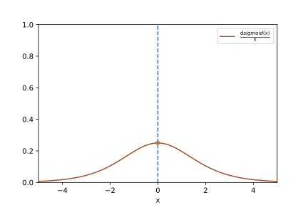
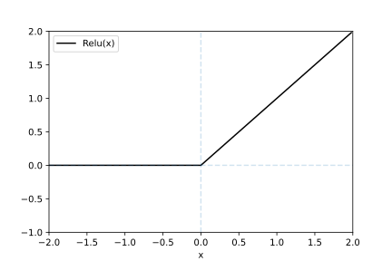
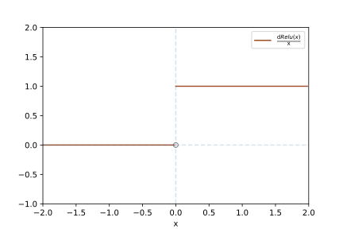
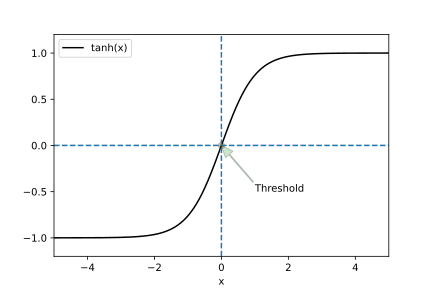
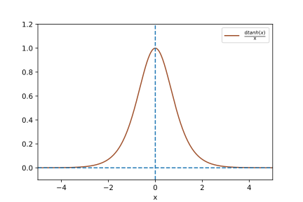
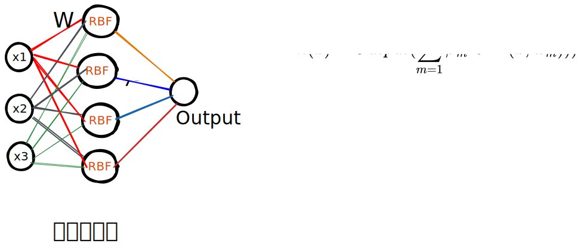
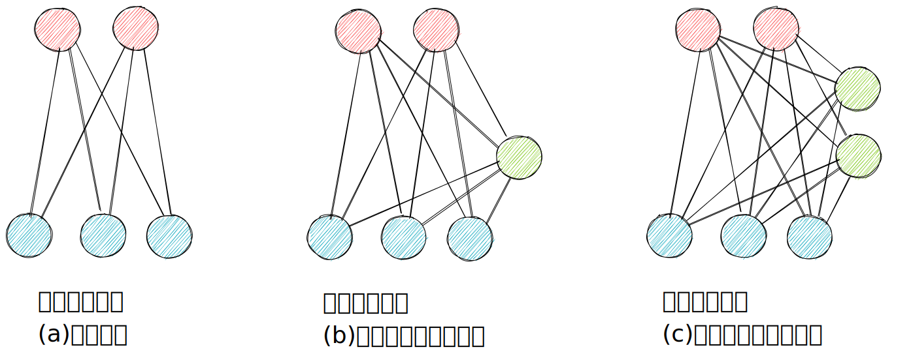

<!-- fit -->
# 人工神经网络


---


---
# 主要内容

- 概述
- 人工神经网络的发展历程
- 人工神经网络的结构
- 前馈神经网络(`MLP`)
- 激活函数
- `MLP`应用于分类任务
- 其它经典神经网络
- `Fashion-MNIST`数据集
- 基于`MLP`预测图片类别

---
# 0.概述

- `Simon Haykin`: 神经网络是一种大规模的并行分布式处理器，天然具有存储并使用经验知识的能力[`Haykin, 1994`]

- 人工神经网络（`Artificial Neural Network，ANN`）是指一系列受生物学和神经科学启发的数学模型。
    >这些模型主要是通过构建人工神经元，并按照一定拓扑结构构建人工神经元之间的连接，以模拟生物神经网络．在人工智能领域，人工神经网络也常常简称为神经网络（`Neural Network，NN`）或神经模型（`Neural Model`）．


---
# 0.概述

- 神经网络是一种连接主义模型
    > 20世纪80年代中后期，最流行的一种连接主义模型是分布式并行处理(`Parallel Distributed Processing，PDP`)模型，有3个主要特性：分布式信息表示、记忆和知识存储于单元间连接、通过改变单元间连接强度学习新知识

- 连接主义的神经网络有着多种多样的网络结构以及学习方法
    > 早期模型强调模型的生物学合理性，但后期更关注对某种特定认知能力的模拟，比如物体识别、语言理解等．尤其在引入误差反向传播来改进其学习能力之后，神经网络也越来越多地应用在各种机器学习任务上.


---
# 0.概述
- 神经网络是一门重要的机器学习技术，是深度学习的基础
    > 神经网络通过模拟人脑的神经网络结构，以期能够实现类人智能。人脑中的神经网络是一个非常复杂的组织，成人的大脑中估计有1000亿个神经元。

- 目前，神经网络已经是一个相当大的、多学科交叉的学科领域
    > 各相关学科对神经网络的定义多种多样，此处采用目前使用最广泛的一种：神经网络是由具有适应性的简单单元组成的广泛并行互联的网络，它能够模拟生物神经系统对真实世界物体所作出的交互反应(`Kohonen, 1988`)。

---
# 0.概述
- 神经网络中最基本的成分是神经元模型
    > 生物神经网络中，神经元与其他神经元相连，当它“兴奋”时就会向相连的神经元发送化学物质，从而改变这些神经元内的电位；如果某个神经元的电位超过了一个“阈值”，那么它被激活，向其它神经元发送化学物质；把许多个这样的神经元按一定的层次结构连接起来，就得到了神经网络。

- 从计算机科学角度看，可以将一个神经网络视为包含了许多参数的数学模型，这个模型是若干个函数相互嵌套代入而得
    > 这些函数是神经元的激活函数，参数是神经元之间的连接权重．神经网络的学习过程就是调整这些参数的过程．

---
# 1. 神经网络的发展过程

- 1940年，生物学家知晓了神经元的组织结构
    > 一个神经元通常具有多条树突和1条轴突，树突主要接收传入信息，轴突尾端有许多轴突末梢可以给其它多个神经元传递信息，跟其它神经元的树突产生连接，连接的问题称为“突触”
- 1943年，心理学家McCulloch和Pitts参考了生物神经元的结构，发明了抽象的神经元模型MP
- 1949年，心理学家Hebb提出了Hebb学习率，认为人脑神经细胞的突触上的强度可以变化。因此，计算机科学家开始考虑用调整权重的方法来让机器学习，为后来的学习算法奠定了基础
- 1958年，计算科学家Rosenbalt提出了由两层神经元组成的神经网络，取名为“Perceptron”

---
# 1. 神经网络的发展过程
- 1969年，人工智能巨擘Minsky在一本叫Perceptron一书中，用详细的数学证明了感知机的弱点（不能解决异或问题），且认为如果将计算层增加到两层，计算量将很大，而且没有有效的学习算法，由此认为研究更深层的网络没有价值。

- 1986年，Rumelhar&Hinton等人提出反向传播算法，解决了两层神经网络（MLP）所需要的复杂计算量问题，从而带动了业界使用两层神经网络研究的热潮。10多年前困扰神经网络界的异或问题被轻松解决，神经网络已经可以用于语音识别、图像识别和自动驾驶等多个领域。

- 2006年，Hinton在Science和相关期刊上发表论文，首次提出了“深度信念网络”的概念。深度信念网络有一个 **预训练(pre-training)** 的过程，这可以方便的让神经网络中的权值找到一个接近最优解的值，之后再使用 **微调(fine-tuning)** 技术对整个网络进行优化训练。

---
# 1. 神经网络的发展过程
- 2012年，Hinton与他的学生在ImageNet竞赛中，用多层的卷积神经网络成功地对包含1,000多个类别的1,000,000多张图片进行了训练，取得了分类错误率15%的好成绩，比第2名高出11个百分点。

- 2015年，何凯明等提出了残差网络(ResNet)，这种网络结构可以训练超过1000层的神经网络，大大拓展了模型的深度。

- 2016年，Goodfellow等提出了生成对抗网络(GAN)，这种网络结构可以用来生成逼真的图片，从而在图像生成领域取得了很大的突破。

- 2017年，Vaswanni等提出了Transformer，在机器翻译领域取得了巨大的成功，这种模型不再使用循环神经网络(RNN)和卷积神经网络(CNN)，而是使用了自注意力机制，从而在机器翻译领域取得了巨大的成功。

---
# 1. 神经网络的发展过程
- 2018年，Hinton, Lecun, Bengio等三位深度学习科学家因共同获得了图灵奖。
- 2019年，OpenAI发布了一个基于Transformer的神经网络模型GPT-2，可以生成逼真的文本，从而在自然语言处理领域取得了巨大的成功。
- 2020年，DeepMind发布蛋白质结构预测模型AlphaFold，可以预测蛋白质的三维结构，从而在生物领域取得了巨大的成功。
- 2021年，OpenAI发布了GPT-3。
- 2022年，DeepMind发布了AlphaFold2。同年，OpenAI发布了ChatGPT(GPT-3.5)，极速获取了大量用户。
- 2023年，OpenAI发布了GPT-4，性能更加强大，进一步拓展着人工智能应用前沿。
- 2024年，OpenAI发布了GPT-4o和GPT-o1 Preview，加入了规划和推理功能。
- 2024年10月，Hopfield和Hinton因神经网络方面的基础性发现和发明获得诺贝尔物理学奖，而发明AlphaFold的Hassabis和Jumper则获得诺贝尔化学奖。


---
# 2. 神经网络的结构
- 一个生物神经细胞的功能比较简单，而人工神经元只是生物神经细胞的理想化和简单实现，功能更加简单．要想模拟人脑的能力，单一的神经元是远远不够的，需要通过很多神经元一起协作来完成复杂的功能．

- 这样通过一定的连接方式或信息传递方式进行协作的神经元可以看作一个网络，就是神经网络．到目前为止，研究者已经发明了各种各样的神经网络结构．目前常用的神经网络结构有以下三种：
    - 前馈神经网络
    - 反馈神经网络
    - 图神经网络

---


---
# 2. 神经网络的结构
## 前馈神经网络

- 前馈网络中各个神经元按接收信息的先后分为不同的组．每一组可以看作一个神经层．每一层中的神经元接收前一层神经元的输出，并输出到下一层神经元．

- 整个网络中的信息是朝一个方向传播，没有反向的信息传播，可以用一个有向无环路图表示．

- 前馈网络包括**全连接前馈网络**和**卷积神经网络**等．

- 前馈网络可以看作一个**函数**，通过简单非线性函数的多次复合，实现输入空间到输出空间的复杂映射．

- 这种网络结构简单，易于实现．


---
# 2. 神经网络的结构
## 记忆神经网络
- 记忆网络，也称为反馈网络，网络中的神经元不但可以接收其他神经元的信息，也可以接收自己的**历史信息**．
- 和前馈网络相比，记忆网络中的神经元具有记忆功能，在不同的时刻具有不同的状态．记忆神经网络中的信息传播可以是单向或双向传递，因此可用一个有向循环图或无向图来表示．
- 记忆网络包括**循环神经网络、Hopfield 网络、玻尔兹曼机、受限玻尔兹曼机**等．
- 记忆网络可以看作一个**程序**，具有更强的计算和记忆能力．


---
# 2. 神经网络的结构
## 图神经网络

- 前馈网络和记忆网络的输入都可以表示为向量或向量序列．但实际应用中很多数据是图结构的数据，比如知识图谱、社交网络、分子（Molecular ）网络等．前馈网络和记忆网络很难处理图结构的数据．

- 图网络是定义在图结构数据上的神经网络．图中每个节点都由一个或一组神经元构成．节点之间的连接可以是有向的，也可以是无向的．每个节点可以收到来自相邻节点或自身的信息．

- 图网络是前馈网络和记忆网络的泛化，包含很多不同的实现方式，比如图卷积网络`（Graph Convolutional Network，GCN）[Kipf et al., 2016]`、图注意力网络（`Graph Attention Network，GAT）[Veličković et al., 2017]`、消息传递神经网络`（Message Passing Neural Network，MPNN）[Gilmer et al., 2017] `等．

---
# 3. 前馈神经网络


---
# 3. 前馈神经网络

- 给定一组神经元，我们可以将神经元作为节点来构建一个网络．不同的神经网络模型有着不同网络连接的拓扑结构．

- 一种比较直接的拓扑结构是前馈网络．前馈神经网络（`Feedforward Neural Network, FNN`）是最早发明的简单人工神经网络．前馈神经网络也经常称为多层感知器（`Multi-Layer Perceptron, MLP`）．

- 但多层感知器的叫法并不是十分合理，因为前馈神经网络(假定激活函数为`logistic`函数)其实是由多层的`logistic`回归模型(连续的非线性函数)组成，而不是由多层的感知器(不连续的非线性函数)组成[`Bishop, 2007`].

- 本课程中，不对多层感知机和前馈神经网络作区分.


---
# 3. 前馈神经网络

- 在前馈神经网络中，各神经元分别属于不同的层。

- 每一层的神经元可以接收前一层神经元的信号，并产生信号输出到下一层。

- 第0 层称为输入层，最后一层称为输出层，其他中间层称为隐藏层。

- 整个网络中无反馈，信号从输入层向输出层单向传播，可用一个有向无环图表示。

- 在各层神经元的信息传递过程中，**激活函数**承担着重要的角色。

---
# 3. 前馈神经网络
## 激活函数的重要性

- 给定一个样本$\boldsymbol{X} \in \mathbb{R}^{n \times d}$，其批量大小为$n$，输入个数为$d$。假设多层感知机只有一个隐藏层，其中隐藏单元个数为$h$。记隐藏层的输出（也称为隐藏层变量或隐藏变量）为$\boldsymbol{H}$，有$\boldsymbol{H} \in \mathbb{R}^{n \times h}$。

- 因为隐藏层和输出层均是全连接层，可以设隐藏层的权重参数和偏差参数分别为$\boldsymbol{W}_h \in \mathbb{R}^{d \times h}$和 $\boldsymbol{b}_h \in \mathbb{R}^{1 \times h}$，输出层的权重和偏差参数分别为$\boldsymbol{W}_o \in \mathbb{R}^{h \times q}$和$\boldsymbol{b}_o \in \mathbb{R}^{1 \times q}$。

- 我们先来看一种含单隐藏层的多层感知机的设计。其输出$\boldsymbol{O} \in \mathbb{R}^{n \times q}$的计算为

$$
\begin{aligned}
\boldsymbol{H} &= \boldsymbol{X} \boldsymbol{W}_h + \boldsymbol{b}_h,\\
\boldsymbol{O} &= \boldsymbol{H} \boldsymbol{W}_o + \boldsymbol{b}_o,
\end{aligned}      
$$

- 也就是将隐藏层的输出直接作为输出层的输入。


---
# 3. 前馈神经网络
## 激活函数的重要性

- 如果将以上两个式子联立起来，可以得到

$$
\boldsymbol{O} = (\boldsymbol{X} \boldsymbol{W}_h + \boldsymbol{b}_h)\boldsymbol{W}_o + \boldsymbol{b}_o = \boldsymbol{X} \boldsymbol{W}_h\boldsymbol{W}_o + \boldsymbol{b}_h \boldsymbol{W}_o + \boldsymbol{b}_o.
$$


- 从联立后的式子可以看出，虽然神经网络引入了隐藏层，却依然等价于一个单层神经网络：其中输出层权重参数为$\boldsymbol{W}_h\boldsymbol{W}_o$，偏差参数为$\boldsymbol{b}_h \boldsymbol{W}_o + \boldsymbol{b}_o$。

   >**不难发现，即便再添加更多的隐藏层，以上设计依然只能与仅含输出层的单层神经网络等价。**

---
# 4. 通用近似定理
- 多层感知机可以通过隐藏神经元，捕捉到输入之间复杂的相互作用， 这些神经元依赖于每个输入的值。 我们可以很容易地设计隐藏节点来执行任意计算。 
  >例如，在一对输入上进行基本逻辑操作，多层感知机是通用近似器。 即使是网络只有一个隐藏层，给定足够的神经元和正确的权重， 我们可以对任意函数建模，尽管实际中学习该函数是很困难的。 
- 神经网络有点像C语言。 C语言和任何其他现代编程语言一样，能够表达任何可计算的程序。 但实际上，想出一个符合规范的程序才是最困难的部分。
- 而且，虽然一个单隐层网络能学习任何函数， 但并不意味着我们应该尝试使用单隐藏层网络来解决所有问题。 
- 事实上，通过使用更深（而不是更广）的网络，我们可以更容易地逼近许多函数。

---
# 5. 激活函数

- 不包含非线性激活函数的多层感知机中，全连接层只是对数据做仿射变换（`affine transformation`），而多个仿射变换的叠加仍然是一个仿射变换。

- 解决问题的一个方法是引入非线性变换，例如，对隐藏变量使用按元素运算的非线性函数进行变换，然后再作为下一个全连接层的输入。这个非线性函数被称为**激活函数（activation function）**。下面我们介绍几个常用的激活函数。


---
# 5. 激活函数

## (1) `sigmoid`函数
- sigmoid函数可以将元素的值变换到0和1之间：

$$\text{sigmoid}(x) = \frac{1}{1 + \exp(-x)}.$$

- sigmoid函数在早期的神经网络中较为普遍，但它目前逐渐被更简单的`ReLU`函数取代。当输入接近0时，sigmoid函数接近线性变换。

- 在`torch`中有对应的实现`torch.sigmoid()`

---


---
# 5. 激活函数

## 1. `sigmoid`函数

- 依据链式法则，sigmoid函数的导数

$$\text{sigmoid}'(x) = \text{sigmoid}(x)\left(1-\text{sigmoid}(x)\right).$$

- 下面绘制了sigmoid函数的导数。当输入为0时，sigmoid函数的导数达到最大值0.25；当输入越偏离0时，sigmoid函数的导数越接近0。

---




---
# 5. 激活函数

## (2) `ReLU`函数

- ReLU（Rectified Linear Unit）函数提供了一个很简单的非线性变换。给定元素$x$，该函数定义为

$$\text{ReLU}(x) = \max(x, 0).$$

- 可以看出，ReLU函数只保留正数元素，并将负数元素清零。

---



---
# 5. 激活函数

## (2) `ReLU`函数

- 显然，当输入为负数时，ReLU函数的导数为0；当输入为正数时，ReLU函数的导数为1。尽管输入为0时ReLU函数不可导，但是我们可以取此处的导数为1。下面绘制ReLU函数的导数。

$$
\frac{\text{d}Relu(x)}{\text{d}x}=\begin{cases}
1,x\ge 0\\
0,x< 0
\end{cases}
$$

---




---
# 5. 激活函数

## (3) `tanh`函数
- `tanh`（双曲正切）函数可以将元素的值变换到-1和1之间：

$$\text{tanh}(x) = \frac{1 - \exp(-2x)}{1 + \exp(-2x)}.$$

- 我们接着绘制tanh函数。当输入接近0时，tanh函数接近线性变换。虽然该函数的形状和sigmoid函数的形状很像，但tanh函数在坐标系的原点上对称。

---



---
# 5. 激活函数

## (3) `tanh`函数

- 依据链式法则，tanh函数的导数

$$\text{tanh}'(x) = 1 - \text{tanh}^2(x).$$

- 下面绘制了tanh函数的导数。当输入为0时，tanh函数的导数达到最大值1；当输入越偏离0时，tanh函数的导数越接近0。

---




---
# 5. 激活函数

## (4) `leakyReLU`函数
LeakyReLU 函数是 ReLU 函数的改进版本。它将输入中的负数元素乘以一个小常数$\alpha$，而不是直接设置为 0。这种改进可以有效地缓解梯度消失的问题。LeakyReLU 函数的定义如下：

$$
\begin{align*}
\text{LeakyReLU}(x) &= \left\{
\begin{aligned}
bx &\text{, } x > 0 \\
\alpha x &\text{, } x \le 0
\end{aligned}
\right. \\
\end{align*}
$$

其中， $\alpha$ 是一个常数，通常取值为 0.01 或 0.1。

---
# 5. 激活函数

## (4) `leakyReLU`函数
- LeakyReLU 函数相对于 ReLU 函数具有以下优点：

    - 可以有效地缓解梯度消失问题。
    - 在训练深度神经网络时具有较好的收敛性。

- LeakyReLU 函数相对于 ReLU 函数也存在以下缺点：
    - 在输入中存在大量负数元素时，LeakyReLU 函数可能导致模型在训练过程中变得不稳定。

---
# 5. 激活函数

## (5) `ELU`函数
`ELU(exponential linear unit)` 函数是 `ReLU` 函数的改进版本。它将输入中的负数元素乘以一个指数常数，而不是直接设置为 0。`ELU` 函数具有以下特点：

* 在正数区间内，ELU 函数与 ReLU 函数相同，具有较好的非线性性。
* 在负数区间内，ELU 函数将输入乘以一个指数常数，具有较好的收敛性。
* ELU 函数不存在梯度消失的问题。


ELU 函数的定义如下：
$$
\begin{align*}
\text{ELU}(x) &= \left\{
\begin{aligned}
x &\text{, } x \ge 0 \\
\alpha(e^x - 1) &\text{, } x < 0
\end{aligned}
\right. \\
\end{align*}
$$

其中， α 是一个常数，通常取值为 0.1.

---
# 5. 激活函数

## (5) `ELU`函数

- ELU 函数相对于 ReLU 函数具有以下优点：
    * 在正数区间内，ELU 函数与 ReLU 函数相同，具有较好的非线性性。
    * 在负数区间内，ELU 函数将输入乘以一个指数常数，具有较好的收敛性。
    * ELU 函数不存在梯度消失的问题。

- ELU 函数相对于 ReLU 函数也存在以下缺点：
    * ELU 函数的计算量比 ReLU 函数略大。
    * ELU 函数可能会导致模型在训练过程中变得不稳定。

- ELU 函数在深度学习中具有广泛的应用，包括图像分类、自然语言处理和机器翻译等。

---
# 5. 激活函数

## (6) `Swish`函数
`Swish(sigmoid weighted linear unit)` 函数是 `ReLU` 函数的改进版本。它将输入乘以一个线性函数，而不是直接设置为 0。`Swish` 函数具有以下特点：
- 在正数区间内，`Swish` 函数与 `ReLU` 函数相同，具有较好的非线性性。
- 在负数区间内，`Swish` 函数将输入乘以一个线性函数，具有较好的收敛性。
- `Swish` 函数不存在梯度消失的问题。

`Swish` 函数的定义如下：
$$
\begin{align*}
\text{Swish}(x) &= x \cdot \text{sigmoid}(x) \\
&= x \cdot \frac{1}{1 + e^{-x}}
\end{align*}
$$


---
# 5. 激活函数
## (6) `Swish`函数
- Swish 函数相对于 ReLU 函数具有以下优点：
    - 在正数区间内，Swish 函数与 ReLU 函数相同，具有较好的非线性性。
    - 在负数区间内，Swish 函数将输入乘以一个线性函数，具有较好的收敛性。
    - Swish 函数不存在梯度消失的问题。

- Swish 函数相对于 ReLU 函数也存在以下缺点：
    - Swish 函数的计算量比 ReLU 函数略大。
    - Swish 函数可能会导致模型在训练过程中变得不稳定。

---
# 6. 前馈神经网络的实现

- 前馈神经网络就是含有至少一个隐藏层的由全连接层组成的神经网络，且每个隐藏层的输出通过激活函数进行变换。

- 前馈神经网络的层数和各隐藏层中隐藏单元个数都是超参数。前馈神经网络按以下方式计算输出：

$$
\begin{aligned}
\boldsymbol{H} &= \phi(\boldsymbol{X} \boldsymbol{W}_h + \boldsymbol{b}_h),\\
\boldsymbol{O} &= \boldsymbol{H} \boldsymbol{W}_o + \boldsymbol{b}_o,
\end{aligned}
$$
 
- 其中$\phi$表示激活函数。在分类问题中，我们可以对输出$\boldsymbol{O}$做softmax运算，并使用softmax回归中的交叉熵损失函数。

- 在回归问题中，我们将输出层的输出个数设为1，并将输出$\boldsymbol{O}$直接提供给线性回归中使用的平方损失函数。


---
# 6. 前馈神经网络的实现

- 基于`torch.tensor`的多层感知机实现

```python
def multilayer_perceptron(features, layers):
    """
    features: 输入
    layers: [(权重矩阵, 偏置向量, 激活函数), ..., ], 如果该层没有激活函数, 则应给None或者False
    """
    y = features  # 初始化输入features
    for weight, bias, func in layers:
        z = y@weight + bias  # 计算净值
        if func:  # 应用激活函数
            if func.__name__ == 'softmax':
                y = func(z, dim=1)
            else:
                y = func(z)
        else:
            y = z
            
    return y.double()
```

---
# 6. 前馈神经网络的实现

- 基于`torch.tensor`的多层感知机实现
```python
features = torch.randn(1000, 5)
layers = [
    (torch.randn(5, 10), torch.tensor(0), torch.tanh),
    (torch.randn(10, 6), torch.tensor(0), torch.relu),
    (torch.randn(6, 5), torch.tensor(0), torch.softmax)
]

y = multilayer_perceptron(features, layers)
```

---
# 6. 前馈神经网络的实现

- 交叉熵损失函数：应用于多分类任务

```python
def cross_entropy(y, hat_y):  # 交叉熵
    '''
    y: one-hot向量
    hat_y: softmax之后对应概率向量，多层感知机的输出
    '''
    crossEnt = -torch.dot(y.reshape(-1), torch.log2(hat_y).reshape(-1)) / y.shape[0]  # 展开成1维，点积
    return crossEnt
```
- mse损失函数: 应用于回归任务
```python
def mean_squared_error(y, hat_y):  # 平均平方误差
    '''
    y: scalar
    hat_y: 多层感知机的输出
    '''
    return torch.mean((hat_y - y)**2)
```
---
# 7. 其它常见神经网络
除了最常见的多层感知机之外，在漫长的神经网络发展历程中，也涌现出其它几种形式的神经网络。
## (1) `RBF`网络
- `RBF`（`Radial Basis Function`, 径向基函数）网络是一种单隐层前馈神经网络，它使用径向基函数作为隐层神经元激活函数，而输出层则是对隐层神经元输出的线性组合。
- 假定输入维度为$d$维向量$x$，输出值为$x$，则`RBF`网络可表示为
    $$
    \varphi(x)=\sum_{i=1}^qw_i\rho(x,c_i)
    $$
    其中$q$为隐层神经元数量，$c_i$和$w_i$分别是第i个隐层神经元对应的中心和权重，$\rho(x,c_i)$是径向基函数。
---
# 7. 其它常见神经网络
## (1) `RBF`网络
- $\rho(x,c_i)$是某种沿径向对称的标量函数，通常定义为样本$x$到数据中心$c_i$之间欧氏距离的单调函数。常用的高斯径向基函数
$$
\rho(x,c_i)=e^{-\beta_i||x-c_i||^2}
$$
- `Park & Sandberg (1991)`证明，具有足够多隐层神经元的RBF网络能以任意精度逼近任意连续函数。
- 通常采用两步过程来训练`RBF`网络：
  - 确定神经元中心$c_i$，常用方式包括随机采用、聚类等
  - 利用BP算法等学习参数$w_i$和$\beta_i$


---


---
# 7. 其它常见神经网络
## (2) `ART`网络
- 竞争型（`competitive learning`）是神经网络中一种常用的无监督学习策略，在使用该策略时，网络的输出神经元相互竞争，每一时刻仅有一个竞争获胜的神经元被激活，其它神经元的状态被抑制。这种机制亦称为“胜者通吃”（winner-take-all）原则。
- `ART`（`Adaptive resonance theory`, 自适应谐振理论）网络是竞争型学习的重要代表，它由比较层、识别层、识别阈值和重置模块构成
  - 比较层负责接收输入样本，并将其传递给识别层神经元
  - 识别层每个神经元对应一个模式类，神经元数量可在训练过程中动态增长以增加新的模式类

---
# 7. 其它常见神经网络
## (2) `ART`网络
- 在接收到比较层的输入信号后，识别层神经元之间相互竞争以产生获胜神经元
- 竞争的最简单方式是计算输入向量与每个识别神经元所对应的模式类的代表向量之间的距离，距离最小者胜
- 获胜神经元将向其它识别神经元发送信号，抑制其它识别神经元的激活
- 若输入向量与获胜神经元所对应的代表向量之间的相似度大于识别阈值，则当前输入样本被归为该代表向量所属类别，同时网络连接权重将会更新，使得以后在接收到类似输入样本时该模式类会计算出更大的相似度，从而使该获胜神经元有更大的获胜可能性
- 若相似度不大于阈值，则重置模块将在识别层增设一个新的神经元，其代表向量就设置为当前的输入向量

---
# 7. 其它常见神经网络
## (2) `ART`网络
- ART网络比较好地缓解了竞争型学习中的“可塑性-稳定性窘境”，可塑性是指神经网络要有学习新知识的能力，而稳定性是指神经网络在学习新知识时要保持对旧知识的记忆
- ART网络具有一个很重要的优点：可进行**增量学习（incremental learning）或在线学习（online learning）**
- 早期的ART网络只能处理布尔型输入数据，此后ART发展成了一个算法族，包括能处理实值的ART2网络、结合模糊处理的FuzzyART网络，以及可以进行监督学习的ARTMAP网络等。

---
# 7. 其它常见神经网络
## (3) `SOM`网络
- `SOM（Self-Organizing Map, 自组织映射）`是一种竞争学习型的无监督神经网络，它能将**高维输入数据映射到低维空间，同时保持输入数据在高维空间的拓扑结构**，即将高维空间中相似的点映射到网络输出层中的邻近神经元
- `SOM`网络中的输出层神经元以矩阵方式排列在二维空间中，每个神经元都拥有一个权向量，网络在接收输入向量后，将会确定输出层获胜神经元，它决定了该输入向量在低维空间的位置
- `SOM`网络是一种无监督的人工神经网络，不同于一般神经网络基于误差反向传播算法训练参数，它应用竞争学习策略，依靠神经元之间互相竞争逐步优化网络
- `SOM`的训练目标就是**为每个输出层神经元找到合适的权向量，以达到保持拓扑结构**

---


---
# 7. 其它常见神经网络
## (3) SOM网络
- `SOM`网络使用近邻函数来维持输入空间的拓扑结构，二维映射包含了数据点之间的相对距离，输入空间中相邻的样本会被映射到相邻的输出神经元
- 由于基于无监督学习，这意味着训练阶段不需要人工介入(即不需要样本标签)，我们可以在不知道类别的情况下，对数据进行聚类
- `SOM`的特点：
    - 神经网络，竞争学习策略
    - 无监督学习，不需要额外标签
    - 非常适合高维数据的可视化，能够维持输入空间的拓扑结构
    - 具有很高的泛化能力，它甚至能识别之前从没遇过的输入样本

---
# 7. 其它常见神经网络
## (3) SOM网络: 权重更新
假设$\mathbf{x}$是当前输入的样本向量，$\mathbf{w}_i(t)$是在时间$t$时刻第$i$个神经元的权重向量。权重向量的更新公式为：

$$ \mathbf{w}_i(t+1) = \mathbf{w}_i(t) + \theta(i, i_{BMU}, t) \cdot \alpha(t) \cdot (\mathbf{x} - \mathbf{w}_i(t)) $$

其中：
- $\mathbf{w}_i(t+1)$是更新后的权重向量。
- $\theta(i, i_{BMU}, t)$是邻域函数，用于确定第$i$个神经元和BMU之间的邻域关系。这个函数的值随着距离的增加而减小，通常采用高斯函数形式，且随时间缩小，反映了邻域大小随学习过程逐步减小的特性。
- $\alpha(t)$是学习率，它是一个随时间递减的正值。
- $\mathbf{x} - \mathbf{w}_i(t)$是输入向量与当前权重向量之间的差值，指示了权重更新的方向。

---
# 7. 其它常见神经网络
## (3) SOM网络: 权重更新
- 权重更新有两个主要的作用：
    (1). **自组织特性**：通过逐渐调整权重，神经元自动组织其位置以反映输入数据的内在结构。
    (2). **拓扑保持**：通过保持输入空间中邻近样本的相对位置关系，SOM能够在其映射的低维网格中保持输入数据的拓扑结构。

- 通过重复这个权重更新过程，SOM网络最终形成一种能够代表输入数据特征的映射，使得相似的输入被映射到网络上相近的位置。这个过程不仅有助于数据的聚类分析，还能用于降维和可视化等多种应用场景。

---
# 7. 其它常见神经网络
## (3) SOM网络: 训练过程
- 初始化：SOM网络由节点（或神经元）组成，每个节点与输入向量空间中的权重向量相关联。网络初始化时，这些权重通常被随机分配。
- 竞争: 在接收到一个训练样本后，每个输出层神经元会计算该样本与自身携带的权向量之间的距离，距离最近的神经元称为竞争获胜者，称为**最佳匹配单元（best matching unit, BMU）**
- 合作: 最佳匹配单元及其邻近神经元的权向量将被调整，以使得这些权向量与当前输入样本的距离缩小
- 自适应：通过多次迭代这一过程，网络逐渐学习输入数据的拓扑结构。最终，SOM网络形成了一种对输入数据进行拓扑保持映射的高维到低维的映射。

---
# 7. 其它常见神经网络
## (4) 级联相关网络
- 通常神经网络模型假定网络结构是固定的，训练的目的是利用训练样本来确定合适的连接权、阈值等参数
- 结构自适应网络则将网络结构作为学习的目标之一，并希望在训练过程中找到最符合数据特点的网络结构，其中级联相关网络（`cascade-correlation`）是结构自适应性网络的重要代表(`Fahlman & Lebiere, 1990`)
- 级联相关网络有两个主要成分：**级联**和**相关**

---


---
# 7. 其它常见神经网络
## (4) 级联相关网络
- **级联** 是指建立层次连接的层级结构，在开始训练时，网络只有输入层和输出层，只有最小拓扑结构，随着训练的进行，新的隐藏层逐渐加入，从而创建起层级结构。当新的隐层神经元加入时，其输入端连接权值是冻结固定的。
- **相关** 是指通过最大化新神经元的输出与网络误差之间的相关性（`correlation`）来训练相关的参数
- 与一般的前馈神经网络相比，级联相关网络无需设置网络层数、隐层神经元数量，且训练速度较快，但在样本量较小时易陷入过拟合

---
# 7. 其它常见神经网络
## (5) Elman网络: RNN
- 与前馈神经网络不同，“递归神经网络”（`recurrent neural network`）允许网络中出现环结构，从而可让一些神经元的输出反馈回来作为输入信号
- 这样的结构与信息反馈过程，使得网络在$t$时刻的输出状态不仅与$t$时刻的输入有关，还与$t-1$时刻的网络状态有关，从而能处理与时间相关的动态变换
- Elman网络是最常用的递归神经网络之一，它的结构与多层前馈神经网络很相似，但隐层神经元的输出被反馈回来，与下一时刻输入神经元提供的信号一起作为隐层神经元下一时刻的输入
- 隐层神经元通常采用Sigmoid激活函数，而网络的训练通常通过推广的BP算法进行（`Pineda, 1987`）

---


---
# 7. 其它常见神经网络
## (6) Bolzmann机
- 神经网络中有一类模型是为网络状态定一个“能量”，能量最小化时网络达到理想状态，而网络训练就是在最小化这个能量函数
- Boltzmann机就是一种基于能量的模型，其神经元分为显层和隐层
  - 显层用于表示数据的输入和输出
  - 隐层则被理解为数据的内在表达
- Boltzmann机中的神经元都是布尔型的，即只能取0和1两种状态，1表示激活，0表示抑制

---


---
# 7. 其它常见神经网络
## (6) Bolzmann机
- 令向量$S\in\{0,1\}^n$表示$n$个神经元的状态，$w_{ij}$表示神经元i与j之间的连接权，$\theta_i$ 表示神经元i的阈值，则状态向量 $S$所对应的Bolzmann机能量定义为
$$
E(s)=-\sum_{i=1}^{n-1}\sum_{j=i+1}^nw_{ij}s_is_j-\sum_{i=1}^n\theta_is_i
$$

- 若网络中的神经元以任意不依赖于输入值的顺序进行更新，则网络最终将达到Bolzmann分布，此时向量S出现的概率将仅由其能量与所有可能状态向量的能量确定：

$$
P(s)=\frac{e^{-E(s)}}{\sum_te^{-E(t)}}
$$

---
# 7. 其它常见神经网络
## (6) Bolzmann机
- Bolzmann机的训练过程就是将每个样本视为一个状态向量，使其出现概率尽可能大
- 标准的Bolzmann机是一个全连接图，训练网络的复杂度很高，这使其难以解决现实任务
- 现实中常采用受限`Bolzmann`机（`Restricted Bolzmann Machine， RBM`），`RBM`仅保留显层与隐层之间的连接，从而将`Bolzmann`机结构由完全图简化为二部图。
- RBM常用对比散度(`Contrastive Divergence, CD`)算法（`Hinton, 2010`）来进行训练

---
# 7. 其它常见神经网络
## (6) Bolzmann机
- 假定网络中有d个显层神经元和q个隐层神经元，令v和h分别表示显层和隐层的状态向量，则由于同一层内不存在连接，有
$$
\begin{gather*}
P(v|h)=\prod_{i=1}^d P(v_i|d) \\
P(h|v)=\prod_{j=1}^q P(d_j|v)
\end{gather*}
$$

---
# 7. 其它常见神经网络
## (6) Bolzmann机
- CD算法对每个训练样本v，先根据上式计算出隐藏层神经元状态的概率分布，然后根据这个概率分布采样得到h
- 此后，根据上式从h产生$v'$，再从$v'$产生$h'$，连接权的更新公式为
$$
\Delta w=\eta (vh^T-v'h'^{T})
$$


---
# 8. `Fashion-MNIST`数据集

- [Fashion-MNIST](https://gitee.com/mirrors/Fashion-MNIST)是一个替代[MNIST](http://yann.lecun.com/exdb/mnist/)手写数字集的图像数据集。

- 它是由`Zalando`（一家德国的时尚科技公司）旗下的研究部门提供。其涵盖了来自10种类别的共7万个不同商品的正面图片。

- `Fashion-MNIST`的大小、格式和训练集/测试集划分与原始的`MNIST`完全一致。60000/10000的训练测试数据划分，28x28的灰度图片。

- 可以直接用它来测试你的机器学习和深度学习算法性能。

---
# 8. `Fashion-MNIST`数据集

- 经典的`MNIST`数据集包含了大量的手写数字。十几年来，来自机器学习、机器视觉、人工智能、深度学习领域的研究员们把这个数据集作为衡量算法的基准之一。

- 你会在很多的会议，期刊的论文中发现这个数据集的身影。实际上，`MNIST`数据集已经成为算法作者的必测的数据集之一。

- 有人曾调侃道："如果一个算法在`MNIST`不work, 那么它就根本没法用；而如果它在`MNIST`上work, 它在其他数据上也可能不work！"

- `Fashion-MNIST`的目的是要成为`MNIST`数据集的一个直接替代品。作为算法作者，你不需要修改任何的代码，就可以直接使用这个数据集。`Fashion-MNIST`的图片大小，训练、测试样本数及类别数与经典MNIST完全相同。

---


---
# 8. `Fashion-MNIST`数据集

## 如何加载?

- 方法1:

```python
mnist_train = torchvision.datasets.FashionMNIST(root='../dataset/fashion_mnist', 
                train=True, transform=transforms.ToTensor())
mnist_test = torchvision.datasets.FashionMNIST(root='../dataset/fashion_mnist', 
                train=False, transform=transforms.ToTensor())
```
> 这种方法下载太太太太太慢了！！！！！！

---
# 8. `Fashion-MNIST`数据集

## 如何加载?

- 方法2: 通过国内的源下载数据集，再加载
```python
def load_mnist(path, kind='train'):
    """
    Load MNIST data from `path`
    """
    labels_path = os.path.join(path, '%s-labels-idx1-ubyte.gz'% kind)
    images_path = os.path.join(path, '%s-images-idx3-ubyte.gz'% kind)

    with gzip.open(labels_path, 'rb') as lbpath:
        labels = np.frombuffer(lbpath.read(), dtype=np.uint8, offset=8)

    with gzip.open(images_path, 'rb') as imgpath:
        images = np.frombuffer(imgpath.read(), dtype=np.uint8, offset=16).reshape(len(labels), 784)

    return images, labels
```
> 得到的numpy.ndarray形式的图片数据及其标签。格式遵循PIL，即1张图片有三个维度构成，分别为高H, 宽W, 通道C

---
# 8. `Fashion-MNIST`数据集

## 如何加载?

- 转换为`tensor`
```python
def load_mnist(path, kind='train'):
    """
    Load MNIST data from `path`
    """
    labels_path = os.path.join(path, '%s-labels-idx1-ubyte.gz'% kind)
    images_path = os.path.join(path, '%s-images-idx3-ubyte.gz'% kind)

    with gzip.open(labels_path, 'rb') as lbpath:
         # 4个字节（32位整数）保存magic number，后4个字节保存标签数量（60000）
        labels = np.frombuffer(lbpath.read(), dtype=np.uint8, offset=8)

    with gzip.open(images_path, 'rb') as imgpath:
        # 28*28灰色像素， 4个字节（32位整数）保存magic number，4个字节保存图片数量，4个字节保存行数，4个字节保存列数
        images = np.frombuffer(imgpath.read(), dtype=np.uint8, offset=16).reshape(len(labels), 28*28)
    
    features = transforms.ToTensor()(images)  # (h, w, c) -> (c, h, w)
    labels = torch.LongTensor(labels)

    return features[0], labels
```

---
# 8. `Fashion-MNIST`数据集

- 转换为`tensor`
```python
def load_mnist_no_transforms(path, kind='train'):
    """
    注意: 如果未安装torchvision，可以使用该函数完成数据的转换
    """
    labels_path = os.path.join(path, '%s-labels-idx1-ubyte.gz'% kind)
    images_path = os.path.join(path, '%s-images-idx3-ubyte.gz'% kind)

    with gzip.open(labels_path, 'rb') as lbpath:
        labels = np.frombuffer(lbpath.read(), dtype=np.uint8, offset=8)

    with gzip.open(images_path, 'rb') as imgpath:
        images = np.frombuffer(imgpath.read(), dtype=np.uint8, offset=16).reshape(len(labels), 28*28)  

    features = torch.tensor(images).float() / 255.0  # 将数据类型转换为浮点数，并进行归一化
    features = features.reshape(-1, 28*28)  # -1 表示自动计算该维度的大小
    labels = torch.tensor(labels).long()
    return features, labels
```

---
# 8. `Fashion-MNIST`数据集

## 如何加载?

- 小批量样本生成器
```python
def load_minibatch_data(batch_size, kind='train', is_one_hot=False, is_mnist=False, path="../dataset/"):
    """
    Prepare mini batch data for training
    """
    if is_mnist:
        c_path = path + 'mnist/'
    else:
        c_path = path + 'fashion_mnist/'
    features, labels = load_mnist(c_path, kind=kind)
    if is_one_hot:
        hot_labels = torch.zeros(features.shape[0], 10)  # 一共有10类图片
        x_indices = np.arange(features.shape[0]).tolist()
        y_indices = labels.byte().tolist()
        hot_labels[x_indices, y_indices] = 1
        dataset = TensorDataset(features, hot_labels)
    else:
        dataset = TensorDataset(features, labels)

    return DataLoader(dataset=dataset, batch_size=batch_size, shuffle=True)
```

---
# 9. 基于MLP预测图片类别

- 训练精度
```python
def accuracy(y, hat_y, is_one_hot=False):
    '''
    y: 标签, one-hot
    hat_y: 标签预测概率, one-hot
    is_one_hot: y是否为one-hot形式
    '''
    if is_one_hot:
        precision = torch.sum(torch.max(y, axis=1)[1] == torch.max(hat_y, axis=1)[1]).numpy() / y.shape[0]
    else:
        precision = torch.sum((y == torch.max(hat_y, axis=1)[1]).byte()).numpy() / y.shape[0]
    return precision
```

---
# 9. 基于MLP预测图片类别
- 方法1： 构建mlp函数
```python
batch_size = 256
train_iter = load_minibatch_data(batch_size, is_one_hot=True)

num_inputs, num_outputs, num_hiddens = 784, 10, 256
W1 = torch.tensor(np.random.normal(0, 0.01, (num_inputs, num_hiddens)), dtype=torch.float)
b1 = torch.zeros(num_hiddens, dtype=torch.float)
W2 = torch.tensor(np.random.normal(0, 0.01, (num_hiddens, num_outputs)), dtype=torch.float)
b2 = torch.zeros(num_outputs, dtype=torch.float)

params = [W1, W2, b1, b2]
for param in params:
    param.requires_grad_(requires_grad=True)

layers = [
    (W1, b1, torch.relu),
    (W2, b2, torch.softmax)
]  # 分别对应输入层和隐藏层
```

---
# 9. 基于MLP预测图片类别
- 方法1: 构建mlp函数
```python
num_epoch = 20
lr = 0.1

for epoch in range(num_epoch):
    for t_x, t_y in train_iter:
        hat_y = multilayer_perceptron(t_x, layers)
        l = cross_entropy(t_y, hat_y.float())
        l.backward()  # 计算损失函数在 W 上的梯度
        for param in params:
            param.data.sub_(lr*param.grad)
            param.grad.data.zero_()
    with torch.no_grad():
        print(f'epoch {epoch + 1}, loss: {l.numpy():.4f}')
```

---
# 9. 基于MLP预测图片类别
- 方法1: 构建mlp函数
```python
train_features, train_labels = load_mnist(path="../dataset/fashion_mnist", kind='train')
test_features, test_labels = load_mnist(path="../dataset/fashion_mnist", kind='t10k')

print(f'Train accuracy: {accuracy(train_labels, multilayer_perceptron(train_features, layers))}') 
print(f'Test accuracy: {accuracy(test_labels, multilayer_perceptron(test_features, layers))}') 
```

---
# 9. 基于MLP预测图片类别
- 方法2：`torch.nn.Module`
```python
class MLP(torch.nn.Module): 
    def __init__(self, feature_size, hidden_size, output_size):
        super(MLP, self).__init__() 
        self.hidden = nn.Linear(feature_size, hidden_size, bias=True)
        self.output = nn.Linear(hidden_size, output_size, bias=True)
        
    def forward(self, x):
        x = nn.functional.relu(self.hidden(x))
        x = self.output(x)
        return x
```

---
# 9. 基于MLP预测图片类别
- 方法2: `torch.nn.Module`
```python
num_inputs, num_outputs, num_hiddens = 784, 10, 256
net = MLP(num_inputs, num_hiddens, num_outputs)
# 初始化网络参数和偏置
for params in net.parameters():
    nn.init.normal_(params, mean=0, std=0.01)
# CrossEntropyLoss包括softmax运算和交叉熵损失计算的函数
loss = nn.CrossEntropyLoss()  
trainer = torch.optim.SGD(net.parameters(), lr=0.2)
```
---
# 9. 基于MLP预测图片类别
- 方法2: `torch.nn.Module`
```python
batch_size = 256
train_iter2 = load_minibatch_data(batch_size, is_one_hot=False)  # nn.CrossEntropyLoss()接收标量

num_epochs = 30
for epoch in range(num_epochs):
    for t_x, t_y in train_iter2:
        l = loss(net(t_x), t_y)  # 计算当前批量的交叉熵损失
        trainer.zero_grad()  # 参数梯度清零
        l.backward()  # 反向传播，计算梯度
        trainer.step()  # 更新参数
        
    with torch.no_grad():  # 不计算梯度，加速损失函数的运算
        print(f"epoch {epoch+1}, loss: {l.data.numpy()},", end=' ')
        train_accuracy = accuracy(train_labels, net(train_features))
        test_accuracy = accuracy(test_labels, net(test_features))
        print(f'train_accuracy: {train_accuracy:.4f}, test_accuracy: {test_accuracy:.4f}') 
```

---
# 9. 基于MLP预测图片类别
- 方法3: `torch.nn.Sequential`
```python
num_inputs, num_outputs, num_hiddens = 784, 10, 256
net = nn.Sequential(
        nn.Linear(num_inputs, num_hiddens),
        nn.ReLU(),
        nn.Linear(num_hiddens, num_outputs), 
        )

for params in net.parameters():
    torch.nn.init.normal_(params, mean=0, std=0.01)

loss = torch.nn.CrossEntropyLoss()
optimizer = torch.optim.SGD(net.parameters(), lr=0.5)
```

---
# 9. 基于MLP预测图片类别
- 方法3: `torch.nn.Sequential`
```python
num_epochs = 30
for epoch in range(num_epochs):
    for t_x, t_y in train_iter2:
        l = loss(net(t_x), t_y)  # 计算当前批量的交叉熵损失
        optimizer.zero_grad()  # 参数梯度清零
        l.backward()  # 反向传播，计算梯度
        optimizer.step()  # 更新参数
        
    with torch.no_grad():  # 不计算梯度，加速损失函数的运算
        print(f"epoch {epoch+1}, loss: {l.data.numpy()},", end=' ')
        train_accuracy = accuracy(train_labels, net(train_features))
        test_accuracy = accuracy(test_labels, net(test_features))
        print(f'train_accuracy: {train_accuracy:.4f}, test_accuracy: {test_accuracy:.4f}') 

```
---
# 参考资料
1. 周志华. 机器学习. 2019.
2. 邱锡鹏. 神经网络与机器学习. 2020.
3. [阿斯顿·张、李沐、扎卡里 C. 立顿、亚历山大 J. 斯莫拉等. 动手学深度学习. 2020.](https://github.com/d2l-ai/d2l-zh)
4. Christopher M. Bishop. Pattern recognition and machine learning. 2006.