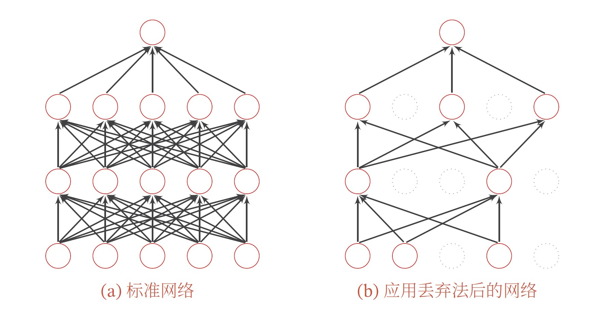

<!-- fit -->
# 误差反向传播算法

---
# 主要内容

- 引言
- 误差反向传播的4个方程
- 误差反向传播算法
    - 算法过程
    - 基于`pytorch`实现
- 参数初始化
- 正则化
- 融合权重衰减和dropout的前馈神经网络实现

---
# 引言

- 神经⽹络主要使⽤梯度下降算法学习权重和偏置。但是，这⾥还留下了⼀个问题：我们并没有讨论如何计算代价函数的梯度。这是很⼤的缺失！我们接下来学习计算这些梯度的快速算法，也就是**反向传播（`Back propagation`）**。

- 反向传播算法最初在1970年代被提及，但是⼈们直到`D. Rumelhart, G. Hinton & R. Williams (1986)` 的著名[论⽂](https://www.nature.com/articles/323533a0)中才认识到这个算法的重要性。这篇论⽂描述了对⼀些神经⽹络反向传播要⽐传统的⽅法更快，这使得使⽤神经⽹络来解决之前⽆法完成的问题变得可⾏。

- 现在，反向传播算法已经是神经⽹络学习的重要组成部分。

---
# 引言
- 为了利用梯度下降法训练神经网络，必须首先计算神经网络中损失函数关于权重和偏置的梯度。

- 如何计算这些梯度？有以下两种方法
    - 数值方法
    $$
    \frac{\partial C}{\partial w_{ij}}\approx \frac{C(w_{ij}+\eta\Delta e_{ij}) - C(w_{ij})}{\eta}
    $$
    其中$\eta>0$是一个很小的正数，而$e_{ij}$是单位向量。这种方法需要重复多次运行前向传播计算$C$, 效率太低。
    - 符号微分：链式法则

---
# 引言

- 反向传播算法涉及两个过程的迭代:
    - 信息经由神经元的前向传递
    - 误差经由神经元的反向传递
    - 核心技术是基于链式法则以及使用中间变量*误差项*

- 反向传播算法的应用
    - 前馈神经网络：多层感知机、卷积神经网络
    - 记忆神经网络：循环神经网络、LSTM
    - 图神经网络
    - 大语言模型: `Transformer, BERT, GPT`

---
# 误差反向传播的4个方程

- 假设输入层表示为$x$，输入层到第1个隐藏层的权重矩阵表示为$w^1$，第1个隐藏层的净值为$z^1$，激活值为$a^1$；输出层的净值为$z^L$, 激活值为$a^L$，即隐藏层加输出层的数量为$L$。第$l$层的神经元个数为$M_l$。

- $w_{jk}^l$表示第$(l-1)$层的第$k$个神经元到$l$层的第$j$个神经元的连接上的权重，$l-1$和$l$层间的权重矩阵为$w^l\in \mathbb{R}^{\mathbf{M}_l\times \mathbf{M}_{l-1}}$。

- $b_j^l$表示第$l-1$层到第$l$层第$j$个神经元的偏置，$l$层的偏置向量表示为$b^l\in \mathbb{R}^{\mathbf{M}_l}$。

- $z_j^l$表示第$l$层第$j$个神经元的净值，$l$层的净值向量表示为$z^l\in \mathbb{R}^{\mathbf{M}_l}$。

- $\sigma^l$表示应用于第$l$层神经元净值的激活函数。

- $a_j^l$表示第$l$层第$j$个神经元的激活值，$l$层的激活值表示为$a^l\in \mathbb{R}^{\mathbf{M}_l}$。

---


---
# 误差反向传播的4个方程

$$
\begin{aligned}
\delta^L&=\frac{\partial{C}}{\partial{a^L}}\odot R'(z^L)  \text{\ \ \ \ \ \ \ \ (BP.1)}\\
\delta^l&=((w^{l+1})^T\delta^{l+1})\odot\sigma'(z^l) \text{\ \ \ \ \ \ \ \ (BP.2)}\\
\frac{\partial{C}}{\partial{b_j^l}}&=\delta_j^l \text{ or } \frac{\partial{C}}{\partial{b^l}}=\delta^l \in \mathbb{R}^{M_l} \text{\ \ \ \ \ \ \ \ (BP.3)}\\
\frac{\partial{C}}{\partial{w_{jk}^l}}&=a_k^{l-1}\delta_j^l \text{ or } \frac{\partial{C}}{\partial{w^l}}=\delta^l (a^{l-1})^T\in \mathbb{R}^{M_l\times M_{l-1}}\text{\ \ \ \ \ \ \ \ (BP.4)}
\end{aligned}
$$

---
# 误差反向传播的4个方程

- 反向传播其实是对权重和偏置变化影响代价函数过程的理解。最终目标其实就是计算偏导数$\frac{\partial{C}}{\partial{w^l_{jk}}}$ 和$\frac{\partial{C}}{\partial{b^l}}$。

- 但是为了计算这些值，我们⾸先引⼊⼀个中间量，$\delta_j^l$，这个我们称为第$l$层第$j$个神经元上的误差。
>从计算上来讲，$\delta_j^l$在下一层的权重和偏置梯度的计算中重复利用，因此将其定义并保存下来可规避重复计算，极大减少计算量

- 反向传播将给出计算误差$\delta_j^l$的流程，然后将其关联到计算$\frac{\partial{C}}{\partial{w^l_{jk}}}$ 和$\frac{\partial{C}}{\partial{b^l}}$上。


---
# 误差反向传播的4个方程

- 假定在前馈信息传播过程中，$l$层第$i$个神经元的净值$z_i^l$增加了$\Delta z_i^l$，则最终损失函数的增量应为$\frac{\partial C}{\partial z_i^l}\Delta z_i^l$。

- **对$\frac{\partial C}{\partial z_j^l}$是$l$层神经元$j$的误差度量的启发式认识**: 假设$\frac{\partial C}{\partial z_i^l}$取很大的值（或正或负），那么可以通过选择与$\frac{\partial C}{\partial z_i^l}$相反符号的$\Delta z_i^l$来降低代价。相反，如果$\frac{\partial C}{\partial z_i^l}$接近0，那么我们并不能通过扰动带权输⼊$z^l_j$来改善太多代价。

- 按照上⾯的描述，我们定义$l$层的第$j$个神经元上的误差$\delta_i^l$为：
$$
\delta_j^l = \frac{\partial C}{\partial z_j^l}
$$

---
神经元的误差项


---
# 误差反向传播的4个方程

## *按照我们通常的惯例，我们使⽤$\delta^l$表⽰关联于$l$层的误差向量。*

## *反向传播会提供给我们⼀种计算每层的$\delta^l$的⽅法，然后将这些误差和最终我们需要的量$\frac{\partial C}{\partial w_{jk}^l}$和$\frac{\partial C}{\partial b_j^l}$联系起来。*

---
# 误差反向传播的4个方程
- `(BP.1)`. 输出层的误差项$\delta^L$, 每个元素定义如下：
$$
\delta_j^L=\frac{\partial C}{\partial a_j^L}\sigma'(z_j^L)
$$

>右式第⼀个项$\frac{\partial C}{\partial a_j^L}$表⽰C随着j层输出激活值的变化⽽变化的速度。假如$C$不太依赖⼀个特定的输出神经元j，那么$\frac{\partial C}{\partial a_j^L}$就会很⼩。右式第⼆项$\sigma'(z_j^L)$刻画了在$z_j^L$处激活函数$\sigma$变化的速度。上式也可以重新写成矩阵形式
>$$
\delta^L=\nabla_aC\odot R'(z^L)
>$$
>
>例如，如果损失函数为误差平方和时，我们有$\nabla_aC=(a^L-y)$，因此可得$\delta_L=(a^L-y)\odot \sigma'(z^L)$

---
# 误差反向传播的4个方程
- `(BP.2)`. 使用$l+1$层误差$\delta^{l+1}$计算$l$层的误差$\delta^{l}$: 
$$
\delta^l=((w^{l+1})^T\delta^{l+1})\odot\sigma'(z^l)
$$

>假设已知$l+1$层的误差$\delta^{l+1}$。当应⽤转置的权重矩阵$(w^{l+1})^T$ ，可以凭直觉地把它看作是在沿着⽹络反向移动误差，给了度量$l$层输出的误差⽅法。然后，进⾏`Hadamard` 乘积运算$\odot\sigma'(z^l)$，以使误差通过$l$层的激活函数反向传递回来，并给出在第$l$层的带权输⼊的误差$\delta$。

- **通过组合`(BP.1)` 和`(BP.2)`，我们可以计算任何层的误差$\delta^l$。⾸先使⽤`(BP.1)` 计算$\delta^L$，然后应⽤⽅程`(BP.2)` 来计算$\delta^{L-1}$，然后再次⽤⽅程`(BP.2)`来计算$\delta^{L-2}$，如此⼀步⼀步地反向传播完整个⽹络。**

---
# 误差反向传播的4个方程
- `(BP.3)`. 代价函数关于⽹络中任意偏置的改变率:
$$
\frac{\partial{C}}{\partial{b_j^l}}=\delta_j^l \\
\text{ or } \\
\frac{\partial{C}}{\partial{b^l}}=\delta^l \in \mathbb{R}^{M_l}
$$

---
权重和偏置梯度的计算


---
# 误差反向传播的4个方程
- `(BP.4)`. 代价函数关于权重的改变率
$$
\frac{\partial{C}}{\partial{w_{jk}^l}}=a_k^{l-1}\delta_j^l \\
\text{ or } \\
\frac{\partial{C}}{\partial{w^l}}=\delta^l (a^{l-1})^T\in \mathbb{R}^{M_l\times M_{l-1}}
$$

>当激活值$a_k^{l-1}$很⼩，例如$a_k^{l-1}\simeq 0$时，梯度$\frac{\partial{C}}{\partial{w_{jk}^l}}$也会趋向很⼩。这样，我们就说权重缓慢学习，表⽰在梯度下降的时候，这个权重不会改变太多。换⾔之，`(BP.4)`的⼀个结果就是来⾃低激活值神经元的权重学习会⾮常缓慢。

---
计算图


---
# 案例

## 交叉熵风险函数
- 交叉熵风险函数$\mathbf{R(z^L, y)}=-y\cdot\log{a^L}$关于$z^L$的梯度为
$$\begin{aligned}
\mathrm{softmax}(z^L) &=  \left(\frac{exp(z^l_1)}{\sum_{j=1}^{M_L}exp(z^l_j)}, ... , \frac{exp(z^l_{M_L})}{\sum_{j=1}^{M_L}exp(z^l_j)}\right)\\
a^L&=\mathrm{softmax}(z^L), \frac{\partial{C}}{\partial{a_i^L}}=-y_i\frac{1}{a_i^L}\\
\frac{\partial{C}}{\partial{a^L}} &= -y\odot (a^L)^{-1} = (-y_1\frac{1}{a_1^L}, -y_2\frac{1}{a_2^L}, ..., -y_{M_L}\frac{1}{a_{M_L}^L})
\end{aligned}
$$


---
# 案例
## 交叉熵风险函数
- 当$i=j$时, 有$\frac{\partial{a_i}}{\partial{z_j}}=a_i(1-a_i)$; 当$i\neq j$时, 有$\frac{\partial{a_i}}{\partial{z_j}}=-a_ia_j$, 因此有

$$
\begin{aligned}
\frac{\partial{a^L}}{\partial{z^L}} &= \begin{bmatrix} 
a_1^L(1-a_1^L) & -a_1^La_2^L & ... & -a_1^La_j^L & ... & -a_1^La_{M_L}^L \\ 
-a_2^La_1^L & a_2^L(1-a_2^L) & ... & a_2^La_j^L & ... & -a_2^La_{M_L}^L \\
... & ... & ... & ... & ... & ....\\
-a_{M_L}^La_1^L & -a_{M_L}^La_2^L & ... & -a_{M_L}^La_j^L & ... & a_{M_L}^L(1-a_{M_L}^L)
\end{bmatrix} \\
&= (\frac{\partial{a^L}}{\partial{z^L_1}}, \frac{\partial{a^L}}{\partial{z^L_2}}, ..., \frac{\partial{a^L}}{\partial{z^L_{M_L}}})
\end{aligned}
$$
> 若$i = j$, 则有$\frac{\partial \mathrm{softmax}(x_i)}{\partial x_j}=\mathrm{softmax}(x_i)(1-\mathrm{softmax}(x_i))$; 否则, $\frac{\partial \mathrm{softmax}(x_i)}{\partial x_j}=-\mathrm{softmax}(x_i)\mathrm{softmax}(x_j)$


---
# 案例
- 因此，结合链式法则，有
$$
\begin{aligned}
\frac{\partial{C}}{\partial{z^L}} &= \frac{\partial{C}}{\partial{a^L}} \frac{\partial{a^L}}{\partial{z^L}} \\
&= (\frac{\partial{C}}{\partial{a^L}}\frac{\partial{a^L}}{\partial{z^L_1}}, \frac{\partial{C}}{\partial{a^L}}\frac{\partial{a^L}}{\partial{z^L_2}}, ..., \frac{\partial{C}}{\partial{a^L}}\frac{\partial{a^L}}{\partial{z^L_{M_L}}}) 
\end{aligned}
$$

- 假定$y_i$=1, 则有$\frac{\partial{C}}{\partial{z^L}}=(a^L_1, a^L_2, ..., a^L_{i}-1, ..., a^L_{M_L})$, 因此输出层的误差项$\delta^L$可以写成: 
$$\delta^L=\frac{\partial{C}}{\partial{z^L}}=a^L-y$$

>  

---
# 练习: 请结合链式法则，推导`(BP.1)~(BP.4)`.

---
# 误差反向传播算法
反向传播方程给出了一种计算代价函数梯度的方法，可以用以下算法描述:

**输入: 训练集`{features, labels}`, 训练回合数`max_epochs`, 学习率`lr`, 批量大小`batch_size`**
**输出: 训练好的前馈神经网络**
**算法过程:**
- 初始化当前回合`epoch=1`, 
- 如果`epoch <= max_epochs`, 执行以下操作
    - 打乱训练集的排序
    - 由前逐批取出`batch_size`个样本，然后做以下计算，直到取完所有样本为止
        - 前馈计算每一层的净值$z^l$和激活值$a^l$，直到最后一层
        - 反向传播计算每一层的误差$\delta^l$(**公式`BP1, BP2`**)
        - 计算损失函数对各层间权重矩阵$w^l$和偏置向量$b^l$的偏导数(**公式`BP3, BP4`**)

---
# 误差反向传播算法

**算法过程:**
- 如果`epoch <= max_epochs`, 执行以下操作
...
    - 由前逐批取出`batch_size`个样本，然后做以下计算，直到取完所有样本为止
        ...
        - 更新权重矩阵和权重矩阵
        $$
        \begin{aligned}
        w^l &:= w^l - lr*\frac{\delta^l(a^{(l-1)})^T}{\mathrm{batch\_size}} \\
        b^l &:= b^l - lr*\mathrm{mean}(\delta^l, axis=1)
        \end{aligned}
        $$
    - 更新$epoch := epoch + 1$
> 注意: `(BP.1)~(BP.4)`是单一样本的更新，针对小批量样本需对误差项向量取平均。

---
# 误差反向传播算法
```python
class FNN:
    def __init__(self, features, labels, params, batch_size=256):
        '''
        features: 特征
        labels: 标签
        params元素: (权重矩阵, 偏置向量, 激活函数, 激活函数的导数)
        注意: 权重的形式为 (M_{l}, M_{l-1}), 偏置的形式为 (1, M_{l})
        '''
        self.features = features
        self.labels = labels
        self.params = params
        self.train_iter = self.data_loader(batch_size=256)
```

---
# 误差反向传播算法
```python
class FNN:
    ...
    def data_loader(self, batch_size, is_one_hot=True):
        '''
        构建小批量数据集
        '''
        if is_one_hot:
            hot_labels = torch.zeros(self.features.shape[0], 10)
            x_indices = np.arange(self.features.shape[0]).tolist()
            y_indices = labels.byte().tolist()
            hot_labels[x_indices, y_indices] = 1
            dataset = TensorDataset(self.features, hot_labels)
        else:
            dataset = TensorDataset(self.features, self.labels)

        return DataLoader(dataset=dataset, batch_size=batch_size, shuffle=True)
```

---
# 误差反向传播算法
```python
class FNN:
    ...
    def forward(self, X):
        '''
        神经元前馈传递信息
        '''
        self.z_list, self.a_list = [], [X]  # 记录各层的净值和激活值
        y = X  # 初始化输入features
        for weight, bias, func, _ in self.params:
            # (N, M_{l-1}) @ (M_{l-1}, M_{l}) + (1, M_{l}), broadcast
            z = y@torch.transpose(weight, 0, 1) + bias.reshape(1, -1)  
            if func:
                if func.__name__ == 'softmax':
                    y = func(z, dim=1)
                else:
                    y = func(z)
            else:
                y = z
                
            self.z_list.append(z)
            self.a_list.append(y)
        return y.double()
```

---
# 误差反向传播算法
```python
class FNN:
    ...
    def cross_entropy(self, X, y):
        '''
        labels: one-hot形式
        hat_y: softmax之后对应概率向量，多层感知机的输出
        '''
        hat_y = self.forward(X)
        if len(y.shape) == 2:
            # 展开成1维，点积
            crossEnt = -torch.dot(y.reshape(-1),torch.log10(hat_y.float()).reshape(-1))/y.shape[0] 
        elif len(y.shape) == 1:
            crossEnt = -torch.mean(torch.log10(hat_y[torch.arange(y.shape[0]), y.long()]))
        else:
            print("Wrong format of y!")
        return crossEnt
```

---
# 误差反向传播算法
```python
class FNN:
    ...
    def cal_neuron_errors(self, y):
        '''
        计算神经元的误差
        '''
        # 输出层误差
        error_L = self.a_list[-1] - y
        self.error_list = [error_L]
        for i in range(len(self.params)-1):
            weight = self.params[-i-1][0]  # 权重矩阵
            der_f = self.params[-i-1][-1]  # 导数
            error_up = self.error_list[-1]  # 上一层的误差
            z = self.z_list[-i-2]  # 当前层的净值
            #  (N, M_{l})@(M_{l}, M_{l-1}) = (N, M_{l-1})
            error = error_up@weight * der_f(z)
            self.error_list.append(error)
            
        self.error_list.reverse()
```

---
# 误差反向传播算法
```python
class FNN:
    ...
    def cal_params_partial(self):
        '''
        计算损失函数关于权重和偏置的偏导数
        '''
        self.der_weight_list = []
        self.der_bias_list = []
        for i in range(len(self.params)):
            a_out = self.a_list[i]
            error_in = self.error_list[i]
            # 以下计算出来的是每个样本对应的der_weight构成的矩阵，归约成1维，可采用均值或求和的形式
            # (M_{l}, N) @ (N, M{l-1})
            der_weight = torch.transpose(error_in, 0, 1)@a_out / self.a_list[0].shape[0]  
            der_bias = torch.mean(torch.transpose(error_in, 0, 1), axis=1)  # (M_{l}, N)
            self.der_weight_list.append(der_weight)
            self.der_bias_list.append(der_bias)

```
---
# 误差反向传播算法
```python
class FNN:
    ...
    def backward(self, y):
        '''
        误差反向传播算法实现
        '''
        self.cal_neuron_errors(y)
        self.cal_params_partial()
    
    def accuracy(self, y, hat_y, is_one_hot=False):
        '''
        y: 标签, one-hot
        hat_y: 标签预测概率, one-hot
        is_one_hot: y是否为one-hot形式
        '''
        if is_one_hot:
            precision = torch.sum(torch.max(y, axis=1)[1]== 
                torch.max(hat_y, axis=1)[1]).numpy() / y.shape[0]
        else:
            precision = torch.sum((y == 
                torch.max(hat_y, axis=1)[1]).byte()).numpy() / y.shape[0]
        return precision

```

---
# 误差反向传播算法
```python
class FNN:
    ...
    def minibatch_sgd_trainer(self, max_epochs=10, lr=0.1):
        '''
        训练
        '''
        for epoch in range(max_epochs):
            for X, y in self.train_iter:
                self.forward(X)  # 前向传播
                self.backward(y)  # 误差反向传播
                for i in range(len(self.params)):
                    self.params[i][0] -= lr*self.der_weight_list[i]
                    self.params[i][1] -= lr*self.der_bias_list[i]
            
            loss = self.cross_entropy(self.features, self.labels)
            accu = self.accuracy(self.labels, self.forward(self.features))
            print(f"第{epoch+1}个回合, 训练集交叉熵损失为:{loss:.4f}, 分类准确率{accu:.4f}")

```

---
# 误差反向传播算法
```python
def d_relu(x):
    '''
    relu激活函数的导数
    '''
    d = torch.zeros_like(x)
    d[x > 0] = 1
    return d

def d_softmax(x):
    '''
    softmax激活函数的导数
    '''
    d = torch.softmax(x, dim=1)
    return d*(1-d)
```

---
# 参数初始化

神经网络的参数学习是一个非凸优化问题．当使用梯度下降法来进行优化网络参数时，参数初始值的选取十分关键，关系到网络的优化效率和泛化能力．参数初始化的方式通常有以下三种：

- 预训练初始化：不同的参数初始值会收敛到不同的局部最优解．虽然这些局部最优解在训练集上的损失比较接近，但是它们的泛化能力差异很大．一个好的初始值会使得网络收敛到一个泛化能力高的局部最优解．通常情况下，一个已经在大规模数据上训练过的模型可以提供一个好的参数初始值，这种初始化方法称为**预训练初始化（`Pre-trained Initialization`）**．预训练任务可以为监督学习或无监督学习任务．由于无监督学习任务更容易获取大规模的训练数据，因此被广泛采用．预训练模型在目标任务上的学习过程也称为**精调（`Fine-Tuning`）**．

---
# 参数初始化

- 随机初始化：在线性模型的训练（比如感知机和`Logistic` 回归）中，我们一般将参数全部初始化为0．但是这在神经网络的训练中会存在一些问题．因为如果参数都为0，在第一遍前向计算时，所有的隐藏层神经元的激活值都相同；在反向传播时，所有权重的更新也都相同，这样会导致隐藏层神经元没有区分性．这种现象也称为**对称权重现象**．为了打破这个平衡，比较好的方式是对每个参数都**随机初始化（`Random Initialization`）**，使得不同神经元之间的区分性更好．
- 固定值初始化：对于一些特殊的参数，我们可以根据经验用一个特殊的固定值来进行初始化．比如偏置（`Bias`）通常用0来初始化，但是有时可以设置某些经验值以提高优化效率．对于使用`ReLU` 的神经元，有时也可以将偏置设为0.01，使得`ReLU` 神经元在训练初期更容易激活，从而获得一定的梯度来进行误差反向传播．

---
# 参数初始化

虽然预训练初始化通常具有更好的收敛性和泛化性，但是灵活性不够，不能在目标任务上任意地调整网络结构．

因此，好的随机初始化方法对训练神经网络模型来说依然十分重要．这里我们介绍三类常用的随机初始化方法：
  - 基于固定方差的参数初始化
  - 基于方差缩放的参数初始化
  - 正交初始化方法．

---
# 参数初始化
## 1. 基于固定方差的参数初始化

- 高斯分布初始化：使用一个高斯分布$N(0,\sigma^2)$对每个参数进行随机初始化．
- 均匀分布初始化：在一个给定的区间$[-r, r]$内采用均匀分布来初始化参数．假设随机变量x在区间$[a, b]$内均匀分布，则其方差为$var(x)=\frac{(b-a)^2}{12}$. 因此，若使用区间为$[-r, r]$的均分分布来采样，并满足$var(x)=\sigma^2$时，则𝑟的取值为$r=\sqrt{3\sigma^2}$

---
# 参数初始化
## 1. 基于固定方差的参数初始化
```python
def uniform_init(m, limit=0.1):
    if isinstance(m, nn.Linear):
        init.uniform_(m.weight, -limit, limit)
        if m.bias is not None:
            init.uniform_(m.bias, -limit, limit)

def normal_init(m, mean=0.0, std=0.05):
    if isinstance(m, nn.Linear):
        init.normal_(m.weight, mean, std)
        if m.bias is not None:
            init.normal_(m.bias, mean, std)

```


---
# 参数初始化
## 2. 基于方差缩放的参数初始化

| 初始化方法 | 激活函数 | 均匀分布$[-r, r]$ | 高斯分布 $N(0, \sigma^2)$ |
| :----: | :----: | :----: | :----: |
| Xavier | Logistic | $r=4\sqrt{\frac{6}{M_{l-1}+M_l}}$ | $\sigma^2=16\times \frac{2}{M_{l-1}+M_l}$ |
| Xavier | tanh | $r=\sqrt{\frac{6}{M_{l-1}+M_l}}$ | $\sigma^2=\frac{2}{M_{l-1}+M_l}$ |
| He | reLu | $r=\sqrt{\frac{6}{M_{l-1}}}$ | $\sigma^2=\frac{2}{M_{l-1}}$ |

---
# 参数初始化
## 2. 基于方差缩放的参数初始化
```python
def xavier_uniform_init(m):
    if isinstance(m, nn.Linear):
        init.xavier_uniform_(m.weight)
        if m.bias is not None:
            init.zeros_(m.bias)

def xavier_normal_init(m):
    if isinstance(m, nn.Linear):
        init.xavier_normal_(m.weight)
        if m.bias is not None:
            init.zeros_(m.bias)

```

---
# 参数初始化
## 2. 基于方差缩放的参数初始化
```python
def he_uniform_init(m):
    if isinstance(m, nn.Linear):
        init.kaiming_uniform_(m.weight, nonlinearity='relu')
        if m.bias is not None:
            init.zeros_(m.bias)

def he_normal_init(m):
    if isinstance(m, nn.Linear):
        init.kaiming_normal_(m.weight, nonlinearity='relu')
        if m.bias is not None:
            init.zeros_(m.bias)
```


---
# 参数初始化
## 3. 正交初始化
正交初始化是一种权重初始化策略，常用于深度学习中的各种网络结构，特别是在循环神经网络（RNN）中非常受欢迎。正交初始化的目的是使得权重矩阵 $W$ 中的行向量或列向量都是正交的，即 $W^T W = I$或$W W^T = I$，其中 $I$是单位矩阵。这样的特性有几个关键优点：
1. **保持特征独立**：正交矩阵的这种特性帮助网络每层输出的特征保持独立，减少了特征间的冗余，提高了学习效率。
2. **缓解梯度问题**：在循环神经网络中，由于权重矩阵在每个时间步都参与计算，正交性能有效防止梯度在反向传播中的消失或爆炸，这是因为正交矩阵的特征值为1，这保持了梯度流动的稳定性。
3. **稳定的激活分布**：由于正交矩阵的乘积仍是正交的，这帮助网络在前向传播中保持激活分布的稳定性，从而有助于网络的快速和稳定训练。

---
# 参数初始化
## 3. 正交初始化
正交初始化特别适用于那些激活函数的输出可以广泛分布且不易饱和的网络层，如ReLU激活函数配合的层。其初始化步骤通常如下：
1. **生成随机矩阵**：首先生成一个形状为 $(d_{\text{in}}, d_{\text{out}})$的随机矩阵，通常元素来自标准正态分布。
2. **应用SVD**：对这个随机矩阵应用奇异值分解（SVD），得到 $U$, $\Sigma$, $V^T$。
3. **构造正交矩阵**：
   - 如果 $d_{\text{in}} < d_{\text{out}}$，使用 $U$作为权重矩阵，因为 $U$的列是正交的。
   - 如果 $d_{\text{in}} \geq d_{\text{out}}$，使用 $V$（来自 $V^T$的转置）作为权重矩阵，因为 $V$的行是正交的。

---
# 参数初始化
## 3. 正交初始化

在PyTorch中，可以直接使用`torch.nn.init.orthogonal_`来应用正交初始化：

```python
# 定义一个线性层
linear = nn.Linear(20, 30)
# 应用正交初始化
torch.nn.init.orthogonal_(linear.weight)
# 打印权重查看效果
print("Weights after orthogonal initialization:")
print(linear.weight)
```

---
# 正则化

- 随着训练回合数的增加，理论上来讲，足够多神经元的前馈神经网络可以学习在训练集中几乎所有样本的特征，从而对训练集有着很高的预测正确率。然而，需要警惕的时候，样本中的误差也同样被学习到了，从而对现实产生了错误的认识。造成的后果是，对于新的样本，预测正确率并不高，甚至比一些简单的模型还要差。

- 因此，如何控制模型不学习样本中的误差是一个很重要的问题，目前通常有以下办法
    - $ℓ_1$和$ℓ_2$正则化
    - 权重衰减
    - 提前终止
    - 丢弃法

---
# 正则化
## 1. $ℓ_1$和$ℓ_2$正则化`Normalization`

- $ℓ_1$ 和$ℓ_2$ 正则化是机器学习中最常用的正则化方法，通过约束参数的ℓ1 和ℓ2范数来减小模型在训练数据集上的过拟合现象.
$$
\theta^*=\text{arg}\min \frac{1}{N}\sum_{n=1}^N \mathbf{L}(y^{(n)},f(x^{(n)};\theta))+\lambda \mathrm{ℓ_p}(\theta)
$$
- 其中$\mathbf{L(\cdot)}$为损失函数，$N$为训练样本，$f(\cdot)$为待学习的神经网络，$\theta$为参数，$ℓ_p$为范数函数，$𝑝$ 的取值通常为`{1, 2}` 代表$ℓ_1$ 和$ℓ_2$ 范数，$𝜆$为正则化系数．

---
# 正则化
## 2. 权重衰减`Weight Decay`
- 权重衰减（`Weight Decay`）是一种有效的正则化方法(`Hanson et al., 1989`)，在每次参数更新时，引入一个衰减系数．
$$
\begin{aligned}
W^l &:= (1-\beta)W^l - \alpha \frac{\partial C}{\partial W^l}\\
b^l &:= (1-\beta)b^l - \alpha \frac{\partial C}{\partial b^l}
\end{aligned}
$$

- 其中$\alpha$为学习率，$\beta$为权重衰减系数，一般取值比较小，比如0.0005．在标准的随机梯度下降中，权重衰减正则化和$ℓ_2$正则化的效果相同．因此，权重衰减在一些深度学习框架中通过$ℓ_2$正则化来实现．但是，较为复杂的优化方法（比如`Adam`）中，权重衰减正则化和$ℓ_2$正则化并不等价.

---
# 正则化
## 3. 提前终止`Early Stop`

- 提前停止（`Early Stop`）对于深度神经网络来说是一种简单有效的正则化方法．由于深度神经网络的拟合能力非常强，因此比较容易在训练集上过拟合．

- 在使用梯度下降法进行优化时，我们可以使用一个和训练集独立的样本集合，称为验证集（`Validation Set`），并用验证集上的错误来代替期望错误．

- 当验证集上的错误率不再下降，就停止迭代．然而在实际操作中，验证集上的错误率变化曲线很可能是先升高再降低．因此，提前停止的具体停止标准需要根据实际任务进行优化(`Prechelt, 1998`)．

---
# 正则化
## 4. 丢弃法`Dropout`

- 当训练一个深度神经网络时， 我们可以随机丢弃一部分神经元（同时丢弃其对应的连接边）来避免过拟合，这种方法称为丢弃法（`Dropout Method`）[`Srivastava et al., 2014`]．每次选择丢弃的神经元是随机的．

- 最简单的方法是设置一个固定的概率𝑝．对每一个神经元都以概率𝑝 来判定要不要保留, 若$p=1$，则意味着需要保留该神经元；若$p=0$, 则意味着不保留该神经元．

- 通过每次随机训练神经网络的一小部分，`Dropout`能够让一张大网络像小网络一样进行学习——较小的神经网络不容易发生过拟合。

- `Dropout`是一种训练一系列网络并对其进行平均的形式。

> 丢弃法通常被认为是对大多数神经网络来说最重要且最先进的正则化技术

---


---
# 正则化
## 4. 丢弃法`Dropout`

- 对于一个神经层$y=f(Wx + b)$，我们可以引入一个掩蔽函数$mask(⋅)$ 使得$y=f(W\times mask(x) + b)$．掩蔽函数$mask(⋅)$的定义为
$$
\mathrm{mask}(x)=\begin{cases} m \odot x \text{  训练时}\\
px \text{  测试时}\\
\end{cases}

$$
或者
$$
\mathrm{mask}(x)=\begin{cases} m \odot \frac{x}{p} \text{  训练时}\\
x \text{  测试时}\\
\end{cases}
$$

---
# 正则化
## 4. 丢弃法`Dropout`
```python
# Dropout概率设置为0.5
dropout = nn.Dropout(p=0.1)
# 假设有一层的输出
layer_output = torch.randn(4, 5)  # 随机生成一些数据
# 应用Dropout
output_during_training = dropout(layer_output)
# 输出查看
print("Output with Dropout during training:")
print(output_during_training)
```

---
# 正则化
## 4. 丢弃法`Dropout`
```python
class MyModel(nn.Module):
    def __init__(self):
        super(MyModel, self).__init__()
        self.layer1 = nn.Linear(784, 256)
        self.dropout1 = nn.Dropout(0.5)
        self.layer2 = nn.Linear(256, 10)
    
    def forward(self, x):
        x = torch.relu(self.layer1(x))
        x = self.dropout1(x)  # 在第一层后应用Dropout
        x = self.layer2(x)
        return x

# 注意：模型训练时会应用Dropout，测试时需关闭Dropout
model = MyModel()
model.train()  # 确保是训练模式
```


---
# 融合权重衰减和dropout的前馈神经网络实现
```python
class FNN2:
    ...
    def mask(self, X, p):
        '''
        X: 输入
        p: 神经元的保留概率
        若输入X除以概率p，则使X的期望保持不变, 预测时, 神经网络的权重不用转换；
        若训练时按正常的输入训练X，预测时，神经网络中对应的权重需乘p
        '''
        if p == 0:
            return torch.zeros_like(X)
        elif p == 1:
            return X
        else:
            prob = p*torch.ones_like(X)
            return X*torch.bernoulli(prob)/p
```

---
# 融合权重衰减和`dropout`的前馈神经网络实现
```python
class FNN2:
    ...    
    def train_forward(self, X):
        '''
        训练用神经元前馈传递信息: 依照概率p随机关闭一些神经元
        '''
        y = X  # 初始化输入features
        mask_y = self.mask(y, self.prob_dropout[0])
        self.z_list, self.a_list = [], [y]  # 记录各层的净值和激活值
        for i, (weight, bias, func, _) in enumerate(self.params, start=1):
            p = self.prob_dropout[i]
            # (N, M_{l-1}) @ (M_{l-1}, M_{l}) + (1, M_{l}), broadcast
            z = y@torch.transpose(weight, 0, 1) + bias.reshape(1, -1)  
            mask_z = self.mask(z, p)
            if func:
                if func.__name__ == 'softmax':
                    y = func(mask_z, dim=1)
                else:
                    y = func(mask_z)
            else:
                y = mask_z
            self.z_list.append(mask_z)
            self.a_list.append(y)
        return y.double()
```

---
# 融合权重衰减和`dropout`的前馈神经网络实现
```python
class FNN2:
    ...    
    def predict_forward(self, X):
        '''
        预测用神经元前馈传递信息: 使用所有神经元
        '''
        y = X  # 初始化输入features
        for i, (weight, bias, func, _) in enumerate(self.params):
            z = y@torch.transpose(weight, 0, 1) + bias.reshape(1, -1)
            if func:
                if func.__name__ == 'softmax':
                    y = func(z, dim=1)
                else:
                    y = func(z)
            else:
                y = z

        return y.double()
```

---
# 融合权重衰减和`dropout`的前馈神经网络实现
```python
class FNN2:
    ...
    def minibatch_sgd_trainer(self, max_epochs=10, lr=0.1, decay=0.0005):
        '''
        训练
        lr: 学习率
        decay: 权重衰减系数
        '''
        for epoch in range(max_epochs):
            for X, y in self.train_iter:
                self.train_forward(X)  # 前向传播
                self.backward(y)  # 误差反向传播
                for i in range(len(self.params)):
                    self.params[i][0] = (1 - decay)*self.params[i][0] - lr*self.der_weight_list[i]
                    self.params[i][1] = (1 - decay)*self.params[i][1] - lr*self.der_bias_list[i]
            
            hat_labels = self.predict_forward(self.features)
            loss = self.cross_entropy(self.labels, hat_labels)
            accu = self.accuracy(self.labels, hat_labels)
            print(f"第{epoch+1}个回合, 训练集交叉熵损失为:{loss:.4f}, 分类准确率{accu:.4f}")
```


---
## 参考资料
1. 邱锡鹏. 神经网络与机器学习. 2020.
2. [阿斯顿·张、李沐、扎卡里 C. 立顿、亚历山大 J. 斯莫拉等. 动手学深度学习. 2020.](https://github.com/d2l-ai/d2l-zh)
3. Christopher M. Bishop. Pattern recognition and machine learning. 2006.
4. Michael Nielsen. Neural network and deep learning. 2016.